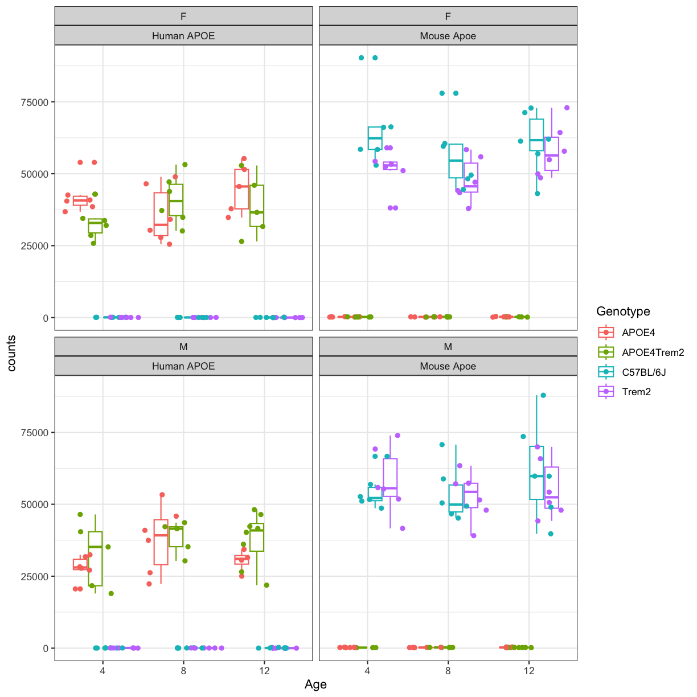

---
# Please do not edit this file directly; it is auto generated.
# Instead, please edit 03-DESeq.md in _episodes_rmd/
source: Rmd
title: "Differential Expression Analysis"
teaching: 40
exercises: 10
questions:
- "What transcriptomic changes we observe in mouse models carrying AD-related mutations?"
objectives:
- "Read in a count matrix and metadata."
- "Understand the data from AD mouse models"
- "Format the data for differential analysis"
- "Perform differential analysis using DESeq2."
- "Pathway enrichment of differentially expressed genes"
- "Save data for next lessons"
---

Author: Ravi Pandey, Jackson Laboratory

## LOAD libraries

~~~
suppressPackageStartupMessages(library("DESeq2"))
suppressPackageStartupMessages(library("ggplot2"))
suppressPackageStartupMessages(library("AnnotationDbi"))
suppressPackageStartupMessages(library("org.Mm.eg.db"))
suppressPackageStartupMessages(library("GO.db"))
suppressPackageStartupMessages(library("EnhancedVolcano"))
suppressPackageStartupMessages(library(tidyverse))
suppressPackageStartupMessages(library(dplyr))
suppressPackageStartupMessages(library(clusterProfiler))
~~~
{: .language-r}

## Reading Gene Expression Count matrix from  Previous Lesson
In this lesson, we will use the raw counts matrix and metadata downloaded in the previous lesson and will perform differential expression analysis. 

### RNA-Seq data from 5xFAD mouse models

~~~
counts <- read.delim("../data/htseqcounts_5XFAD.txt", check.names = FALSE)
~~~
{: .language-r}

Reading Sample Metadata from Previous Lesson

~~~
covars <- readRDS("../data/covars_5XFAD.rds")
~~~
{: .language-r}

Let's explore the data: 

Let’s look at the top of the metadata.

~~~
head(covars)
~~~
{: .language-r}

~~~
# A tibble: 6 × 50
  specimenID platform    RIN   rnaBatch libraryBatch sequencingBatch libraryPrep
  <chr>      <chr>       <lgl>    <dbl>        <dbl>           <dbl> <chr>      
1 32043rh    IlluminaNo… NA           1            1               1 polyAselec…
2 32043rh    IlluminaNo… NA           1            1               1 polyAselec…
3 32044rh    IlluminaNo… NA           1            1               1 polyAselec…
4 32044rh    IlluminaNo… NA           1            1               1 polyAselec…
5 32046rh    IlluminaNo… NA           1            1               1 polyAselec…
6 32046rh    IlluminaNo… NA           1            1               1 polyAselec…
# ℹ 43 more variables: libraryPreparationMethod <lgl>, isStranded <lgl>,
#   readStrandOrigin <lgl>, runType <chr>, readLength <dbl>,
#   individualID <dbl>, specimenIdSource <chr>, organ <chr>, tissue <chr>,
#   BrodmannArea <lgl>, sampleStatus <chr>, tissueWeight <lgl>,
#   tissueVolume <lgl>, nucleicAcidSource <lgl>, cellType <lgl>,
#   fastingState <lgl>, isPostMortem <lgl>, samplingAge <lgl>, ...1 <dbl>,
#   climbID <dbl>, microchipID <dbl>, birthID <chr>, matingID <chr>, …
~~~
{: .output}

identify distinct groups using sample metadata

~~~
distinct(covars, sex, genotype, timepoint)
~~~
{: .language-r}

~~~
Error in `distinct()`:
! Must use existing variables.
✖ `timepoint` not found in `.data`.
~~~
{: .error}

We're going to explore the data further using a series of Challenges. 
You will be asked to look at the contents of some of the columns to see 
how the data are 
distributed.

> ## Challenge 1
> How many mice were used to produce this data? 
>
> > ## Solution to Challenge 1
> >
> > ~~~
> > covars %>% group_by(sex,genotype,timepoint) %>% count()
> > dplyr::count(metadata, sex, genotype,timepoint)
> > ~~~
> > {: .language-r}
> {: .solution}
{: .challenge}

How many rows and columns are there in `counts`?

~~~
dim(counts)
~~~
{: .language-r}

~~~
[1] 55489    73
~~~
{: .output}

In the counts matrix, genes are in rows and samples are in columns. Let’s look at the first few rows.

~~~
head(counts,n=5)
~~~
{: .language-r}

~~~
             gene_id 32043rh 32044rh 32046rh 32047rh 32048rh 32049rh 32050rh
1    ENSG00000080815   22554       0       0       0   16700       0       0
2    ENSG00000142192  344489       4       0       1  260935       6       8
3 ENSMUSG00000000001    5061    3483    3941    3088    2756    3067    2711
4 ENSMUSG00000000003       0       0       0       0       0       0       0
5 ENSMUSG00000000028     208     162     138     127      95     154     165
  32052rh 32053rh 32057rh 32059rh 32061rh 32062rh 32065rh 32067rh 32068rh
1   19748   14023       0   17062       0   15986      10       0   18584
2  337456  206851       1  264748       0  252248     172       4  300398
3    3334    3841    4068    3306    4076    3732    3940    4238    3257
4       0       0       0       0       0       0       0       0       0
5     124     103     164     116     108     134     204     239     148
  32070rh 32073rh 32074rh 32075rh 32078rh 32081rh 32088rh 32640rh 46105rh
1       1       0       0   22783   17029   16626   15573   12721       4
2       4       2       9  342655  280968  258597  243373  188818      19
3    3351    3449    4654    4844    3132    3334    3639    3355    4191
4       0       0       0       0       0       0       0       0       0
5     159     167     157     211     162     149     160     103     158
  46106rh 46107rh 46108rh 46109rh 46110rh 46111rh 46112rh 46113rh 46115rh
1       0       0       0       0       0   17931       0   19087       0
2       0       0       1       5       1  293409       8  273704       1
3    3058    4265    3248    3638    3747    3971    3192    3805    3753
4       0       0       0       0       0       0       0       0       0
5     167     199     113     168     175     203     158     108     110
  46121rh 46131rh 46132rh 46134rh 46138rh 46141rh 46142rh 46862rh 46863rh
1       0       0   12703   18833       0   18702   17666       0   14834
2       0       1  187975  285048       0  284499  250600       0  218494
3    4134    3059    3116    3853    3682    2844    3466    3442    3300
4       0       0       0       0       0       0       0       0       0
5     179     137     145     183     171     138      88     154     157
  46865rh 46866rh 46867rh 46868rh 46871rh 46872rh 46873rh 46874rh 46875rh
1   10546   10830   10316   10638   15248       0       0   11608   11561
2  169516  152769  151732  190150  229063       6       1  165941  171303
3    3242    3872    3656    3739    3473    3154    5510    3657    4121
4       0       0       0       0       0       0       0       0       0
5     131     152     152     155     140      80     240     148     112
  46876rh 46877rh 46878rh 46879rh 46881rh 46882rh 46883rh 46884rh 46885rh
1       0       0   12683   15613       0   14084   20753       0       0
2       0       2  183058  216122       0  199448  306081       0       5
3    3422    3829    3996    4324    2592    2606    4600    2913    3614
4       0       0       0       0       0       0       0       0       0
5     147     166     169     215     115     101     174     127     151
  46886rh 46887rh 46888rh 46889rh 46890rh 46891rh 46892rh 46893rh 46895rh
1   16639   16072       0   16680   13367       0   25119      92       0
2  242543  258061       0  235530  196721       0  371037    1116       0
3    3294    3719    3899    4173    4008    3037    5967    3459    4262
4       0       0       0       0       0       0       0       0       0
5     139     128     210     127     156     116     260     161     189
  46896rh 46897rh
1   15934       0
2  235343       6
3    3923    3486
4       0       0
5     179     117
~~~
{: .output}

As you can see, the gene ids are ENSEBL IDs. There is some risk that these may not be unique. Let’s check whether any of the gene symbols are duplicated. We will sum the number of duplicated gene symbols.

~~~
sum(duplicated(rownames(counts)))
~~~
{: .language-r}

~~~
[1] 0
~~~
{: .output}

The sum equals zero, so there are no duplicated gene symbols, which is good. Similarly, samples should be unique. Once again, let's verify this:

~~~
sum(duplicated(colnames(counts)))
~~~
{: .language-r}

~~~
[1] 0
~~~
{: .output}

### Formatting the count matrix
Now, as we see that gene_id is in first column of count matrix, but we will need only count data in matrix, so we will change the gene_id column to rownames.  
Converting the gene_id as rownames of count matrix

~~~
counts <- counts %>% column_to_rownames(.,var="gene_id") %>% as.data.frame()
~~~
{: .language-r}

let's confirm if change is done correctly

~~~
head(counts,n=5)
~~~
{: .language-r}

~~~
                   32043rh 32044rh 32046rh 32047rh 32048rh 32049rh 32050rh
ENSG00000080815      22554       0       0       0   16700       0       0
ENSG00000142192     344489       4       0       1  260935       6       8
ENSMUSG00000000001    5061    3483    3941    3088    2756    3067    2711
ENSMUSG00000000003       0       0       0       0       0       0       0
ENSMUSG00000000028     208     162     138     127      95     154     165
                   32052rh 32053rh 32057rh 32059rh 32061rh 32062rh 32065rh
ENSG00000080815      19748   14023       0   17062       0   15986      10
ENSG00000142192     337456  206851       1  264748       0  252248     172
ENSMUSG00000000001    3334    3841    4068    3306    4076    3732    3940
ENSMUSG00000000003       0       0       0       0       0       0       0
ENSMUSG00000000028     124     103     164     116     108     134     204
                   32067rh 32068rh 32070rh 32073rh 32074rh 32075rh 32078rh
ENSG00000080815          0   18584       1       0       0   22783   17029
ENSG00000142192          4  300398       4       2       9  342655  280968
ENSMUSG00000000001    4238    3257    3351    3449    4654    4844    3132
ENSMUSG00000000003       0       0       0       0       0       0       0
ENSMUSG00000000028     239     148     159     167     157     211     162
                   32081rh 32088rh 32640rh 46105rh 46106rh 46107rh 46108rh
ENSG00000080815      16626   15573   12721       4       0       0       0
ENSG00000142192     258597  243373  188818      19       0       0       1
ENSMUSG00000000001    3334    3639    3355    4191    3058    4265    3248
ENSMUSG00000000003       0       0       0       0       0       0       0
ENSMUSG00000000028     149     160     103     158     167     199     113
                   46109rh 46110rh 46111rh 46112rh 46113rh 46115rh 46121rh
ENSG00000080815          0       0   17931       0   19087       0       0
ENSG00000142192          5       1  293409       8  273704       1       0
ENSMUSG00000000001    3638    3747    3971    3192    3805    3753    4134
ENSMUSG00000000003       0       0       0       0       0       0       0
ENSMUSG00000000028     168     175     203     158     108     110     179
                   46131rh 46132rh 46134rh 46138rh 46141rh 46142rh 46862rh
ENSG00000080815          0   12703   18833       0   18702   17666       0
ENSG00000142192          1  187975  285048       0  284499  250600       0
ENSMUSG00000000001    3059    3116    3853    3682    2844    3466    3442
ENSMUSG00000000003       0       0       0       0       0       0       0
ENSMUSG00000000028     137     145     183     171     138      88     154
                   46863rh 46865rh 46866rh 46867rh 46868rh 46871rh 46872rh
ENSG00000080815      14834   10546   10830   10316   10638   15248       0
ENSG00000142192     218494  169516  152769  151732  190150  229063       6
ENSMUSG00000000001    3300    3242    3872    3656    3739    3473    3154
ENSMUSG00000000003       0       0       0       0       0       0       0
ENSMUSG00000000028     157     131     152     152     155     140      80
                   46873rh 46874rh 46875rh 46876rh 46877rh 46878rh 46879rh
ENSG00000080815          0   11608   11561       0       0   12683   15613
ENSG00000142192          1  165941  171303       0       2  183058  216122
ENSMUSG00000000001    5510    3657    4121    3422    3829    3996    4324
ENSMUSG00000000003       0       0       0       0       0       0       0
ENSMUSG00000000028     240     148     112     147     166     169     215
                   46881rh 46882rh 46883rh 46884rh 46885rh 46886rh 46887rh
ENSG00000080815          0   14084   20753       0       0   16639   16072
ENSG00000142192          0  199448  306081       0       5  242543  258061
ENSMUSG00000000001    2592    2606    4600    2913    3614    3294    3719
ENSMUSG00000000003       0       0       0       0       0       0       0
ENSMUSG00000000028     115     101     174     127     151     139     128
                   46888rh 46889rh 46890rh 46891rh 46892rh 46893rh 46895rh
ENSG00000080815          0   16680   13367       0   25119      92       0
ENSG00000142192          0  235530  196721       0  371037    1116       0
ENSMUSG00000000001    3899    4173    4008    3037    5967    3459    4262
ENSMUSG00000000003       0       0       0       0       0       0       0
ENSMUSG00000000028     210     127     156     116     260     161     189
                   46896rh 46897rh
ENSG00000080815      15934       0
ENSG00000142192     235343       6
ENSMUSG00000000001    3923    3486
ENSMUSG00000000003       0       0
ENSMUSG00000000028     179     117
~~~
{: .output}

As you can see from count table there are some genes that start with **"ENSG"** and others start with **"ENSMUSG"**. **"ENSG"** referes to human gene ENSEMBL id and **"ENSMUSG"** refer to mouse ENSEMBL id. Let's check how many gene_ids are NOT from the mouse genome by searching for the string "MUS" (as in Mus musculus) in the rownames of count matrix

~~~
counts[,1:6] %>% 
  filter(!str_detect(rownames(.), "MUS"))
~~~
{: .language-r}

~~~
                32043rh 32044rh 32046rh 32047rh 32048rh 32049rh
ENSG00000080815   22554       0       0       0   16700       0
ENSG00000142192  344489       4       0       1  260935       6
~~~
{: .output}
Ok, so we see there are two human genes in out count matrix. Why? What genes are they?

Briefly, 5xFAD mouse strain harbors two human transgenes APP ("ENSG00000142192") and PSEN1 ("ENSG00000080815") and inserted into exon 2 of the mouse Thy1 gene. To validate 5XFAD strain and capture expression of human transgene APP and PS1, a custom mouse genomic sequences was created and we quantified expression of human as well as mouse App ("ENSMUSG00000022892") and Psen1 ("ENSMUSG00000019969") genes by our MODEL-AD RNA-Seq pipeline.

### Validation of 5xFAD mouse strain

#First we convert the dataframe to longer format and join our covariates by MouseID

~~~
count_tpose <- counts  %>%
                rownames_to_column(.,var="gene_id") %>% 
                filter(gene_id %in% c("ENSG00000080815","ENSMUSG00000019969","ENSG00000142192","ENSMUSG00000022892")) %>% 
                pivot_longer(.,cols = -"gene_id",names_to = "specimenID",values_to="counts") %>% as.data.frame() %>%
                left_join(covars ,by="specimenID") %>% as.data.frame()
head(count_tpose) 
~~~
{: .language-r}

~~~
          gene_id specimenID counts            platform RIN rnaBatch
1 ENSG00000080815    32043rh  22554 IlluminaNovaseq6000  NA        1
2 ENSG00000080815    32043rh  22554 IlluminaNovaseq6000  NA        1
3 ENSG00000080815    32044rh      0 IlluminaNovaseq6000  NA        1
4 ENSG00000080815    32044rh      0 IlluminaNovaseq6000  NA        1
5 ENSG00000080815    32046rh      0 IlluminaNovaseq6000  NA        1
6 ENSG00000080815    32046rh      0 IlluminaNovaseq6000  NA        1
  libraryBatch sequencingBatch    libraryPrep libraryPreparationMethod
1            1               1 polyAselection                       NA
2            1               1 polyAselection                       NA
3            1               1 polyAselection                       NA
4            1               1 polyAselection                       NA
5            1               1 polyAselection                       NA
6            1               1 polyAselection                       NA
  isStranded readStrandOrigin   runType readLength individualID
1      FALSE               NA pairedEnd        101        32043
2      FALSE               NA pairedEnd        101        32043
3      FALSE               NA pairedEnd        101        32044
4      FALSE               NA pairedEnd        101        32044
5      FALSE               NA pairedEnd        101        32046
6      FALSE               NA pairedEnd        101        32046
  specimenIdSource organ      tissue BrodmannArea sampleStatus tissueWeight
1             <NA> brain whole brain           NA       frozen           NA
2             <NA> brain whole brain           NA       frozen           NA
3             <NA> brain whole brain           NA       frozen           NA
4             <NA> brain whole brain           NA       frozen           NA
5             <NA> brain whole brain           NA       frozen           NA
6             <NA> brain whole brain           NA       frozen           NA
  tissueVolume nucleicAcidSource cellType fastingState isPostMortem samplingAge
1           NA                NA       NA        FALSE         TRUE          NA
2           NA                NA       NA        FALSE         TRUE          NA
3           NA                NA       NA        FALSE         TRUE          NA
4           NA                NA       NA        FALSE         TRUE          NA
5           NA                NA       NA        FALSE         TRUE          NA
6           NA                NA       NA        FALSE         TRUE          NA
  ...1 climbID microchipID birthID matingID individualIdSource materialOrigin
1   15  298456   288646853 RMO1223 M-108-17                JAX            JAX
2   87  298456   288646853 RMO1223 M-108-17                JAX            JAX
3   16  298457   289822454 RMO1223 M-108-17                JAX            JAX
4   88  298457   289822454 RMO1223 M-108-17                JAX            JAX
5   17  298459   289859181 RMO1223 M-108-17                JAX            JAX
6   89  298459   289859181 RMO1223 M-108-17                JAX            JAX
     sex species generation  dateBirth ageDeath ageDeathUnits brainWeight
1 female   Mouse       N1F3 2018-03-19 10.81967        months       0.503
2 female   Mouse       N1F3 2018-03-19 10.81967        months       0.503
3   male   Mouse       N1F3 2018-03-19 10.81967        months       0.482
4   male   Mouse       N1F3 2018-03-19 10.81967        months       0.482
5   male   Mouse       N1F3 2018-03-19 10.81967        months       0.470
6   male   Mouse       N1F3 2018-03-19 10.81967        months       0.470
  rodentWeight rodentDiet bedding       room waterpH stockNumber
1        28.76       0.06   aspen JAX_MGL373    2.85        8730
2        28.76       0.06   aspen JAX_MGL373    2.85        8730
3        46.51       0.06   aspen JAX_MGL373    2.85        8730
4        46.51       0.06   aspen JAX_MGL373    2.85        8730
5        41.00       0.06   aspen JAX_MGL373    2.85        8730
6        41.00       0.06   aspen JAX_MGL373    2.85        8730
          genotype genotypeBackground individualCommonGenotype modelSystemName
1    5XFAD_carrier            C57BL6J                    5XFAD           5XFAD
2    5XFAD_carrier            C57BL6J                    5XFAD           5XFAD
3 5XFAD_noncarrier            C57BL6J                  C57BL6J           5XFAD
4 5XFAD_noncarrier            C57BL6J                  C57BL6J           5XFAD
5 5XFAD_noncarrier            C57BL6J                  C57BL6J           5XFAD
6 5XFAD_noncarrier            C57BL6J                  C57BL6J           5XFAD
                                         officialName
1 B6.Cg-Tg(APPSwFlLon,PSEN1*M146L*L286V)6799Vas/Mmjax
2 B6.Cg-Tg(APPSwFlLon,PSEN1*M146L*L286V)6799Vas/Mmjax
3 B6.Cg-Tg(APPSwFlLon,PSEN1*M146L*L286V)6799Vas/Mmjax
4 B6.Cg-Tg(APPSwFlLon,PSEN1*M146L*L286V)6799Vas/Mmjax
5 B6.Cg-Tg(APPSwFlLon,PSEN1*M146L*L286V)6799Vas/Mmjax
6 B6.Cg-Tg(APPSwFlLon,PSEN1*M146L*L286V)6799Vas/Mmjax
~~~
{: .output}

~~~
#make the age column a factor and re-order the levels
count_tpose$timepoint <- factor(count_tpose$timepoint,levels=c("4 mo","6 mo","12 mo"))
~~~
{: .language-r}

~~~
Error in `$<-.data.frame`(`*tmp*`, timepoint, value = structure(integer(0), levels = c("4 mo", : replacement has 0 rows, data has 576
~~~
{: .error}

~~~
# rename the gene id to gene symbol
count_tpose$gene_id[count_tpose$gene_id %in% "ENSG00000142192"] <- "Human APP"
count_tpose$gene_id[count_tpose$gene_id %in% "ENSG00000080815"] <- "Human PSEN1"
count_tpose$gene_id[count_tpose$gene_id %in% "ENSMUSG00000022892"] <- "Mouse App"
count_tpose$gene_id[count_tpose$gene_id %in% "ENSMUSG00000019969"] <- "Mouse Psen1"
~~~
{: .language-r}

~~~
#Create simple box plots showing normalized counts by genotype and time point, faceted by sex.
count_tpose %>% 
  ggplot(aes(x=timepoint, y=counts, color=genotype)) +
  geom_boxplot() + 
  geom_point(position=position_jitterdodge()) +
  facet_wrap(~sex+gene_id) +theme_bw()
~~~
{: .language-r}

~~~
Error in `geom_boxplot()`:
! Problem while computing aesthetics.
ℹ Error occurred in the 1st layer.
Caused by error:
! object 'timepoint' not found
~~~
{: .error}
You will notice expression of Human APP is higher in 5XFAD carriers but lower in non-carriers. However mouse App expressed in both 5XFAD carrier and non-carrier. 

We are going to sum the counts from both ortholgous genes (human APP and mouse App; human PSEN1 and mouse Psen1) and save summed expression as expression of mouse genes, respectively to match with gene names in control mice.

~~~
#merge mouse and human APP gene raw count
counts[rownames(counts) %in% "ENSMUSG00000022892",] <- counts[rownames(counts) %in% "ENSMUSG00000022892",] + counts[rownames(counts) %in% "ENSG00000142192",]
counts <- counts[!rownames(counts) %in% c("ENSG00000142192"),]

#merge mouse and human PS1 gene raw count
counts[rownames(counts) %in% "ENSMUSG00000019969",] <- counts[rownames(counts) %in% "ENSMUSG00000019969",] + counts[rownames(counts) %in% "ENSG00000080815",]
counts <- counts[!rownames(counts) %in% c("ENSG00000080815"),]
~~~
{: .language-r}

Let's verify if expression of both human genes have been merged or not:

~~~
counts[,1:6] %>% 
  filter(!str_detect(rownames(.), "MUS"))
~~~
{: .language-r}

~~~
[1] 32043rh 32044rh 32046rh 32047rh 32048rh 32049rh
<0 rows> (or 0-length row.names)
~~~
{: .output}

What proportion of genes have zero counts in all samples?

~~~
gene_sums <- data.frame(gene_id = rownames(counts),
                        sums    = Matrix::rowSums(counts))
sum(gene_sums$sums == 0)
~~~
{: .language-r}

~~~
[1] 9691
~~~
{: .output}
We can see that 9691 (17%) genes have no reads at all associated with them. In the next lesson, we will remove genes that have no counts in any samples.

## Differential Analysis using DESeq2

Now, after exploring and formatting the data, We will look for differential expression between the control and 5xFAD mice at different ages for both sexes. The differentially expressed genes (DEGs) can inform our understanding of how the 5XFAD mutation affect the biological processes.

DESeq2 analysis consist of multiple steps. We are going to briefly understand some of the important steps using subset of data and then we will perform differential analysis on whole dataset. For detailed analysis see the [DESeq2](http://bioconductor.org/packages/devel/bioc/vignettes/DESeq2/inst/doc/DESeq2.html) tutorial.

First, order the data (so counts and metadata match) and save in another variable

~~~
rawdata <- counts[,sort(colnames(counts))]
metadata <- covars[sort(rownames(covars)),]
~~~
{: .language-r}

subset the counts matrix and sample metadata to include only 12 month old male mice. You can amend the code to compare wild type and 5XFAD mice from either sex, at any time point.

~~~
meta.12M.Male <- metadata[(metadata$sex=="male" & metadata$timepoint=='12 mo'),]
~~~
{: .language-r}

~~~
Warning: Unknown or uninitialised column: `timepoint`.
~~~
{: .warning}

~~~
Error in `metadata[(metadata$sex == "male" & metadata$timepoint == "12 mo"), ]`:
! Can't subset rows with `(metadata$sex == "male" & metadata$timepoint == "12 mo")`.
✖ Logical subscript `(metadata$sex == "male" & metadata$timepoint == "12 mo")` must be size 1 or 144, not 0.
~~~
{: .error}

~~~
meta.12M.Male
~~~
{: .language-r}

~~~
Error in eval(expr, envir, enclos): object 'meta.12M.Male' not found
~~~
{: .error}

~~~
dat <- as.matrix(rawdata[,colnames(rawdata) %in% rownames(meta.12M.Male)])
~~~
{: .language-r}

~~~
Error in h(simpleError(msg, call)): error in evaluating the argument 'x' in selecting a method for function 'as.matrix': error in evaluating the argument 'table' in selecting a method for function '%in%': error in evaluating the argument 'x' in selecting a method for function 'rownames': object 'meta.12M.Male' not found
~~~
{: .error}

~~~
colnames(dat)
~~~
{: .language-r}

~~~
Error in h(simpleError(msg, call)): error in evaluating the argument 'x' in selecting a method for function 'colnames': object 'dat' not found
~~~
{: .error}

~~~
rownames(meta.12M.Male)
~~~
{: .language-r}

~~~
Error in h(simpleError(msg, call)): error in evaluating the argument 'x' in selecting a method for function 'rownames': object 'meta.12M.Male' not found
~~~
{: .error}

~~~
match(colnames(dat),rownames(meta.12M.Male))
~~~
{: .language-r}

~~~
Error in h(simpleError(msg, call)): error in evaluating the argument 'x' in selecting a method for function 'match': error in evaluating the argument 'x' in selecting a method for function 'colnames': object 'dat' not found
~~~
{: .error}

Next, we build the DESeqDataSet using the following function:

~~~
ddsHTSeq <- DESeqDataSetFromMatrix(countData=dat, 
                                   colData=meta.12M.Male, 
                                   design = ~genotype)
~~~
{: .language-r}

~~~
Error in h(simpleError(msg, call)): error in evaluating the argument 'x' in selecting a method for function 'ncol': object 'dat' not found
~~~
{: .error}

~~~
ddsHTSeq
~~~
{: .language-r}

~~~
Error in eval(expr, envir, enclos): object 'ddsHTSeq' not found
~~~
{: .error}

### Pre-filtering
While it is not necessary to pre-filter low count genes before running the DESeq2 functions, there are two reasons which make pre-filtering useful: by removing rows in which there are very few reads, we reduce the memory size of the dds data object, and we increase the speed of the transformation and testing functions within DESeq2. It can also improve visualizations, as features with no information for differential expression are not plotted.

Here we perform a minimal pre-filtering to keep only rows that have at least 10 reads total. 

~~~
ddsHTSeq <- ddsHTSeq[rowSums(counts(ddsHTSeq)) >= 10,]
~~~
{: .language-r}

~~~
Error in eval(expr, envir, enclos): object 'ddsHTSeq' not found
~~~
{: .error}

~~~
ddsHTSeq
~~~
{: .language-r}

~~~
Error in eval(expr, envir, enclos): object 'ddsHTSeq' not found
~~~
{: .error}

### Reference level
By default, R will choose a reference level for factors based on alphabetical order. Then, if you never tell the DESeq2 functions which level you want to compare against (e.g. which level represents the control group), the comparisons will be based on the alphabetical order of the levels.

specifying the reference-level to **5XFAD_noncarrier**:

~~~
ddsHTSeq$genotype <- relevel(ddsHTSeq$genotype,ref="5XFAD_noncarrier")  
~~~
{: .language-r}

~~~
Error in eval(expr, envir, enclos): object 'ddsHTSeq' not found
~~~
{: .error}

Run the standard differential expression analysis steps that is wrapped into a single function, `DESeq`.

~~~
dds <- DESeq(ddsHTSeq,parallel = TRUE)
~~~
{: .language-r}

~~~
Error in eval(expr, envir, enclos): object 'ddsHTSeq' not found
~~~
{: .error}

Results tables are generated using the function `results`, which extracts a results table with log2 fold changes, p values and adjusted p values. By default the argument alpha is set to 0.1. If the adjusted p value cutoff will be a value other than 0.1, alpha should be set to that value:

~~~
res <- results(dds,alpha=0.05)  # setting 0.05 as significant threshold
~~~
{: .language-r}

~~~
Error in eval(expr, envir, enclos): object 'dds' not found
~~~
{: .error}

~~~
res
~~~
{: .language-r}

~~~
Error in eval(expr, envir, enclos): object 'res' not found
~~~
{: .error}

We can order our results table by the smallest p value:

~~~
resOrdered <- res[order(res$pvalue),]
~~~
{: .language-r}

~~~
Error in eval(expr, envir, enclos): object 'res' not found
~~~
{: .error}

~~~
head(resOrdered,n=10)
~~~
{: .language-r}

~~~
Error in h(simpleError(msg, call)): error in evaluating the argument 'x' in selecting a method for function 'head': object 'resOrdered' not found
~~~
{: .error}

we can summarize some basic tallies using the summary function.

~~~
summary(res)
~~~
{: .language-r}

~~~
Error in h(simpleError(msg, call)): error in evaluating the argument 'object' in selecting a method for function 'summary': object 'res' not found
~~~
{: .error}

How many adjusted p-values were less than 0.05?

~~~
sum(res$padj < 0.05, na.rm=TRUE)
~~~
{: .language-r}

~~~
Error in eval(expr, envir, enclos): object 'res' not found
~~~
{: .error}

> ## Challenge 2
> How many adjusted p-values were less than 0.1? 
>
> > ## Solution to Challenge 2
> > ~~~
> > sum(res$padj < 0.1, na.rm=TRUE) 
> > ~~~
> > {: .language-r
> {: .solution}
{: .challenge}

### Function to convert ensembleIDs to common gene names
We'll use a package to translate mouse ENSEMBL IDS to gene names. Run this function and they will be called up when assembling results from the differential expression analysis

~~~
map_function.df <- function(x, inputtype, outputtype) {
  mapIds(
    org.Mm.eg.db,
    keys = row.names(x),
    column = outputtype,
    keytype = inputtype,
    multiVals = "first"
  )
}
~~~
{: .language-r}

### Generating Result table

~~~
All_res <- as.data.frame(res) %>% 
  mutate(symbol = map_function.df(res,"ENSEMBL","SYMBOL")) %>%    ##run map_function to add symbol of gene corresponding to ENSEBL ID
  mutate(EntrezGene = map_function.df(res,"ENSEMBL","ENTREZID")) %>%  ##run map_function to add Entrez ID of gene corresponding to ENSEBL ID
  dplyr::select("symbol", "EntrezGene","baseMean", "log2FoldChange", "lfcSE", "stat", "pvalue", "padj")
~~~
{: .language-r}

~~~
Error in h(simpleError(msg, call)): error in evaluating the argument 'x' in selecting a method for function 'as.data.frame': object 'res' not found
~~~
{: .error}

~~~
head(All_res)
~~~
{: .language-r}

~~~
Error in h(simpleError(msg, call)): error in evaluating the argument 'x' in selecting a method for function 'head': object 'All_res' not found
~~~
{: .error}

### Extracting genes that are significantly expressed

~~~
dseq_res <- subset(All_res[order(All_res$padj), ], padj < 0.05)
~~~
{: .language-r}

~~~
Error in h(simpleError(msg, call)): error in evaluating the argument 'x' in selecting a method for function 'subset': object 'All_res' not found
~~~
{: .error}
Wow! We have a lot of genes with apparently very strong statistically significant differences between the control and 5xFAD carrier.

~~~
dim(dseq_res)
~~~
{: .language-r}

~~~
Error in eval(expr, envir, enclos): object 'dseq_res' not found
~~~
{: .error}

~~~
head(dseq_res)
~~~
{: .language-r}

~~~
Error in h(simpleError(msg, call)): error in evaluating the argument 'x' in selecting a method for function 'head': object 'dseq_res' not found
~~~
{: .error}

## Exploring and exporting results

#### Exporting results to CSV files
we can save results file into a csv file like this:

~~~
write.csv(All_res,file="../results/All_5xFAD_12months_male.csv")
~~~
{: .language-r}

~~~
Error in eval(expr, p): object 'All_res' not found
~~~
{: .error}

~~~
write.csv(dseq_res,file="../results/DEG_5xFAD_12months_male.csv")
~~~
{: .language-r}

~~~
Error in eval(expr, p): object 'dseq_res' not found
~~~
{: .error}

## Volcano plot

We can visualize the differential expression results using Volcano plot function from **EnhancedVolcano** package.
For the most basic volcano plot, only a single data-frame, data-matrix, or tibble of test results is required, containing point labels, log2FC, and adjusted or unadjusted P values. The default cut-off for log2FC is >|2|; the default cut-off for P value is 10e-6.

~~~
EnhancedVolcano(All_res,
                                   lab = (All_res$symbol),
                                   x = 'log2FoldChange',
                                   y = 'padj',legendPosition = 'none',
                                   title = 'Volcano plot:Differential Expression Results',
                                   subtitle = '',
                                   FCcutoff = 0.1,
                                   pCutoff = 0.05,
                                   xlim = c(-3, 6))
~~~
{: .language-r}

~~~
Error in eval(expr, envir, enclos): object 'All_res' not found
~~~
{: .error}
You can see that some top significantly expressed are immune/inflammation-related genes such as Ctsd, C4b, Csf1 etc. These genes are upregulated in the 5XFAD strain. 

## Principal component plot of the samples

~~~
ddsHTSeq <- DESeqDataSetFromMatrix(countData=as.matrix(rawdata), colData=metadata, design= ~ genotype)
~~~
{: .language-r}

~~~
Error in DESeqDataSetFromMatrix(countData = as.matrix(rawdata), colData = metadata, : ncol(countData) == nrow(colData) is not TRUE
~~~
{: .error}

~~~
ddsHTSeq <- ddsHTSeq[rowSums(counts(ddsHTSeq)>1) >= 10, ]
~~~
{: .language-r}

~~~
Error in eval(expr, envir, enclos): object 'ddsHTSeq' not found
~~~
{: .error}

~~~
dds <- DESeq(ddsHTSeq,parallel = TRUE)
~~~
{: .language-r}

~~~
Error in eval(expr, envir, enclos): object 'ddsHTSeq' not found
~~~
{: .error}

~~~
vsd <- varianceStabilizingTransformation(dds, blind=FALSE)
~~~
{: .language-r}

~~~
Error in h(simpleError(msg, call)): error in evaluating the argument 'x' in selecting a method for function 'colnames': object 'dds' not found
~~~
{: .error}

~~~
plotPCA(vsd, intgroup=c("genotype", "sex","timepoint"))
~~~
{: .language-r}

~~~
Error in h(simpleError(msg, call)): error in evaluating the argument 'object' in selecting a method for function 'plotPCA': object 'vsd' not found
~~~
{: .error}

It is also possible to customize the PCA plot using the ggplot function.

~~~
pcaData <- plotPCA(vsd, intgroup=c("genotype", "sex","timepoint"), returnData=TRUE)
~~~
{: .language-r}

~~~
Error in h(simpleError(msg, call)): error in evaluating the argument 'object' in selecting a method for function 'plotPCA': object 'vsd' not found
~~~
{: .error}

~~~
percentVar <- round(100 * attr(pcaData, "percentVar"))
~~~
{: .language-r}

~~~
Error in eval(expr, envir, enclos): object 'pcaData' not found
~~~
{: .error}

~~~
ggplot(pcaData, aes(PC1, PC2,color=genotype, shape=sex)) + 
  geom_point(size=3) +
  geom_text(aes(label=timepoint),hjust=0.5, vjust=2,size =3.5) +
  labs(x= paste0("PC1: ",percentVar[1],"% variance"), y= paste0("PC2: ",percentVar[2],"% variance"))
~~~
{: .language-r}

~~~
Error in eval(expr, envir, enclos): object 'pcaData' not found
~~~
{: .error}

PCA identified genotype and sex being a major source of variation in between 5XFAD and WT mice. Female and male samples clustered distinctly at all ages, suggesting the presence of sex-biased molecular changes in animals. 

## Function for Differential analysis using DESeq2

Finally, we can built a function for differential analysis that consist of all above discussed steps. It will require to input sorted raw count matrix, sample metadata and define the reference group.

~~~
DEG <- function(rawdata,meta,
                   include.batch = FALSE,
                   ref = ref) {
  dseq_res <- data.frame()
  All_res <- data.frame()
  
  if (include.batch) {
    cat("Including batch as covariate\n")
    design_formula <- ~ Batch + genotype
  }
  else{
    design_formula <- ~ genotype
  }
  
  dat2 <- as.matrix(rawdata[, colnames(rawdata) %in% rownames(meta)])
  ddsHTSeq <-
    DESeqDataSetFromMatrix(countData = dat2,
                           colData = meta,
                           design = design_formula)
  ddsHTSeq <- ddsHTSeq[rowSums(counts(ddsHTSeq)) >= 10, ]
  ddsHTSeq$genotype <- relevel(ddsHTSeq$genotype, ref = ref)
  dds <- DESeq(ddsHTSeq, parallel = TRUE)
  
  res <- results(dds, alpha = 0.05)
  #summary(res)
  
  res$symbol <- map_function.df(res,"ENSEMBL","SYMBOL")
  
  res$EntrezGene <- map_function.df(res,"ENSEMBL","ENTREZID")
  
  All_res <<- as.data.frame(res[, c("symbol", "EntrezGene","baseMean", "log2FoldChange", "lfcSE", "stat", "pvalue", "padj")])

}
~~~
{: .language-r}

Let's use this function to analyze all groups present in our data.

## Differential Analysis of all groups

First, we add a **Group** column to our metadata table that will combine all variable of interest for that sample.

~~~
metadata$Group <- paste0(metadata$genotype,"-",metadata$sex,"-",metadata$timepoint)

unique(metadata$Group)
~~~
{: .language-r}

~~~
[1] "5XFAD_carrier-female-"    "5XFAD_noncarrier-female-"
[3] "5XFAD_carrier-male-"      "5XFAD_noncarrier-male-"  
~~~
{: .output}

Next, we create a comparison table that has all cases and controls that we would like to compare with each other. Here I have made comparison group for age and sex-matched 5xFAD carriers vs 5xFAD_noncarriers:

~~~
comparisons <-  data.frame(control=c("5XFAD_noncarrier-male-4 mo", "5XFAD_noncarrier-female-4 mo", "5XFAD_noncarrier-male-6 mo", 
                                     "5XFAD_noncarrier-female-6 mo","5XFAD_noncarrier-male-12 mo", "5XFAD_noncarrier-female-12 mo"), 
                           case=c("5XFAD_carrier-male-4 mo", "5XFAD_carrier-female-4 mo", "5XFAD_carrier-male-6 mo", 
                                  "5XFAD_carrier-female-6 mo","5XFAD_carrier-male-12 mo", "5XFAD_carrier-female-12 mo")
                           )
~~~
{: .language-r}

~~~
comparisons
~~~
{: .language-r}

~~~
                        control                       case
1    5XFAD_noncarrier-male-4 mo    5XFAD_carrier-male-4 mo
2  5XFAD_noncarrier-female-4 mo  5XFAD_carrier-female-4 mo
3    5XFAD_noncarrier-male-6 mo    5XFAD_carrier-male-6 mo
4  5XFAD_noncarrier-female-6 mo  5XFAD_carrier-female-6 mo
5   5XFAD_noncarrier-male-12 mo   5XFAD_carrier-male-12 mo
6 5XFAD_noncarrier-female-12 mo 5XFAD_carrier-female-12 mo
~~~
{: .output}

Finally, we implement our DEG function on each comparison and store the result table in a list and data frame:

~~~
# initiate a empty list and data frame to save results
DE_5xFAD.list <- list()
DE_5xFAD.df <- data.frame()

for (i in 1:nrow(comparisons))
  {
    meta <- metadata[metadata$Group %in% comparisons[i,],]
    DEG(rawdata,meta,ref = "5XFAD_noncarrier")
    
    #append results in data frame
    DE_5xFAD.df <- rbind(DE_5xFAD.df,All_res %>% mutate(model="5xFAD",sex=unique(meta$sex),age=unique(meta$timepoint)))
    
    #append results in list
    DE_5xFAD.list[[i]] <- All_res
    names(DE_5xFAD.list)[i] <- paste0(comparisons[i,2])
}
~~~
{: .language-r}

~~~
Error in DESeqDataSet(se, design = design, ignoreRank): counts matrix should be numeric, currently it has mode: logical
~~~
{: .error}

Let's explore the result stored in our list:

~~~
names(DE_5xFAD.list)
~~~
{: .language-r}

~~~
NULL
~~~
{: .output}

We can easily extract result table for any group of interest by using **$** and name of group. Let's check top few rows from 5XFAD_carrier-male-4 mo group:

~~~
head(DE_5xFAD.list$`5XFAD_carrier-male-4 mo`)
~~~
{: .language-r}

~~~
NULL
~~~
{: .output}

Let's check the result stored as dataframe:

~~~
head(DE_5xFAD.df)
~~~
{: .language-r}

~~~
data frame with 0 columns and 0 rows
~~~
{: .output}

Check if result is present for all ages:

~~~
unique((DE_5xFAD.df$age))
~~~
{: .language-r}

~~~
NULL
~~~
{: .output}

Check if result is present for both sexes:

~~~
unique((DE_5xFAD.df$sex))
~~~
{: .language-r}

~~~
NULL
~~~
{: .output}

Check number of genes in each group:

~~~
count(DE_5xFAD.df,model,sex,age)
~~~
{: .language-r}

~~~
Error in `count()`:
! Must group by variables found in `.data`.
Column `model` is not found.
Column `sex` is not found.
Column `age` is not found.
~~~
{: .error}

#### Check number of genes significantly differentially expressed in all cases compared to age and sex-matched controls:

~~~
degs.up <- map(DE_5xFAD.list, ~length(which(.x$padj<0.05 & .x$log2FoldChange>0)))
degs.down <- map(DE_5xFAD.list, ~length(which(.x$padj<0.05 & .x$log2FoldChange<0)))
deg <- data.frame(Cases=names(degs.up), Up_DEGs.pval.05=as.vector(unlist(degs.up)),Down_DEGs.pval.05=as.vector(unlist(degs.down)))
knitr::kable(deg)
~~~
{: .language-r}

Interestingly, in females more genes are differentially expressed at 4 months and with age more genes are differentially expressed. Male mice is catching up female mice at later time-point.

## Pathway Enrichment
We may wish to look for enrichment of biological pathways in a list of differentially expressed genes. Here we will test for enrichment of KEGG pathways using  using enrichKEGG function in [clusterProfiler](https://bioconductor.org/packages/release/bioc/vignettes/clusterProfiler/inst/doc/clusterProfiler.html) package.

~~~
dat <- list(FAD_M_4=subset(DE_5xFAD.list$`5XFAD_carrier-male-4 mo`[order(DE_5xFAD.list$`5XFAD_carrier-male-4 mo`$padj), ], padj < 0.05) %>% pull(EntrezGene),
            FAD_F_4=subset(DE_5xFAD.list$`5XFAD_carrier-female-4 mo`[order(DE_5xFAD.list$`5XFAD_carrier-female-4 mo`$padj), ], padj < 0.05) %>% pull(EntrezGene))
~~~
{: .language-r}

~~~
Error in h(simpleError(msg, call)): error in evaluating the argument 'x' in selecting a method for function 'subset': argument 1 is not a vector
~~~
{: .error}

~~~
## perform enrichment analysis
enrich_pathway <- compareCluster(dat,
                                 fun = "enrichKEGG",
                                  pvalueCutoff = 0.05,
                                  organism = "mmu"
                                 )
~~~
{: .language-r}

~~~
Error in eval(expr, envir, enclos): object 'dat' not found
~~~
{: .error}

~~~
enrich_pathway@compareClusterResult$Description <- gsub(" - Mus musculus \\(house mouse)","",enrich_pathway@compareClusterResult$Description)
~~~
{: .language-r}

~~~
Error in h(simpleError(msg, call)): error in evaluating the argument 'x' in selecting a method for function 'gsub': object 'enrich_pathway' not found
~~~
{: .error}

Let's plot top enriched functions using dotplot function of clusterProfiler package.

~~~
clusterProfiler::dotplot(enrich_pathway,showCategory=10,font.size = 14,title="Enriched KEGG Pathways")
~~~
{: .language-r}

~~~
Error in h(simpleError(msg, call)): error in evaluating the argument 'object' in selecting a method for function 'dotplot': object 'enrich_pathway' not found
~~~
{: .error}

What does this plot infer?

## Save Data for Next Lesson 

We will use the results data in the next lesson. Save it now and we will load it at the beginning of the next lesson. We will use R’s save command to [save]((https://stat.ethz.ch/R-manual/R-devel/library/base/html/save.html)) the objects in compressed, binary format. The `save` command is useful when you want to save multiple objects in one file.

~~~
save(DE_5xFAD.df,DE_5xFAD.list,file="../results/DEAnalysis_5XFAD.Rdata")
~~~
{: .language-r}

> ## Challenge 3
> Draw volcano plot for 6 months old female 5xFAD_carrier ? 
>
> > ## Solution to Challenge 3
> > ~~~
> > EnhancedVolcano(DE_5xFAD.list$`5XFAD_carrier-female-6 mo,
                                  lab = (DE_5xFAD.list$`5XFAD_carrier-female-6 mo`$symbol),
                                  x = 'log2FoldChange',
                                  y = 'padj',legendPosition = 'none',
                                  title = 'Volcano plot:Differential Expression Results',
                                  subtitle = '',
                                  FCcutoff = 0.1,
                                  pCutoff = 0.05,
                                  xlim = c(-5, 5))
> > ~~~
> > {: .language-r}                                   
> {: .solution}
{: .challenge}

### Loading RNA-Seq data from LOAD1 (APOE4*Trem2 Mouse Model)
There is another RNA-Seq data from LOAD1 mouse cohort. This cohort has three distinct mice strains: 
*APOE4: humanized Apoe knock-in strain, mouse Apoe allele was replaced by human APOE gene sequence; 
*Trem2.R47H:knock out mutant of the Trem2, R47H point mutation with two silent mutation and 
*APOE4.Trem2.R47H (LOAD1): double mutant strain carries humanized APOE (isoform 4) knock in mutation and R47H point mutation of the Trem2 gene. 

Let's read the count data and sample metadata as we did for 5XFAD samples.

~~~
counts <- read.delim("../data/htseqcounts_APTR.txt", check.names = FALSE)
~~~
{: .language-r}

~~~
ind_meta <- read.csv("../data/metadata_RNASEQ_ALLJAX_402Samples.csv") 
~~~
{: .language-r}
 
Let’s look at the first few rows.
 

~~~
head(ind_meta)
~~~
{: .language-r}

~~~
  Mouse.ID Sex Genotype Age Batch
1      123   M C57BL/6J   4     1
2      181   F C57BL/6J   4     1
3      191   M C57BL/6J   4     1
4      193   M C57BL/6J   4     1
5      221   F C57BL/6J   4     1
6      225   F C57BL/6J   4     1
~~~
{: .output}
Let's quickly explore the sample metadata:

~~~
dim(ind_meta)
~~~
{: .language-r}

~~~
[1] 402   5
~~~
{: .output}

How many strains are in this sample metadata?

~~~
table(ind_meta$Genotype)
~~~
{: .language-r}

~~~

     5XFAD      Apoe4      APOE4 APOE4Trem2     ApoeKO        APP       Bin1 
        36          6         57         59          6         26          6 
  C57BL/6J      Cd2ap        Clu      Trem2 
       137          6          6         57 
~~~
{: .output}

How many samples are in each genotype for each sex and age group? 

~~~
ind_meta %>% group_by(Sex,Genotype,Age) %>% count()
~~~
{: .language-r}

~~~
# A tibble: 51 × 4
# Groups:   Sex, Genotype, Age [51]
   Sex   Genotype     Age     n
   <chr> <chr>      <int> <int>
 1 F     5XFAD          4     6
 2 F     5XFAD          6     6
 3 F     5XFAD         12     6
 4 F     APOE4          4    12
 5 F     APOE4          8     6
 6 F     APOE4         12     5
 7 F     APOE4         24     6
 8 F     APOE4Trem2     4    12
 9 F     APOE4Trem2     8     6
10 F     APOE4Trem2    12     5
# ℹ 41 more rows
~~~
{: .output}

We notice that there is a column **Batch** in sample metadata. 

Let's see how many samples are in each batch.

~~~
table(ind_meta$Batch)
~~~
{: .language-r}

~~~

  1   2   3   4   5   6 
140  94  72  36  48  12 
~~~
{: .output}
So, total 5 batches. In bulk RNA-Seq experiments, it is usually vital that we apply a correction for samples profiled in different batches. Due to tim-constraint we do not want to do it in this lesson. So, we will use samples from only one batch in this lesson. 

Let's check which genotype are in which batch?

~~~
table(ind_meta$Batch,ind_meta$Genotype)
~~~
{: .language-r}

~~~
   
    5XFAD Apoe4 APOE4 APOE4Trem2 ApoeKO APP Bin1 C57BL/6J Cd2ap Clu Trem2
  1     0     0    33         35      0   0    0       36     0   0    36
  2     0     0    24         24      0   0    0       25     0   0    21
  3    36     0     0          0      0   0    0       36     0   0     0
  4     0     6     0          0      6   0    6        6     6   6     0
  5     0     0     0          0      0  16    0       32     0   0     0
  6     0     0     0          0      0  10    0        2     0   0     0
~~~
{: .output}
We are going to use samples from Batch 1 as it has more samples and contain most of our LOAD1 cohort samples that we are interested. 

Subset sample metadata for batch 1 only and Convert Mouse ID column to rownames.

~~~
covar <- ind_meta %>% filter(Batch==1) %>% remove_rownames() %>% column_to_rownames(.,var="Mouse.ID")  
~~~
{: .language-r}

How many rows and columns are there in `covar`?

~~~
dim(covar)
~~~
{: .language-r}

~~~
[1] 140   4
~~~
{: .output}

Let’s look at the first few rows.

~~~
head(covar)
~~~
{: .language-r}

~~~
    Sex Genotype Age Batch
123   M C57BL/6J   4     1
181   F C57BL/6J   4     1
191   M C57BL/6J   4     1
193   M C57BL/6J   4     1
221   F C57BL/6J   4     1
225   F C57BL/6J   4     1
~~~
{: .output}

Check mouse strains and are there numbers in `covar`?

~~~
table(covar$Genotype)
~~~
{: .language-r}

~~~

     APOE4 APOE4Trem2   C57BL/6J      Trem2 
        33         35         36         36 
~~~
{: .output}

> ## Challenge 4
> How many samples are in each genotype for each sex and age group? 
>
> > ## Solution to Challenge 4
> > ~~~
> > covar %>% group_by(Sex,Genotype,Age) %>% count()
> > ~~~
> > {: .language-r} 
> {: .solution}
{: .challenge}

Let's explore count data.

~~~
head(counts,n=5)
~~~
{: .language-r}

~~~
             gene_ID  116  123   12  181 18421 18422 18424 18425 18427 18428
1    ENSG00000130203   54   37  112   90    16    35    29    36     6     6
2 ENSMUSG00000000001 2347 2648 2302 2585  3291  2256  2791  3029  1880  2298
3 ENSMUSG00000000003    0    0    0    0     0     0     0     0     0     0
4 ENSMUSG00000000028   89  114   60  113   109    72    76    86    73    93
5 ENSMUSG00000000031   47   20    7   18    20    17    12    16     6    12
  18429 18430 18431 18432 18465  18469 18472  191  193 19682 19696 19700 20246
1     6     8    21    10 75147 106325    14   47   82 21898 46442 45987     0
2  2677  1884  2023  1745  3554   4040  4438 2494 2996  2545  2736  2851  4255
3     0     0     0     0     0      0     0    0    0     0     0     0     0
4    73    88    56    67   123    181   106  107  102    76    96   117   186
5    12     4    19    13    63     18    36   15   67    14    24    41    33
  20248 20322 20357 20440 20443 20465 20466 20467 20495  20801  20804  20817
1     0 34116 46491 75376 77544    52    52    30 25511 117185 108849 108754
2  3247  2185  3238  3482  3903  2282  3075  2597  2124   4801   3994   4299
3     0     0     0     0     0     0     0     0     0      0      0      0
4   121    72    84   106   194   111    88    95    60    197    167    163
5    32    22    14    51    30    29    34    11    22     44     32     36
  20822 20837 20875 20877 20879 20882 20887 20892 20893 20894 20895 20898 20899
1 70324 78966 78796 74305 80772 94969     4    48    62    32    39    76    12
2  3236  4267  3871  2534  3601  3543  2405  2282  2279  2600  2553  2971  1984
3     0     0     0     0     0     0     0     0     0     0     0     0     0
4   201   131   162   118   156    96    64    88   124   122    94    76    57
5    19    15    43    16    13    43    17    17     6     8    13    44    11
  22001 22005 22078 22079 22083 22085 22087 22088 22090 22094 22095 22096 22097
1 51479 40252 52870 25029 31474 37812 36563 26525 48147 31663 26470 45566 55277
2  3161  2867  3400  2356  3121  3433  2569  1983  2933  2303  2190  2876  3571
3     0     0     0     0     0     0     0     0     0     0     0     0     0
4    89   127   112    89   116   102   127    86   108    84   105    67   124
5    16    10    16    12    24    21     9     9     8    14    20    65    30
  22098 22144 22149 22168 22171 22172 22174  221 22514 22523  225 22705 22711
1 34337 36095 42308 34796 41583 30591 47146   41 27832 43621   64 30363 26211
2  2205  2732  2336  2094  2309  2214  2863 2605  2384  2536 3133  2091  1859
3     0     0     0     0     0     0     0    0     0     0    0     0     0
4    94   110    70    56   127   104   121  103    89   114  117   108    48
5    10    16     4     9    20    16    39   16    38    36   17     9    12
  22712 22723 22746 22754 22755 22770 22869 23110 23156 23161 23168 23170 23184
1 30339 53178 37198 34847 48921 30110 43811 83574 74727 62068 85174 63851 73676
2  2487  2574  2763  2607  2740  3087  3298  4001  3578  3430  3365  2862  3198
3     0     0     0     0     0     0     0     0     0     0     0     0     0
4    91   111    95   123    73   105   130   135   134   187   149   126   142
5    24    39    25     3    29    14    45    82    14    12    29     8    33
  23409 23410 23412 23414 23415 23450 23451 23454  239  242  251  252   25
1 75553 59847 71130 67167 91016     5    11    14  234   35   43  133   47
2  3537  3043  3514  3189  3944  2472  2226  2884 4137 2394 2945 2800 1989
3     0     0     0     0     0     0     0     0    0    0    0    0    0
4   115   134   131   102   194    61    94   137  125  156   80   87   66
5    36    30    34    35    44    20    22    26    7   21   35  100    5
  26305 26313 26318 26330 26332 26334 26339 26346 26347 26617 26623 26624 27104
1     0     0     0     1     7     0     0     0     6 36805 38549 42588    39
2  3491  4493  3175  3577  3536  4017  3868  3685  2881  2483  2513  2992  2459
3     0     0     0     0     0     0     0     0     0     0     0     0     0
4   132   213   136   149   141   162   121   129   110    69    90   110    88
5    34    69    35    29    21    28    54    43     9    32    13    45    32
  27168 27192 27194 27208 27209  272 27354 27355 27356 27357 27385 27386 27392
1    47 33724 40868    55    26   74    85    79    49    61    53   124    43
2  2358  2153  3043  2383  2339 2933  3605  2466  2813  3246  2996  2508  2517
3     0     0     0     0     0    0     0     0     0     0     0     0     0
4    87    98   112   107    55  100   124    94    68   150   123    88    97
5    10    12    30    26    20   13   233    29    24    35    20    32    18
  27394 27395 27396 27397 27398 27399 27488 27495 27499 27504 27507 27509 27510
1    77    69    37    40    18    52 42890 53940 40501 21691 27115 32449 18986
2  3436  3214  3143  1757  2670  2282  2992  3289  2878  2306  2665  2912  2181
3     0     0     0     0     0     0     0     0     0     0     0     0     0
4   146    87   101    52    94   103    92   121    67    79    78   109    56
5    28    13    31     3    10    27    24    42    28     4    14    28    11
  27585 27586 27590 27593 27594 27596 27598 27599 27600 27707 27708   27 28129
1 34478 40459 32038 20594 46469 27813 28542 25804 35189 31781 28269   32   104
2  2372  3032  2757  1967  3634  2270  2784  2398  2986  2281  2777 2324  2679
3     0     0     0     0     0     0     0     0     0     0     0    0     0
4    59    98   118    97   122    55    93    65   114   106    97   54   138
5    23    48    22     6    39     5     8     5    28    36    32   10   706
  288810708 289457705 289461928 289470196 289478142 289482201 289494346
1        35         0        55        23        36        58         0
2      2091      3096      2148      2507      2615      2514      4320
3         0         0         0         0         0         0         0
4        63       116        87       131        55        99       214
5        14        28        16        20        28         8        19
  289535121 289576914 289666353 289674340  299 30269 30270 30271   30  344  347
1        64        65        83        10   26    62    26    49   76   41    6
2      2567      3353      2985      2079 2381  3073  2374  2823 4084 3185 3295
3         0         0         0         0    0     0     0     0    0    0    0
4        95       134       109        79  126   102    89    94  128  170  123
5        20        31        30        12    8    29    10    21   49   26   19
     35  364  367  393  394  399    3  400 40407 40408 40416 40423 40425 40434
1 35251   20    7   58   19   17   27   10 63779 91374    19     1     0     0
2  2796 3799 3344 5148 3413 2649 2290 3987  3191  4044  3726  3041  2857  3724
3     0    0    0    0    0    0    0    0     0     0     0     0     0     0
4   122  173  186  205  156  103  121  179   100   186   180   161   103   172
5    12   36   32   71   24   17   11   30    17    54    54    45    37    36
  40438 40439  40571 40573 40575 40576 40579 40580 40581 40585 40587 40590
1     0     0 128540 78818 55469    59     0     1     0     0 60212 58952
2  3685  2737   6846  4165  3458  2748  4149  3596  4379  3948  3197  3512
3     0     0      0     0     0     0     0     0     0     0     0     0
4   151   104    271   197   139    90   175   156   186   123   101   114
5    53    28     74    67    20    46    54    44    56    44    50    38
  40591 40593 40595 40808 40823 40834 40837 40839 40845 40877 40880    42    44
1 78712     0 74833 69807     1 72482 84527 78285 77004 62765 94765 40950 22335
2  4050  3129  3799  3056  4161  3497  3606  3510  4246  3958  4091  2675  2471
3     0     0     0     0     0     0     0     0     0     0     0     0     0
4   169   120   139    75   175   148   138   160   146   139   201   131    86
5    68    33    35    19    45    29    39    21    21    62    37    13    34
  46611 46618 46621 46623 46630 46642  46647 46648 46649 46650 46651 46652
1 61971 57335 66163 60289     0 68907 107855     0     0     0     0     0
2  3396  2746  2999  3303  3264  3407   4788  3566  3046  3240  4054  3681
3     0     0     0     0     0     0      0     0     0     0     0     0
4   158   149   149   120   111   167    193   140   160    97   135   172
5    20    26    56    29    34    11     41    22    37     6    53    51
  46653 46654 46662 46686 46687 46688 46698    46    54    56    57    58    8
1     0     0 59014     0     9     1 58161 53318 41514 42211 37472 45864   77
2  3628  4260  2984  5382  3955  3028  2780  3244  2533  3570  2421  2677 3300
3     0     0     0     0     0     0     0     0     0     0     0     0    0
4   102   173   132   139   233   108   118   162    94   150    71    93  166
5    12    38    11    53    66    33    46    14    11    20     3    19   43
~~~
{: .output}
Converting the gene_id as rownames of count matrix

~~~
counts <- counts %>% column_to_rownames(.,var="gene_ID") %>% as.data.frame()
~~~
{: .language-r}

How many rows and columns are there in `counts`?

~~~
dim(counts)
~~~
{: .language-r}

~~~
[1] 55488   234
~~~
{: .output}
In the counts matrix, genes are in rows and samples are in columns.

There are 140 samples in batch 1 as we saw in `covar` and samples in counts matrix is 234. So, we need to subset counts matrix for samples in `covar`. 

~~~
counts <- counts[,colnames(counts) %in% rownames(covar)]
~~~
{: .language-r}

~~~
dim(counts)
~~~
{: .language-r}

~~~
[1] 55488   140
~~~
{: .output}
Now there are count data from 140 samples present in metadata.

Check how many gene_ids are NOT from the mouse genome by searching for the string "MUS" (as in Mus musculus) in the rownames of count matrix

~~~
counts[,1:6] %>% 
  filter(!str_detect(rownames(.), "MUS"))
~~~
{: .language-r}

~~~
                116 123  12 181 18421 18422
ENSG00000130203  54  37 112  90    16    35
~~~
{: .output}
We see entry of gene id "ENSG00000130203". This is human APOE gene that has been quantified by our MODEL-AD RNA-Seq pipeline.  

Here you can also check expression of mouse Apoe. 

~~~
counts[rownames(counts) %in% "ENSMUSG00000002985",1:10]
~~~
{: .language-r}

~~~
                     116   123    12   181 18421 18422 18424 18425 18427 18428
ENSMUSG00000002985 44173 51114 45209 58427 72939 47959 37884 43401 49936 54232
~~~
{: .output}
Let's visualize the expression of mouse and human APOE gene across all samples using ggplot2 package.

### Validation of mouse strains

#First we convert the dataframe to longer format and join our covariates by MouseID

~~~
count_tpose <- counts  %>%
                rownames_to_column(.,var="gene_id") %>% 
                filter(gene_id %in% c("ENSG00000130203","ENSMUSG00000002985")) %>% 
                pivot_longer(.,cols = -"gene_id",names_to = "Mouse.ID",values_to="counts") %>% as.data.frame() %>%
                left_join(ind_meta %>% mutate("Mouse.ID"=as.character(Mouse.ID)),by="Mouse.ID") %>% as.data.frame()
head(count_tpose) 
~~~
{: .language-r}

~~~
          gene_id Mouse.ID counts Sex Genotype Age Batch
1 ENSG00000130203      116     54   F    Trem2   8     1
2 ENSG00000130203      123     37   M C57BL/6J   4     1
3 ENSG00000130203       12    112   M C57BL/6J   8     1
4 ENSG00000130203      181     90   F C57BL/6J   4     1
5 ENSG00000130203    18421     16   F    Trem2  12     1
6 ENSG00000130203    18422     35   M    Trem2   8     1
~~~
{: .output}

~~~
#make the age column a factor and re-order the levels
count_tpose$Age <- factor(count_tpose$Age,levels=c(4,8,12))

# rename the gene id to gene symbol
count_tpose$gene_id[count_tpose$gene_id %in% "ENSG00000130203"] <- "Human APOE"
count_tpose$gene_id[count_tpose$gene_id %in% "ENSMUSG00000002985"] <- "Mouse Apoe"
~~~
{: .language-r}

~~~
#Create simple box plots showing normalized counts by genotype and time point, faceted by sex.
count_tpose %>% 
  ggplot(aes(x=Age, y=counts, color=Genotype)) +
  geom_boxplot() + 
  geom_point(position=position_jitterdodge()) +
  facet_wrap(~Sex+gene_id) +theme_bw()
~~~
{: .language-r}

plot of chunk boxplot_APOE4_cohort

You will notice expression of mouse Apoe is higher in samples carrying humanized APOE gene sequences but lower in other samples and vice-versa for human APOE. This also suggest that mouse Apoe gene has been correctly replaced by human APOE gene sequences in APOE4 and APOE4Trem strains. This way we can validated the insertion of human transgene.

As before, we need to merge expression of human APOE and mouse Apoe:

~~~
counts[rownames(counts) %in% "ENSMUSG00000002985",] <- counts[rownames(counts) %in% "ENSMUSG00000002985",] + counts[rownames(counts) %in% "ENSG00000130203",]
counts <- counts[!rownames(counts) %in% c("ENSG00000130203"),]
~~~
{: .language-r}

Let's verify

~~~
counts[,1:6] %>% 
  filter(!str_detect(rownames(.), "MUS"))
~~~
{: .language-r}

~~~
[1] 116   123   12    181   18421 18422
<0 rows> (or 0-length row.names)
~~~
{: .output}

Formatting the count and metadata for differential analysis

~~~
rawdata <- counts[,sort(colnames(counts))]
metadata <- covar[sort(rownames(covar)),] 

## renaming column names
colnames(metadata) <- c("sex","genotype","timepoint","Batch")

metadata$sex[metadata$sex %in% "F"] <- "female"
metadata$sex[metadata$sex %in% "M"] <- "male"
~~~
{: .language-r}

## Differential Analysis of all groups in LOAD1 cohort

Next, we create a comparison table that has all cases and controls that we would like to compare with each other. Here I have made comparison group for age and sex-matched distinct mouse strains vs C57BL/6J (control mice):

~~~
metadata$Group <- paste0(metadata$genotype,"-",metadata$sex,"-",metadata$timepoint)
comparisons <-  data.frame(
                      control=rep(c("C57BL/6J-male-4", "C57BL/6J-female-4", "C57BL/6J-male-8", "C57BL/6J-female-8", "C57BL/6J-male-12", "C57BL/6J-female-12"),3), 
                              case=c("APOE4-male-4", "APOE4-female-4", "APOE4-male-8", "APOE4-female-8", "APOE4-male-12", "APOE4-female-12",
                                  "Trem2-male-4", "Trem2-female-4", "Trem2-male-8", "Trem2-female-8", "Trem2-male-12", "Trem2-female-12",
                                  "APOE4Trem2-male-4", "APOE4Trem2-female-4", "APOE4Trem2-male-8", "APOE4Trem2-female-8", "APOE4Trem2-male-12", "APOE4Trem2-female-12")
                      )
head(comparisons)
~~~
{: .language-r}

~~~
             control            case
1    C57BL/6J-male-4    APOE4-male-4
2  C57BL/6J-female-4  APOE4-female-4
3    C57BL/6J-male-8    APOE4-male-8
4  C57BL/6J-female-8  APOE4-female-8
5   C57BL/6J-male-12   APOE4-male-12
6 C57BL/6J-female-12 APOE4-female-12
~~~
{: .output}

Finally, we implement our DEG function on each comparison and store the result table in a list and data frame:

~~~
DE_LOAD1.list <- list()
DE_LOAD1.df <- data.frame()

for (i in 1:nrow(comparisons)){
  meta <- metadata[metadata$Group %in% comparisons[i,],]
  DEG(rawdata,meta,ref = "C57BL/6J")
  
  #append results in data frame
  DE_LOAD1.df <- rbind(DE_LOAD1.df,All_res %>% mutate(model=gsub("-.*$","",comparisons[i,2])[1],sex=unique(meta$sex),age=unique(meta$timepoint)))
  
  #append results in list
  DE_LOAD1.list[[i]] <- All_res
  names(DE_LOAD1.list)[i] <- paste0(comparisons[i,2])
}

save(DE_LOAD1.df,DE_LOAD1.list,file="../results/DEAnalysis_LOAD1.Rdata")
~~~
{: .language-r}

check number of genes significantly expressed (adjusted p =0.05) in all cases compared to age and sex-matched controls:

~~~
degs.up <- map(DE_LOAD1.list, ~length(which(.x$padj<0.05 & .x$log2FoldChange>0)))
degs.down <- map(DE_LOAD1.list, ~length(which(.x$padj<0.05 & .x$log2FoldChange<0)))
deg <- data.frame(comparison=names(degs.up), Up_DEGs.pval.05=as.vector(unlist(degs.up)),Down_DEGs.pval.05=as.vector(unlist(degs.down)))
knitr::kable(deg)
~~~
{: .language-r}

|comparison           | Up_DEGs.pval.05| Down_DEGs.pval.05|
|:--------------------|---------------:|-----------------:|
|APOE4-male-4         |               0|                 3|
|APOE4-female-4       |               0|                 1|
|APOE4-male-8         |              42|               103|
|APOE4-female-8       |              11|                14|
|APOE4-male-12        |               0|                 1|
|APOE4-female-12      |               0|                 3|
|Trem2-male-4         |               5|                59|
|Trem2-female-4       |               5|                13|
|Trem2-male-8         |               3|                29|
|Trem2-female-8       |               2|                 9|
|Trem2-male-12        |             118|                88|
|Trem2-female-12      |             113|               172|
|APOE4Trem2-male-4    |              15|                 8|
|APOE4Trem2-female-4  |               1|                 2|
|APOE4Trem2-male-8    |               7|                32|
|APOE4Trem2-female-8  |               2|                 1|
|APOE4Trem2-male-12   |               0|                 2|
|APOE4Trem2-female-12 |               1|                 4|

> ## Challenge 5
> Save the data for next lesson?
>
> > ## Solution to Challenge 5
> > ~~~
> > save(DE_LOAD1.df,DE_LOAD1.list,file="../result/DEAnalysis_LOAD1.Rdata")
> > ~~~
> > {: .language-r} 
> {: .solution}
{: .challenge}

### Session Info

~~~
sessionInfo()
~~~
{: .language-r}

~~~
R version 4.3.0 (2023-04-21)
Platform: aarch64-apple-darwin20 (64-bit)
Running under: macOS Monterey 12.6.2

Matrix products: default
BLAS:   /Library/Frameworks/R.framework/Versions/4.3-arm64/Resources/lib/libRblas.0.dylib 
LAPACK: /Library/Frameworks/R.framework/Versions/4.3-arm64/Resources/lib/libRlapack.dylib;  LAPACK version 3.11.0

locale:
[1] en_US.UTF-8/en_US.UTF-8/en_US.UTF-8/C/en_US.UTF-8/en_US.UTF-8

time zone: America/New_York
tzcode source: internal

attached base packages:
[1] stats4    stats     graphics  grDevices utils     datasets  methods  
[8] base     

other attached packages:
 [1] clusterProfiler_4.8.1       lubridate_1.9.2            
 [3] forcats_1.0.0               stringr_1.5.0              
 [5] dplyr_1.1.2                 purrr_1.0.1                
 [7] readr_2.1.4                 tidyr_1.3.0                
 [9] tibble_3.2.1                tidyverse_2.0.0            
[11] EnhancedVolcano_1.18.0      ggrepel_0.9.3              
[13] GO.db_3.17.0                org.Mm.eg.db_3.17.0        
[15] AnnotationDbi_1.62.1        ggplot2_3.4.2              
[17] DESeq2_1.40.1               SummarizedExperiment_1.30.2
[19] Biobase_2.60.0              MatrixGenerics_1.12.0      
[21] matrixStats_1.0.0           GenomicRanges_1.52.0       
[23] GenomeInfoDb_1.36.0         IRanges_2.34.0             
[25] S4Vectors_0.38.1            BiocGenerics_0.46.0        
[27] knitr_1.43                 

loaded via a namespace (and not attached):
 [1] DBI_1.1.3               bitops_1.0-7            gson_0.1.0             
 [4] shadowtext_0.1.2        gridExtra_2.3           rlang_1.1.1            
 [7] magrittr_2.0.3          DOSE_3.26.1             compiler_4.3.0         
[10] RSQLite_2.3.1           png_0.1-8               vctrs_0.6.2            
[13] reshape2_1.4.4          pkgconfig_2.0.3         crayon_1.5.2           
[16] fastmap_1.1.1           XVector_0.40.0          labeling_0.4.2         
[19] ggraph_2.1.0            utf8_1.2.3              HDO.db_0.99.1          
[22] tzdb_0.4.0              enrichplot_1.20.0       bit_4.0.5              
[25] xfun_0.39               zlibbioc_1.46.0         cachem_1.0.8           
[28] aplot_0.1.10            jsonlite_1.8.5          blob_1.2.4             
[31] highr_0.10              DelayedArray_0.26.3     BiocParallel_1.34.2    
[34] tweenr_2.0.2            parallel_4.3.0          R6_2.5.1               
[37] RColorBrewer_1.1-3      stringi_1.7.12          GOSemSim_2.26.0        
[40] Rcpp_1.0.10             downloader_0.4          Matrix_1.5-4           
[43] splines_4.3.0           igraph_1.4.3            timechange_0.2.0       
[46] tidyselect_1.2.0        viridis_0.6.3           qvalue_2.32.0          
[49] codetools_0.2-19        lattice_0.21-8          plyr_1.8.8             
[52] treeio_1.24.1           withr_2.5.0             KEGGREST_1.40.0        
[55] evaluate_0.21           gridGraphics_0.5-1      scatterpie_0.2.1       
[58] polyclip_1.10-4         Biostrings_2.68.1       ggtree_3.8.0           
[61] pillar_1.9.0            ggfun_0.0.9             generics_0.1.3         
[64] RCurl_1.98-1.12         hms_1.1.3               tidytree_0.4.2         
[67] munsell_0.5.0           scales_1.2.1            glue_1.6.2             
[70] lazyeval_0.2.2          tools_4.3.0             data.table_1.14.8      
[73] fgsea_1.26.0            locfit_1.5-9.8          graphlayouts_1.0.0     
[76] fastmatch_1.1-3         tidygraph_1.2.3         cowplot_1.1.1          
[79] grid_4.3.0              ape_5.7-1               colorspace_2.1-0       
[82] nlme_3.1-162            patchwork_1.1.2         GenomeInfoDbData_1.2.10
[85] ggforce_0.4.1           cli_3.6.1               fansi_1.0.4            
[88] viridisLite_0.4.2       S4Arrays_1.0.4          gtable_0.3.3           
[91] yulab.utils_0.0.6       digest_0.6.31           ggplotify_0.1.0        
[94] farver_2.1.1            memoise_2.0.1           lifecycle_1.0.3        
[97] httr_1.4.6              bit64_4.0.5             MASS_7.3-58.4          
~~~
{: .output}

