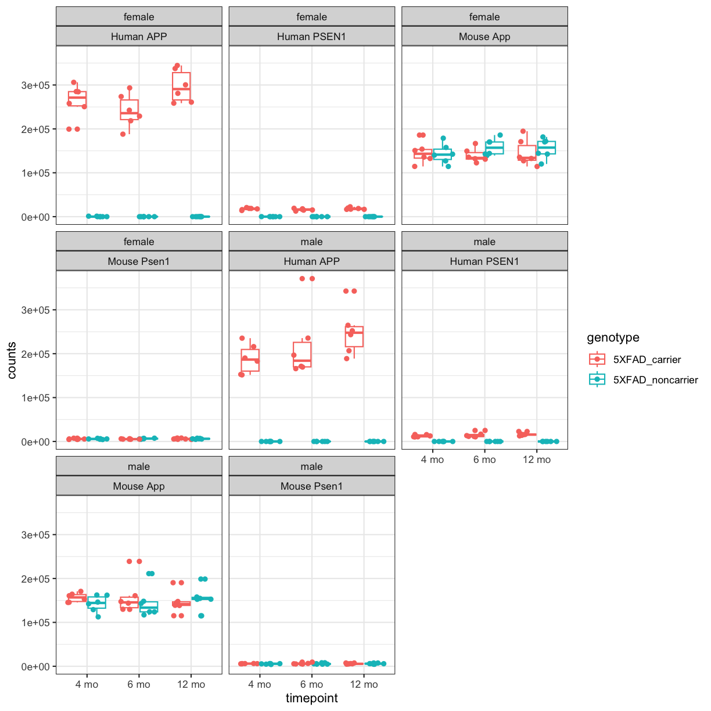

---
# Please do not edit this file directly; it is auto generated.
# Instead, please edit 03-DESeq_figTest.md in _episodes_rmd/
source: Rmd
title: "Differential Expression Analysis"
teaching: 40
exercises: 10
questions:
- "What transcriptomic changes we observe in mouse models carrying AD-related mutations?"
objectives:
- "Read in a count matrix and metadata."
- "Understand the data from AD mouse models"
- "Format the data for differential analysis"
- "Perform differential analysis using DESeq2."
- "Pathway enrichment of differentially expressed genes"
- "Save data for next lessons"
---

Author: Ravi Pandey, Jackson Laboratory

## LOAD libraries

~~~
suppressPackageStartupMessages(library("DESeq2"))
suppressPackageStartupMessages(library("ggplot2"))
suppressPackageStartupMessages(library("AnnotationDbi"))
suppressPackageStartupMessages(library("org.Mm.eg.db"))
suppressPackageStartupMessages(library("GO.db"))
suppressPackageStartupMessages(library("EnhancedVolcano"))
suppressPackageStartupMessages(library(tidyverse))
suppressPackageStartupMessages(library(dplyr))
suppressPackageStartupMessages(library(clusterProfiler))
~~~
{: .language-r}

## Reading Gene Expression Count matrix from  Previous Lesson
In this lesson, we will use the raw counts matrix and metadata downloaded in the previous lesson and will perform differential expression analysis. 

### RNA-Seq data from 5xFAD mouse models

~~~
counts <- read.delim("../data/htseqcounts_5XFAD.txt", check.names = FALSE)
~~~
{: .language-r}

Reading Sample Metadata from Previous Lesson

~~~
covars <- readRDS("../data/covars_5XFAD.rds")
~~~
{: .language-r}

Let's explore the data: 

Let’s look at the top of the metadata.

~~~
head(covars)
~~~
{: .language-r}

~~~
        individualID specimenID    sex         genotype timepoint
32043rh        32043    32043rh female    5XFAD_carrier     12 mo
32044rh        32044    32044rh   male 5XFAD_noncarrier     12 mo
32046rh        32046    32046rh   male 5XFAD_noncarrier     12 mo
32047rh        32047    32047rh   male 5XFAD_noncarrier     12 mo
32049rh        32049    32049rh female 5XFAD_noncarrier     12 mo
32057rh        32057    32057rh female 5XFAD_noncarrier     12 mo
~~~
{: .output}

identify distinct groups using sample metadata

~~~
distinct(covars, sex, genotype, timepoint)
~~~
{: .language-r}

~~~
           sex         genotype timepoint
32043rh female    5XFAD_carrier     12 mo
32044rh   male 5XFAD_noncarrier     12 mo
32049rh female 5XFAD_noncarrier     12 mo
46105rh female 5XFAD_noncarrier      6 mo
46108rh   male 5XFAD_noncarrier      6 mo
46131rh female 5XFAD_noncarrier      4 mo
46877rh   male 5XFAD_noncarrier      4 mo
46887rh female    5XFAD_carrier      4 mo
32053rh   male    5XFAD_carrier     12 mo
46111rh female    5XFAD_carrier      6 mo
46865rh   male    5XFAD_carrier      6 mo
46866rh   male    5XFAD_carrier      4 mo
~~~
{: .output}

We're going to explore the data further using a series of Challenges. 
You will be asked to look at the contents of some of the columns to see 
how the data are 
distributed.

> ## Challenge 1
> How many mice were used to produce this data? 
>
> > ## Solution to Challenge 1
> >
> > covars %>% group_by(sex,genotype,timepoint) %>% count()
> > dplyr::count(metadata, sex, genotype,timepoint)
> {: .solution}
{: .challenge}

How many rows and columns are there in `counts`?

~~~
dim(counts)
~~~
{: .language-r}

~~~
[1] 55489    73
~~~
{: .output}

In the counts matrix, genes are in rows and samples are in columns. Let’s look at the first few rows.

~~~
head(counts,n=5)
~~~
{: .language-r}

~~~
             gene_id 32043rh 32044rh 32046rh 32047rh 32048rh 32049rh 32050rh
1    ENSG00000080815   22554       0       0       0   16700       0       0
2    ENSG00000142192  344489       4       0       1  260935       6       8
3 ENSMUSG00000000001    5061    3483    3941    3088    2756    3067    2711
4 ENSMUSG00000000003       0       0       0       0       0       0       0
5 ENSMUSG00000000028     208     162     138     127      95     154     165
  32052rh 32053rh 32057rh 32059rh 32061rh 32062rh 32065rh 32067rh 32068rh
1   19748   14023       0   17062       0   15986      10       0   18584
2  337456  206851       1  264748       0  252248     172       4  300398
3    3334    3841    4068    3306    4076    3732    3940    4238    3257
4       0       0       0       0       0       0       0       0       0
5     124     103     164     116     108     134     204     239     148
  32070rh 32073rh 32074rh 32075rh 32078rh 32081rh 32088rh 32640rh 46105rh
1       1       0       0   22783   17029   16626   15573   12721       4
2       4       2       9  342655  280968  258597  243373  188818      19
3    3351    3449    4654    4844    3132    3334    3639    3355    4191
4       0       0       0       0       0       0       0       0       0
5     159     167     157     211     162     149     160     103     158
  46106rh 46107rh 46108rh 46109rh 46110rh 46111rh 46112rh 46113rh 46115rh
1       0       0       0       0       0   17931       0   19087       0
2       0       0       1       5       1  293409       8  273704       1
3    3058    4265    3248    3638    3747    3971    3192    3805    3753
4       0       0       0       0       0       0       0       0       0
5     167     199     113     168     175     203     158     108     110
  46121rh 46131rh 46132rh 46134rh 46138rh 46141rh 46142rh 46862rh 46863rh
1       0       0   12703   18833       0   18702   17666       0   14834
2       0       1  187975  285048       0  284499  250600       0  218494
3    4134    3059    3116    3853    3682    2844    3466    3442    3300
4       0       0       0       0       0       0       0       0       0
5     179     137     145     183     171     138      88     154     157
  46865rh 46866rh 46867rh 46868rh 46871rh 46872rh 46873rh 46874rh 46875rh
1   10546   10830   10316   10638   15248       0       0   11608   11561
2  169516  152769  151732  190150  229063       6       1  165941  171303
3    3242    3872    3656    3739    3473    3154    5510    3657    4121
4       0       0       0       0       0       0       0       0       0
5     131     152     152     155     140      80     240     148     112
  46876rh 46877rh 46878rh 46879rh 46881rh 46882rh 46883rh 46884rh 46885rh
1       0       0   12683   15613       0   14084   20753       0       0
2       0       2  183058  216122       0  199448  306081       0       5
3    3422    3829    3996    4324    2592    2606    4600    2913    3614
4       0       0       0       0       0       0       0       0       0
5     147     166     169     215     115     101     174     127     151
  46886rh 46887rh 46888rh 46889rh 46890rh 46891rh 46892rh 46893rh 46895rh
1   16639   16072       0   16680   13367       0   25119      92       0
2  242543  258061       0  235530  196721       0  371037    1116       0
3    3294    3719    3899    4173    4008    3037    5967    3459    4262
4       0       0       0       0       0       0       0       0       0
5     139     128     210     127     156     116     260     161     189
  46896rh 46897rh
1   15934       0
2  235343       6
3    3923    3486
4       0       0
5     179     117
~~~
{: .output}

As you can see, the gene ids are ENSEBL IDs. There is some risk that these may not be unique. Let’s check whether any of the gene symbols are duplicated. We will sum the number of duplicated gene symbols.

~~~
sum(duplicated(rownames(counts)))
~~~
{: .language-r}

~~~
[1] 0
~~~
{: .output}

The sum equals zero, so there are no duplicated gene symbols, which is good. Similarly, samples should be unique. Once again, let's verify this:

~~~
sum(duplicated(colnames(counts)))
~~~
{: .language-r}

~~~
[1] 0
~~~
{: .output}

### Formatting the count matrix
Now, as we see that gene_id is in first column of count matrix, but we will need only count data in matrix, so we will change the gene_id column to rownames.  
Converting the gene_id as rownames of count matrix

~~~
counts <- counts %>% column_to_rownames(.,var="gene_id") %>% as.data.frame()
~~~
{: .language-r}

let's confirm if change is done correctly

~~~
head(counts,n=5)
~~~
{: .language-r}

~~~
                   32043rh 32044rh 32046rh 32047rh 32048rh 32049rh 32050rh
ENSG00000080815      22554       0       0       0   16700       0       0
ENSG00000142192     344489       4       0       1  260935       6       8
ENSMUSG00000000001    5061    3483    3941    3088    2756    3067    2711
ENSMUSG00000000003       0       0       0       0       0       0       0
ENSMUSG00000000028     208     162     138     127      95     154     165
                   32052rh 32053rh 32057rh 32059rh 32061rh 32062rh 32065rh
ENSG00000080815      19748   14023       0   17062       0   15986      10
ENSG00000142192     337456  206851       1  264748       0  252248     172
ENSMUSG00000000001    3334    3841    4068    3306    4076    3732    3940
ENSMUSG00000000003       0       0       0       0       0       0       0
ENSMUSG00000000028     124     103     164     116     108     134     204
                   32067rh 32068rh 32070rh 32073rh 32074rh 32075rh 32078rh
ENSG00000080815          0   18584       1       0       0   22783   17029
ENSG00000142192          4  300398       4       2       9  342655  280968
ENSMUSG00000000001    4238    3257    3351    3449    4654    4844    3132
ENSMUSG00000000003       0       0       0       0       0       0       0
ENSMUSG00000000028     239     148     159     167     157     211     162
                   32081rh 32088rh 32640rh 46105rh 46106rh 46107rh 46108rh
ENSG00000080815      16626   15573   12721       4       0       0       0
ENSG00000142192     258597  243373  188818      19       0       0       1
ENSMUSG00000000001    3334    3639    3355    4191    3058    4265    3248
ENSMUSG00000000003       0       0       0       0       0       0       0
ENSMUSG00000000028     149     160     103     158     167     199     113
                   46109rh 46110rh 46111rh 46112rh 46113rh 46115rh 46121rh
ENSG00000080815          0       0   17931       0   19087       0       0
ENSG00000142192          5       1  293409       8  273704       1       0
ENSMUSG00000000001    3638    3747    3971    3192    3805    3753    4134
ENSMUSG00000000003       0       0       0       0       0       0       0
ENSMUSG00000000028     168     175     203     158     108     110     179
                   46131rh 46132rh 46134rh 46138rh 46141rh 46142rh 46862rh
ENSG00000080815          0   12703   18833       0   18702   17666       0
ENSG00000142192          1  187975  285048       0  284499  250600       0
ENSMUSG00000000001    3059    3116    3853    3682    2844    3466    3442
ENSMUSG00000000003       0       0       0       0       0       0       0
ENSMUSG00000000028     137     145     183     171     138      88     154
                   46863rh 46865rh 46866rh 46867rh 46868rh 46871rh 46872rh
ENSG00000080815      14834   10546   10830   10316   10638   15248       0
ENSG00000142192     218494  169516  152769  151732  190150  229063       6
ENSMUSG00000000001    3300    3242    3872    3656    3739    3473    3154
ENSMUSG00000000003       0       0       0       0       0       0       0
ENSMUSG00000000028     157     131     152     152     155     140      80
                   46873rh 46874rh 46875rh 46876rh 46877rh 46878rh 46879rh
ENSG00000080815          0   11608   11561       0       0   12683   15613
ENSG00000142192          1  165941  171303       0       2  183058  216122
ENSMUSG00000000001    5510    3657    4121    3422    3829    3996    4324
ENSMUSG00000000003       0       0       0       0       0       0       0
ENSMUSG00000000028     240     148     112     147     166     169     215
                   46881rh 46882rh 46883rh 46884rh 46885rh 46886rh 46887rh
ENSG00000080815          0   14084   20753       0       0   16639   16072
ENSG00000142192          0  199448  306081       0       5  242543  258061
ENSMUSG00000000001    2592    2606    4600    2913    3614    3294    3719
ENSMUSG00000000003       0       0       0       0       0       0       0
ENSMUSG00000000028     115     101     174     127     151     139     128
                   46888rh 46889rh 46890rh 46891rh 46892rh 46893rh 46895rh
ENSG00000080815          0   16680   13367       0   25119      92       0
ENSG00000142192          0  235530  196721       0  371037    1116       0
ENSMUSG00000000001    3899    4173    4008    3037    5967    3459    4262
ENSMUSG00000000003       0       0       0       0       0       0       0
ENSMUSG00000000028     210     127     156     116     260     161     189
                   46896rh 46897rh
ENSG00000080815      15934       0
ENSG00000142192     235343       6
ENSMUSG00000000001    3923    3486
ENSMUSG00000000003       0       0
ENSMUSG00000000028     179     117
~~~
{: .output}

As you can see from count table there are some genes that start with **"ENSG"** and others start with **"ENSMUSG"**. **"ENSG"** referes to human gene ENSEMBL id and **"ENSMUSG"** refer to mouse ENSEMBL id. Let's check how many gene_ids are NOT from the mouse genome by searching for the string "MUS" (as in Mus musculus) in the rownames of count matrix

~~~
counts[,1:6] %>% 
  filter(!str_detect(rownames(.), "MUS"))
~~~
{: .language-r}

~~~
                32043rh 32044rh 32046rh 32047rh 32048rh 32049rh
ENSG00000080815   22554       0       0       0   16700       0
ENSG00000142192  344489       4       0       1  260935       6
~~~
{: .output}
Ok, so we see there are two human genes in out count matrix. Why? What genes are they?

Briefly, 5xFAD mouse strain harbors two human transgenes APP ("ENSG00000142192") and PSEN1 ("ENSG00000080815") and inserted into exon 2 of the mouse Thy1 gene. To validate 5XFAD strain and capture expression of human transgene APP and PS1, a custom mouse genomic sequences was created and we quantified expression of human as well as mouse App ("ENSMUSG00000022892") and Psen1 ("ENSMUSG00000019969") genes by our MODEL-AD RNA-Seq pipeline.

### Validation of 5xFAD mouse strain

#First we convert the dataframe to longer format and join our covariates by MouseID

~~~
count_tpose <- counts  %>%
                rownames_to_column(.,var="gene_id") %>% 
                filter(gene_id %in% c("ENSG00000080815","ENSMUSG00000019969","ENSG00000142192","ENSMUSG00000022892")) %>% 
                pivot_longer(.,cols = -"gene_id",names_to = "specimenID",values_to="counts") %>% as.data.frame() %>%
                left_join(covars ,by="specimenID") %>% as.data.frame()
head(count_tpose) 
~~~
{: .language-r}

~~~
          gene_id specimenID counts individualID    sex         genotype
1 ENSG00000080815    32043rh  22554        32043 female    5XFAD_carrier
2 ENSG00000080815    32044rh      0        32044   male 5XFAD_noncarrier
3 ENSG00000080815    32046rh      0        32046   male 5XFAD_noncarrier
4 ENSG00000080815    32047rh      0        32047   male 5XFAD_noncarrier
5 ENSG00000080815    32048rh  16700        32048 female    5XFAD_carrier
6 ENSG00000080815    32049rh      0        32049 female 5XFAD_noncarrier
  timepoint
1     12 mo
2     12 mo
3     12 mo
4     12 mo
5     12 mo
6     12 mo
~~~
{: .output}

~~~
#make the age column a factor and re-order the levels
count_tpose$timepoint <- factor(count_tpose$timepoint,levels=c("4 mo","6 mo","12 mo"))

# rename the gene id to gene symbol
count_tpose$gene_id[count_tpose$gene_id %in% "ENSG00000142192"] <- "Human APP"
count_tpose$gene_id[count_tpose$gene_id %in% "ENSG00000080815"] <- "Human PSEN1"
count_tpose$gene_id[count_tpose$gene_id %in% "ENSMUSG00000022892"] <- "Mouse App"
count_tpose$gene_id[count_tpose$gene_id %in% "ENSMUSG00000019969"] <- "Mouse Psen1"
~~~
{: .language-r}

~~~
#Create simple box plots showing normalized counts by genotype and time point, faceted by sex.
count_tpose %>% 
  ggplot(aes(x=timepoint, y=counts, color=genotype)) +
  geom_boxplot() + 
  geom_point(position=position_jitterdodge()) +
  facet_wrap(~sex+gene_id) +theme_bw()
~~~
{: .language-r}

plot of chunk counts_boxplot

You will notice expression of Human APP is higher in 5XFAD carriers but lower in non-carriers. However mouse App expressed in both 5XFAD carrier and non-carrier. 

We are going to sum the counts from both ortholgous genes (human APP and mouse App; human PSEN1 and mouse Psen1) and save summed expression as expression of mouse genes, respectively to match with gene names in control mice.

~~~
#merge mouse and human APP gene raw count
counts[rownames(counts) %in% "ENSMUSG00000022892",] <- counts[rownames(counts) %in% "ENSMUSG00000022892",] + counts[rownames(counts) %in% "ENSG00000142192",]
counts <- counts[!rownames(counts) %in% c("ENSG00000142192"),]

#merge mouse and human PS1 gene raw count
counts[rownames(counts) %in% "ENSMUSG00000019969",] <- counts[rownames(counts) %in% "ENSMUSG00000019969",] + counts[rownames(counts) %in% "ENSG00000080815",]
counts <- counts[!rownames(counts) %in% c("ENSG00000080815"),]
~~~
{: .language-r}

Let's verify if expression of both human genes have been merged or not:

~~~
counts[,1:6] %>% 
  filter(!str_detect(rownames(.), "MUS"))
~~~
{: .language-r}

~~~
[1] 32043rh 32044rh 32046rh 32047rh 32048rh 32049rh
<0 rows> (or 0-length row.names)
~~~
{: .output}

What proportion of genes have zero counts in all samples?

~~~
gene_sums <- data.frame(gene_id = rownames(counts),
                        sums    = Matrix::rowSums(counts))
sum(gene_sums$sums == 0)
~~~
{: .language-r}

~~~
[1] 9691
~~~
{: .output}
We can see that 9691 (17%) genes have no reads at all associated with them. In the next lesson, we will remove genes that have no counts in any samples.

### Session Info

~~~
sessionInfo()
~~~
{: .language-r}

~~~
R version 4.3.0 (2023-04-21)
Platform: aarch64-apple-darwin20 (64-bit)
Running under: macOS Monterey 12.6.2

Matrix products: default
BLAS:   /Library/Frameworks/R.framework/Versions/4.3-arm64/Resources/lib/libRblas.0.dylib 
LAPACK: /Library/Frameworks/R.framework/Versions/4.3-arm64/Resources/lib/libRlapack.dylib;  LAPACK version 3.11.0

locale:
[1] en_US.UTF-8/en_US.UTF-8/en_US.UTF-8/C/en_US.UTF-8/en_US.UTF-8

time zone: America/New_York
tzcode source: internal

attached base packages:
[1] stats4    stats     graphics  grDevices utils     datasets  methods  
[8] base     

other attached packages:
 [1] clusterProfiler_4.8.1       lubridate_1.9.2            
 [3] forcats_1.0.0               stringr_1.5.0              
 [5] dplyr_1.1.2                 purrr_1.0.1                
 [7] readr_2.1.4                 tidyr_1.3.0                
 [9] tibble_3.2.1                tidyverse_2.0.0            
[11] EnhancedVolcano_1.18.0      ggrepel_0.9.3              
[13] GO.db_3.17.0                org.Mm.eg.db_3.17.0        
[15] AnnotationDbi_1.62.1        ggplot2_3.4.2              
[17] DESeq2_1.40.1               SummarizedExperiment_1.30.2
[19] Biobase_2.60.0              MatrixGenerics_1.12.0      
[21] matrixStats_1.0.0           GenomicRanges_1.52.0       
[23] GenomeInfoDb_1.36.0         IRanges_2.34.0             
[25] S4Vectors_0.38.1            BiocGenerics_0.46.0        
[27] knitr_1.43                 

loaded via a namespace (and not attached):
 [1] DBI_1.1.3               bitops_1.0-7            gson_0.1.0             
 [4] shadowtext_0.1.2        gridExtra_2.3           rlang_1.1.1            
 [7] magrittr_2.0.3          DOSE_3.26.1             compiler_4.3.0         
[10] RSQLite_2.3.1           png_0.1-8               vctrs_0.6.2            
[13] reshape2_1.4.4          pkgconfig_2.0.3         crayon_1.5.2           
[16] fastmap_1.1.1           XVector_0.40.0          labeling_0.4.2         
[19] ggraph_2.1.0            utf8_1.2.3              HDO.db_0.99.1          
[22] tzdb_0.4.0              enrichplot_1.20.0       bit_4.0.5              
[25] xfun_0.39               zlibbioc_1.46.0         cachem_1.0.8           
[28] aplot_0.1.10            jsonlite_1.8.5          blob_1.2.4             
[31] highr_0.10              DelayedArray_0.26.3     BiocParallel_1.34.2    
[34] tweenr_2.0.2            parallel_4.3.0          R6_2.5.1               
[37] RColorBrewer_1.1-3      stringi_1.7.12          GOSemSim_2.26.0        
[40] Rcpp_1.0.10             downloader_0.4          Matrix_1.5-4           
[43] splines_4.3.0           igraph_1.4.3            timechange_0.2.0       
[46] tidyselect_1.2.0        viridis_0.6.3           qvalue_2.32.0          
[49] codetools_0.2-19        lattice_0.21-8          plyr_1.8.8             
[52] treeio_1.24.1           withr_2.5.0             KEGGREST_1.40.0        
[55] evaluate_0.21           gridGraphics_0.5-1      scatterpie_0.2.1       
[58] polyclip_1.10-4         Biostrings_2.68.1       ggtree_3.8.0           
[61] pillar_1.9.0            ggfun_0.0.9             generics_0.1.3         
[64] RCurl_1.98-1.12         hms_1.1.3               tidytree_0.4.2         
[67] munsell_0.5.0           scales_1.2.1            glue_1.6.2             
[70] lazyeval_0.2.2          tools_4.3.0             data.table_1.14.8      
[73] fgsea_1.26.0            locfit_1.5-9.8          graphlayouts_1.0.0     
[76] fastmatch_1.1-3         tidygraph_1.2.3         cowplot_1.1.1          
[79] grid_4.3.0              ape_5.7-1               colorspace_2.1-0       
[82] nlme_3.1-162            patchwork_1.1.2         GenomeInfoDbData_1.2.10
[85] ggforce_0.4.1           cli_3.6.1               fansi_1.0.4            
[88] viridisLite_0.4.2       S4Arrays_1.0.4          gtable_0.3.3           
[91] yulab.utils_0.0.6       digest_0.6.31           ggplotify_0.1.0        
[94] farver_2.1.1            memoise_2.0.1           lifecycle_1.0.3        
[97] httr_1.4.6              bit64_4.0.5             MASS_7.3-58.4          
~~~
{: .output}

