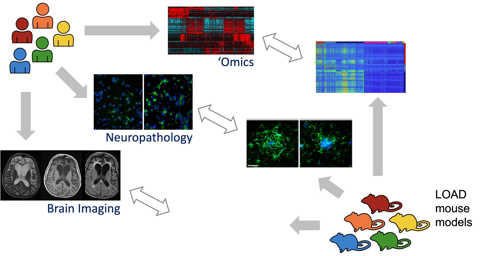
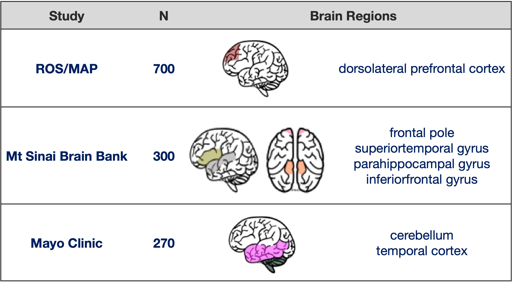
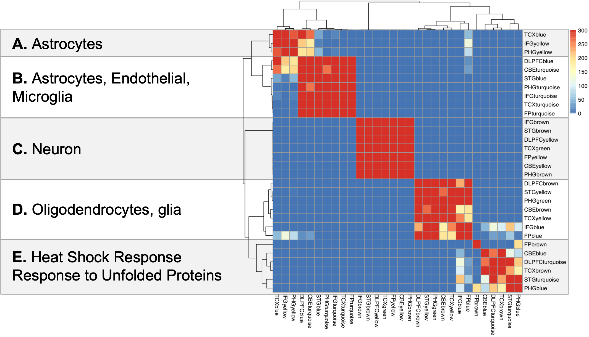
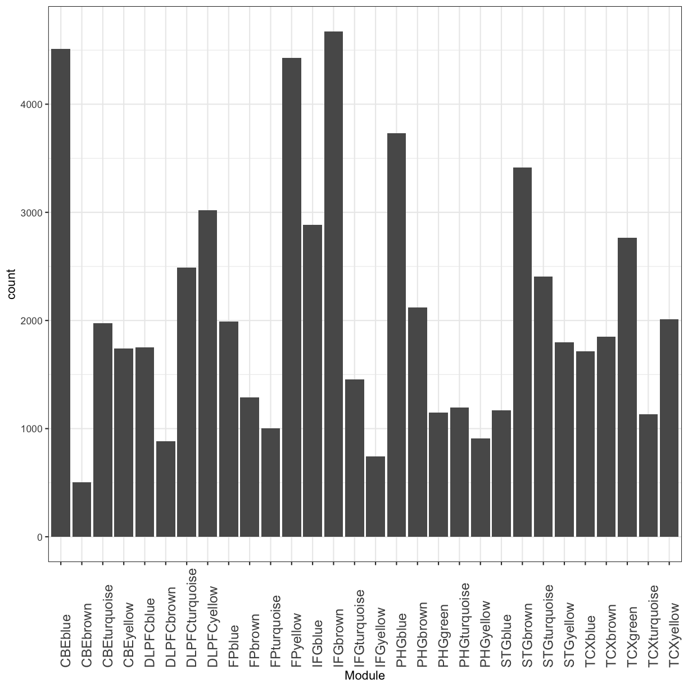
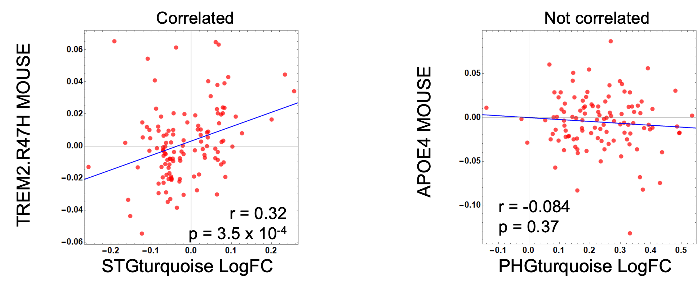
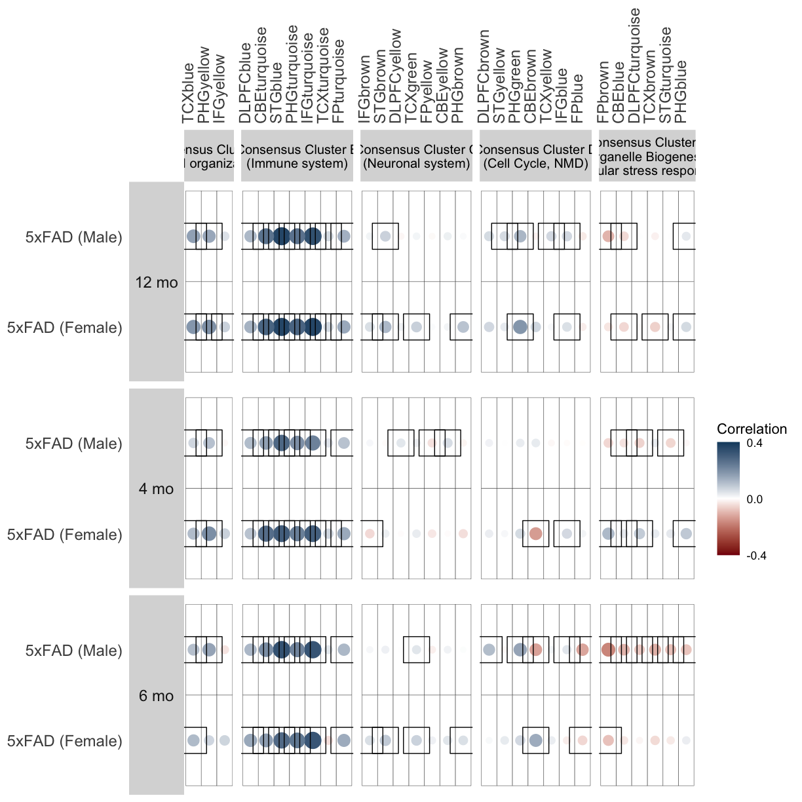
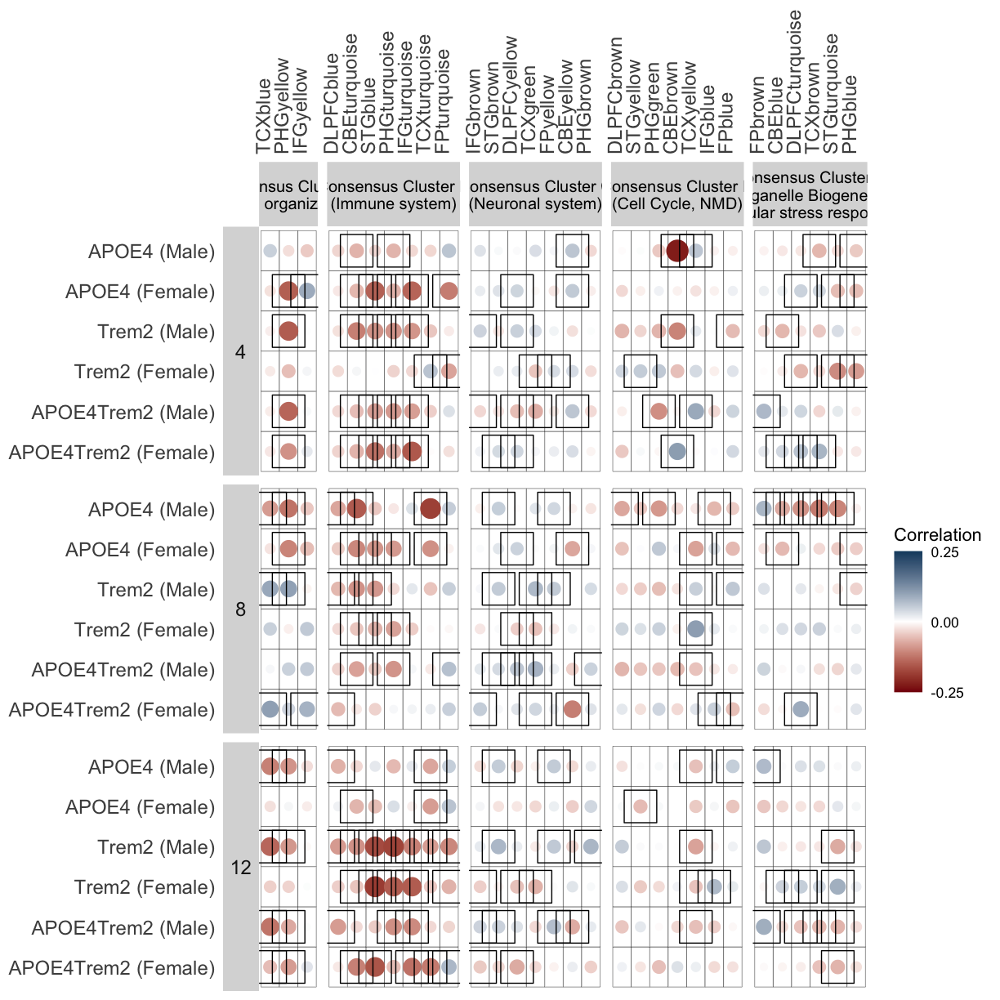

---
# Please do not edit this file directly; it is auto generated.
# Instead, please edit 04-AMPAD_correlation.md in _episodes_rmd/
title: "Mouse-human alignment of transcriptomic signatures"
output: html_document
teaching: 30
exercises: 10
questions:
- "How well transcriptomic changes we observe in mouse models carrying AD-related mutations align with human AD data?"
- "How do we perfrom corss-species comparison"
objectives:
- "Understand the human AD modules."
- "Approach to align mouse data to human data"
- "Perform correlation analysis."
- "visualize the results"
keypoints:
- "AMP-AD gene modules represent major transcriptomic heterogeneity in AD."
- "Correlation of logFC is a practical approach for human-mouse alignment of AD-associated transcriptomic signatures."
---

Author: Ravi Pandey, Jackson Laboratory

## Aligning Human and Mouse Phenotype

ALZHEIMER'S DISEASE (AD) is complex disease, we do not expect these mouse models have complete LOAD (late-onset AD) pathology. We can do MRI as well PET imaging to match  back to human imaging study ADNI, we can do neuropathology, finally we can do lots of Genomics, proteomics, and metabolomics. These omics study allows us to do real direct homology comparison between human and mouse as genes are overwhemly shared between these two species.

## Overview of Human transcriptomic data
Three independent human brain transcriptome studies ROSMAP [Religious Orders Study and the Memory and Aging Project], MSSM [Mount Sinai School of Medicine], and Mayo collected human postmortem brain RNA-seq data from seven distinct regions: dorsolateral prefrontal cortex (DLPFC), temporal cortex (TCX), inferior frontal gyrus (IFG), superior temporal gyrus (STG), frontal pole (FP), parahippocampal gyrus (PHG), and cerebellum (CBE), 

These postmortem samples are generally balanced for AD, MCI, and non-effected controls. This really give us broad assessment how AD as affecetd multiple brain region in 3 different population around the US.

## Overview of Human Consensus RNA-Seq Coexpression Modules

The Accelerating Medicines Partnership-Alzheimer’s Disease (AMP-AD) Consortium has generated RNA-seq profiles from more than 1,200 human brains and is applying systems biology approaches toward the goal of elucidating AD mechanisms and potential therapeutic targets.

[Wan, et al.](https://doi.org/10.1016/j.celrep.2020.107908) performed meta analysis including all available AMP-AD RNA-seq datasets and systematically define correspondences between gene expression changes associated with AD in human brains. Briefly, [Wan, et al.](https://doi.org/10.1016/j.celrep.2020.107908) performed library normalization and covariate adjustments for each human study separately using fixed/mixed effects modeling to account for batch effects. Among the 2978 AMP-AD modules identified across all tissues, 660 modules were selected which showed an enrichment for at least one AD-specific differential expressed gene set from the meta-analysis in cases compared to controls. 

Next, they performed multi method co-expression network analysis  followed by differential analysis and found 30 co-expression modules related LOAD pathology from human cohort study. Among the 30 aggregate co-expression modules, five consensus clusters have been described by Wan, et al. These consensus clusters consist of a subset of modules which are associated with similar AD related changes across the multiple studies and brain regions. Further, they looked for enrichment of cell type signature in these modules using expression-weighted cell type enrichment analysis [Skene and Grant, 2016](https://doi.org/10.3389/fnins.2016.00016) as well as  applied functional annotation to these modules.

First module block enriched in astrocytes, next block is enriched in endothelial and microglial genes suggesting strong inflammation component, next block in strongly enriched in neuron suggesting neurodegeneration, next is enriched in oligodendrocytes and glial genes suggesting myelination and finally mixed modules that have things to do like stress response and response to unfolded proteins. Stress response not cell specific,so they may be throughout many cells in brain.

Here we are showing matrix view of gene content overlap between these  module, and you can see few strongly overlapping group of modules, implicating similar pathology in different studies in different brain regions.

## Reading AMP-AD modules data

You can download data on the 30 human AMP-AD co-expression modules was obtained from the Synapse data repository (https://www.synapse.org/#!Synapse:syn11932957/tables/; SynapseID: syn11932957). 

~~~
query <- synTableQuery("SELECT * FROM syn11932957")
module_table <- read.table(query$filepath, sep = ",",header = TRUE)
~~~
{: .language-r}

Let's look at module table

~~~
head(module_table)
~~~
{: .language-r}

~~~
  ROW_ID ROW_VERSION          GeneID         Module    method
1      0           0 ENSG00000168439 DLPFCturquoise aggregate
2      1           0 ENSG00000086061 DLPFCturquoise aggregate
3      2           0 ENSG00000204389 DLPFCturquoise aggregate
4      3           0 ENSG00000114416 DLPFCturquoise aggregate
5      4           0 ENSG00000110172 DLPFCturquoise aggregate
6      5           0 ENSG00000099622 DLPFCturquoise aggregate
               ModuleName brainRegion               ModuleNameFull
1 aggregateDLPFCturquoise       DLPFC aggregateDLPFCturquoiseDLPFC
2 aggregateDLPFCturquoise       DLPFC aggregateDLPFCturquoiseDLPFC
3 aggregateDLPFCturquoise       DLPFC aggregateDLPFCturquoiseDLPFC
4 aggregateDLPFCturquoise       DLPFC aggregateDLPFCturquoiseDLPFC
5 aggregateDLPFCturquoise       DLPFC aggregateDLPFCturquoiseDLPFC
6 aggregateDLPFCturquoise       DLPFC aggregateDLPFCturquoiseDLPFC
  external_gene_name
1              STIP1
2             DNAJA1
3             HSPA1A
4               FXR1
5            CHORDC1
6              CIRBP
~~~
{: .output}

Here you see total 9 columns in this table. Column of our interest are:
*Colum 2: human ensembl gene ID, 
*column 3: module name in which gene is clustered and 
*column 7: is brain tissue.
*column 9: is gene names.

How many distinct modules are in table?

~~~
length(unique(module_table$Module))
~~~
{: .language-r}

~~~
[1] 30
~~~
{: .output}

What are the name of modules?

~~~
unique(module_table$Module)
~~~
{: .language-r}

~~~
 [1] "DLPFCturquoise" "DLPFCblue"      "DLPFCbrown"     "DLPFCyellow"   
 [5] "CBEturquoise"   "CBEblue"        "CBEbrown"       "CBEyellow"     
 [9] "TCXturquoise"   "TCXblue"        "TCXbrown"       "TCXyellow"     
[13] "TCXgreen"       "IFGturquoise"   "IFGblue"        "IFGbrown"      
[17] "IFGyellow"      "STGturquoise"   "STGblue"        "STGbrown"      
[21] "STGyellow"      "PHGturquoise"   "PHGblue"        "PHGbrown"      
[25] "PHGyellow"      "PHGgreen"       "FPturquoise"    "FPblue"        
[29] "FPbrown"        "FPyellow"      
~~~
{: .output}

and how many genes are in each module?

~~~
table(module_table$Module)
~~~
{: .language-r}

~~~

       CBEblue       CBEbrown   CBEturquoise      CBEyellow      DLPFCblue 
          4509            504           1977           1739           1751 
    DLPFCbrown DLPFCturquoise    DLPFCyellow         FPblue        FPbrown 
           882           2489           3019           1991           1289 
   FPturquoise       FPyellow        IFGblue       IFGbrown   IFGturquoise 
          1001           4426           2885           4673           1456 
     IFGyellow        PHGblue       PHGbrown       PHGgreen   PHGturquoise 
           743           3733           2123           1151           1195 
     PHGyellow        STGblue       STGbrown   STGturquoise      STGyellow 
           910           1171           3414           2404           1799 
       TCXblue       TCXbrown       TCXgreen   TCXturquoise      TCXyellow 
          1713           1851           2766           1131           2013 
~~~
{: .output}

You can also visualize this as bar plot using ggplot2 package. 

~~~
ggplot(module_table,aes(x=Module)) + 
  geom_bar() + 
  theme_bw() + 
  theme(axis.text.x = ggplot2::element_text(angle = 90, hjust = 0, size = 12))
~~~
{: .language-r}

plot of chunk module_nGenes

> ## Challenge 1
> What are other ways to count genes in each module? 
>
> > ## Solution to Challenge 1
> >
> > ~~~
> > dplyr::count(module_table ,Module)
> > ~~~
> > {: .language-r}
> {: .solution}
{: .challenge}

We can also check total unique genes in table

~~~
length(unique((module_table$GeneID)))
~~~
{: .language-r}

~~~
[1] 17033
~~~
{: .output}

You can also check which modules come from which brain region.

~~~
unique(module_table[c("Module", "brainRegion")])
~~~
{: .language-r}

~~~
              Module brainRegion
1     DLPFCturquoise       DLPFC
2490       DLPFCblue       DLPFC
4241      DLPFCbrown       DLPFC
5123     DLPFCyellow       DLPFC
8142    CBEturquoise         CBE
10119        CBEblue         CBE
14628       CBEbrown         CBE
15132      CBEyellow         CBE
16871   TCXturquoise         TCX
18002        TCXblue         TCX
19715       TCXbrown         TCX
21566      TCXyellow         TCX
23579       TCXgreen         TCX
26345   IFGturquoise         IFG
27801        IFGblue         IFG
30686       IFGbrown         IFG
35359      IFGyellow         IFG
36102   STGturquoise         STG
38506        STGblue         STG
39677       STGbrown         STG
43091      STGyellow         STG
44890   PHGturquoise         PHG
46085        PHGblue         PHG
49818       PHGbrown         PHG
51941      PHGyellow         PHG
52851       PHGgreen         PHG
54002    FPturquoise          FP
55003         FPblue          FP
56994        FPbrown          FP
58283       FPyellow          FP
~~~
{: .output}

#### Mouse-Human orthologous gene conversion
In module table, we have human ENSEMBL ids and gene names. But we will need corresponding mouse gene name, so that we can compare with our results from mouse models. To do this, we are going to add mouse orthologous gene names corresponding to human ENSEMBL id. Mouse orthologs for human genes were extracted using the [HCOP](https://www.genenames.org/tools/hcop/) tool (The HGNC Comparison of Orthology Predictions) by [Wan, et al.](https://doi.org/10.1016/j.celrep.2020.107908). We are going to read that table from the Synapse data repository (https://doi.org/10.7303/syn17010253.1,synapse id:syn17010253)

~~~
mouse.human.ortho <- fread(synapser::synGet("syn17010253")$path,check.names = F,header=T)
~~~
{: .language-r}

Let's see top rows of this ortholog table:

~~~
head(mouse.human.ortho)
~~~
{: .language-r}

~~~
   human_entrez_gene human_ensembl_gene hgnc_id
1:                 -    ENSG00000274059       -
2:                 -    ENSG00000212595       -
3:                 -    ENSG00000277418       -
4:                 -    ENSG00000274759       -
5:                 -    ENSG00000274663       -
6:                 -    ENSG00000277488       -
                                   human_name human_symbol human_chr
1: 5S ribosomal RNA [Source:RFAM;Acc:RF00001]      5S_rRNA         1
2: 5S ribosomal RNA [Source:RFAM;Acc:RF00001]      5S_rRNA         X
3: 5S ribosomal RNA [Source:RFAM;Acc:RF00001]      5S_rRNA         8
4: 5S ribosomal RNA [Source:RFAM;Acc:RF00001]      5S_rRNA         4
5: 5S ribosomal RNA [Source:RFAM;Acc:RF00001]      5S_rRNA        17
6: 5S ribosomal RNA [Source:RFAM;Acc:RF00001]      5S_rRNA        17
   human_assert_ids mouse_entrez_gene mouse_ensembl_gene      mgi_id
1:  ENSG00000274059                 - ENSMUSG00000089601 MGI:5451871
2:  ENSG00000212595                 - ENSMUSG00000088132 MGI:5452363
3:  ENSG00000277418                 - ENSMUSG00000088814 MGI:5452162
4:  ENSG00000274759                 - ENSMUSG00000084431 MGI:4421893
5:  ENSG00000274663                 - ENSMUSG00000084588 MGI:4421913
6:  ENSG00000277488                 - ENSMUSG00000084588 MGI:4421913
                   mouse_name mouse_symbol mouse_chr   mouse_assert_ids support
1:      predicted gene, 22094      Gm22094         - ENSMUSG00000089601 Ensembl
2:      predicted gene, 22586      Gm22586         - ENSMUSG00000088132 Ensembl
3:      predicted gene, 22385      Gm22385         - ENSMUSG00000088814 Ensembl
4: nuclear encoded rRNA 5S 48      n-R5s48         - ENSMUSG00000084431 Ensembl
5: nuclear encoded rRNA 5S 68      n-R5s68         - ENSMUSG00000084588 Ensembl
6: nuclear encoded rRNA 5S 68      n-R5s68         - ENSMUSG00000084588 Ensembl
~~~
{: .output}

Add mouse gene names from ortholog table to module table by matching human ENSEMBL ids from both tables . 

~~~
module_table$Mouse_gene_name <- mouse.human.ortho$mouse_symbol[match(module_table$GeneID,mouse.human.ortho$human_ensembl_gene)]
~~~
{: .language-r}

~~~
head(module_table)
~~~
{: .language-r}

~~~
  ROW_ID ROW_VERSION          GeneID         Module    method
1      0           0 ENSG00000168439 DLPFCturquoise aggregate
2      1           0 ENSG00000086061 DLPFCturquoise aggregate
3      2           0 ENSG00000204389 DLPFCturquoise aggregate
4      3           0 ENSG00000114416 DLPFCturquoise aggregate
5      4           0 ENSG00000110172 DLPFCturquoise aggregate
6      5           0 ENSG00000099622 DLPFCturquoise aggregate
               ModuleName brainRegion               ModuleNameFull
1 aggregateDLPFCturquoise       DLPFC aggregateDLPFCturquoiseDLPFC
2 aggregateDLPFCturquoise       DLPFC aggregateDLPFCturquoiseDLPFC
3 aggregateDLPFCturquoise       DLPFC aggregateDLPFCturquoiseDLPFC
4 aggregateDLPFCturquoise       DLPFC aggregateDLPFCturquoiseDLPFC
5 aggregateDLPFCturquoise       DLPFC aggregateDLPFCturquoiseDLPFC
6 aggregateDLPFCturquoise       DLPFC aggregateDLPFCturquoiseDLPFC
  external_gene_name Mouse_gene_name
1              STIP1           Stip1
2             DNAJA1          Dnaja1
3             HSPA1A          Hspa1a
4               FXR1            Fxr1
5            CHORDC1         Chordc1
6              CIRBP           Cirbp
~~~
{: .output}

We will only keep column of our interest and non-empty entries:

~~~
ampad_modules <- module_table %>%
  distinct(tissue = brainRegion, module = Module, gene = GeneID, Mouse_gene_name) %>%
  filter(Mouse_gene_name != "")
~~~
{: .language-r}

~~~
head(ampad_modules)
~~~
{: .language-r}

~~~
  tissue         module            gene Mouse_gene_name
1  DLPFC DLPFCturquoise ENSG00000168439           Stip1
2  DLPFC DLPFCturquoise ENSG00000086061          Dnaja1
3  DLPFC DLPFCturquoise ENSG00000204389          Hspa1a
4  DLPFC DLPFCturquoise ENSG00000114416            Fxr1
5  DLPFC DLPFCturquoise ENSG00000110172         Chordc1
6  DLPFC DLPFCturquoise ENSG00000099622           Cirbp
~~~
{: .output}

## Reading differential expression result of human data from meta-analysis
Differential expression meta-analysis of reprocessed RNASeq data from AMP-AD (all 7 brain regions). LogFC values for human transcripts were obtained via the AMP-AD knowledge portal(https://www.synapse.org/#!Synapse:syn11180450; SynapseID: syn11180450).  

~~~
ampad_modules_raw <- fread(synapser::synGet("syn11180450")$path,check.names = F,header=T)
~~~
{: .language-r}

Let's check the data

~~~
head(ampad_modules_raw)
~~~
{: .language-r}

~~~
             Model Tissue Comparison ensembl_gene_id      logFC       CI.L
1: SourceDiagnosis    CBE AD-CONTROL ENSG00000078043 -0.4455482 -0.5474320
2: SourceDiagnosis    CBE AD-CONTROL ENSG00000205302  0.4534512  0.3452585
3: SourceDiagnosis    CBE AD-CONTROL ENSG00000134982  0.5778206  0.4383669
4: SourceDiagnosis    CBE AD-CONTROL ENSG00000173230  0.5924321  0.4493164
5: SourceDiagnosis    CBE AD-CONTROL ENSG00000115204 -0.3426223 -0.4257147
6: SourceDiagnosis    CBE AD-CONTROL ENSG00000163867 -0.3176858 -0.3965217
         CI.R   AveExpr         t      P.Value    adj.P.Val        B Direction
1: -0.3436645 1.3320969 -8.592843 1.206969e-16 2.053175e-12 27.12967      DOWN
2:  0.5616439 2.9361993  8.235175 1.699316e-15 1.445353e-11 24.54943        UP
3:  0.7172742 3.5498628  8.141480 3.365041e-15 1.530863e-11 23.85060        UP
4:  0.7355477 3.0759381  8.133894 3.599700e-15 1.530863e-11 23.81776        UP
5: -0.2595299 2.2634337 -8.102128 4.512223e-15 1.535148e-11 23.62730      DOWN
6: -0.2388499 0.4404036 -7.918097 1.695179e-14 4.806115e-11 22.34035      DOWN
   hgnc_symbol percentage_gc_content gene.length Sex Study
1:       PIAS2                 38.59       17527 ALL  MAYO
2:        SNX2                 36.08        4254 ALL  MAYO
3:         APC                 37.63       12440 ALL  MAYO
4:      GOLGB1                 38.07       11865 ALL  MAYO
5:       MPV17                 50.33        5625 ALL  MAYO
6:       ZMYM6                 38.80        9591 ALL  MAYO
~~~
{: .output}

Data came from how many tissues?

~~~
unique(ampad_modules_raw$Tissue)
~~~
{: .language-r}

~~~
[1] "CBE"   "TCX"   "FP"    "IFG"   "PHG"   "STG"   "DLPFC"
~~~
{: .output}
We see that data is from all 7 brain regions.

AMP-AD data has been processed many ways and using different models and comparisons. Let's see how many ways data has been analyzed,

~~~
unique(ampad_modules_raw$Comparison)
~~~
{: .language-r}

~~~
 [1] "AD-CONTROL"                "PATH_AGE-CONTROL"         
 [3] "PSP-CONTROL"               "AD-PATH_AGE"              
 [5] "AD-OTHER"                  "OTHER-CONTROL"            
 [7] "2-0"                       "2-1"                      
 [9] "1-0"                       "CDR"                      
[11] "4-1"                       "4-2"                      
[13] "FEMALE-MALE"               "AD-CONTROL.IN.FEMALE-MALE"
[15] "AOD"                      
~~~
{: .output}

For our analysis, we need data for "Diagnosis" model and comparison between cases vs controls. So, we subset the logFC data for these conditions. Also, we need only three columns: "Tissue","Gene" and "logFC".  So, we will filter and subset the data.

~~~
ampad_fc <- ampad_modules_raw %>%
  as_tibble() %>%
  filter(Model == "Diagnosis", Comparison == "AD-CONTROL") %>%
  dplyr::select(tissue = Tissue, gene = ensembl_gene_id, ampad_fc = logFC)
~~~
{: .language-r}

#### Combine with modules so correlation can be done per module

Next, we will combine fold change table `ampad_fc` and module table `ampad_modules`. First, look at both tables to check how can we merge them together?

~~~
head(ampad_fc)
~~~
{: .language-r}

~~~
# A tibble: 6 × 3
  tissue gene            ampad_fc
  <chr>  <chr>              <dbl>
1 CBE    ENSG00000085224    0.363
2 CBE    ENSG00000131016    0.481
3 CBE    ENSG00000078043   -0.361
4 CBE    ENSG00000243943   -0.257
5 CBE    ENSG00000093167   -0.477
6 CBE    ENSG00000058272    0.330
~~~
{: .output}

~~~
head(ampad_modules)
~~~
{: .language-r}

~~~
  tissue         module            gene Mouse_gene_name
1  DLPFC DLPFCturquoise ENSG00000168439           Stip1
2  DLPFC DLPFCturquoise ENSG00000086061          Dnaja1
3  DLPFC DLPFCturquoise ENSG00000204389          Hspa1a
4  DLPFC DLPFCturquoise ENSG00000114416            Fxr1
5  DLPFC DLPFCturquoise ENSG00000110172         Chordc1
6  DLPFC DLPFCturquoise ENSG00000099622           Cirbp
~~~
{: .output}
In both tables, common columns are "gene" and "tissue". So we will merge both datasets using these two columns. 
**Reminder**: Every gene can be present in multiple brain regions but only one module form any brain region. Let's check that:

~~~
ampad_modules[ampad_modules$gene %in% "ENSG00000168439",]
~~~
{: .language-r}

~~~
      tissue         module            gene Mouse_gene_name
1      DLPFC DLPFCturquoise ENSG00000168439           Stip1
9376     CBE        CBEblue ENSG00000168439           Stip1
17627    TCX       TCXbrown ENSG00000168439           Stip1
31448    STG   STGturquoise ENSG00000168439           Stip1
40130    PHG        PHGblue ENSG00000168439           Stip1
48317     FP         FPblue ENSG00000168439           Stip1
~~~
{: .output}
We can see that this gene is present in six distinct modules and all modules are from different brain regions. You can do for any other gene as well.

Let's merge using `inner_join` function from tidyverse:

~~~
ampad_modules_fc <- ampad_modules %>%
  inner_join(ampad_fc, by = c("gene", "tissue")) %>% 
  dplyr::select(symbol = Mouse_gene_name, module, ampad_fc) 
~~~
{: .language-r}

~~~
head(ampad_modules_fc)
~~~
{: .language-r}

~~~
   symbol         module    ampad_fc
1   Stip1 DLPFCturquoise  0.03342379
2  Dnaja1 DLPFCturquoise  0.02350154
3  Hspa1a DLPFCturquoise  0.10220020
4    Fxr1 DLPFCturquoise  0.03842087
5 Chordc1 DLPFCturquoise  0.06350503
6   Cirbp DLPFCturquoise -0.24214640
~~~
{: .output}
We will use `ampad_modules_fc` dataset to compare with log fold change data from mouse models.

#### Preparing module information for correlation plot 

~~~
mod <- c("TCXblue","PHGyellow","IFGyellow","DLPFCblue","CBEturquoise","STGblue","PHGturquoise","IFGturquoise","TCXturquoise","FPturquoise","IFGbrown","STGbrown","DLPFCyellow","TCXgreen","FPyellow","CBEyellow","PHGbrown","DLPFCbrown","STGyellow","PHGgreen","CBEbrown","TCXyellow","IFGblue","FPblue","FPbrown","CBEblue","DLPFCturquoise","TCXbrown","STGturquoise","PHGblue")

cluster_a <- tibble(
  module = c("TCXblue", "PHGyellow", "IFGyellow"),
  cluster = "Consensus Cluster A (ECM organization)",
  cluster_label = "Consensus Cluster A\n(ECM organization)"
)

cluster_b <- tibble(
  module = c("DLPFCblue", "CBEturquoise", "STGblue", "PHGturquoise", "IFGturquoise", "TCXturquoise", "FPturquoise"),
  cluster = "Consensus Cluster B (Immune system)",
  cluster_label = "Consensus Cluster B\n(Immune system)"
)

cluster_c <- tibble(
  module = c("IFGbrown", "STGbrown", "DLPFCyellow", "TCXgreen", "FPyellow", "CBEyellow", "PHGbrown"),
  cluster = "Consensus Cluster C (Neuronal system)",
  cluster_label = "Consensus Cluster C\n(Neuronal system)"
)

cluster_d <- tibble(
  module = c("DLPFCbrown", "STGyellow", "PHGgreen", "CBEbrown", "TCXyellow", "IFGblue", "FPblue"),
  cluster = "Consensus Cluster D (Cell Cycle, NMD)",
  cluster_label = "Consensus Cluster D\n(Cell Cycle, NMD)"
)

cluster_e <- tibble(
  module = c("FPbrown", "CBEblue", "DLPFCturquoise", "TCXbrown", "STGturquoise", "PHGblue"),
  cluster = "Consensus Cluster E (Organelle Biogensis, Cellular stress response)",
  cluster_label = "Consensus Cluster E\n(Organelle Biogenesis,\nCellular stress response)"
)

module_clusters <- cluster_a %>%
  bind_rows(cluster_b) %>%
  bind_rows(cluster_c) %>%
  bind_rows(cluster_d) %>%
  bind_rows(cluster_e) %>%
  mutate(cluster_label = fct_inorder(cluster_label))

head(module_clusters)
~~~
{: .language-r}

~~~
# A tibble: 6 × 3
  module       cluster                                cluster_label             
  <chr>        <chr>                                  <fct>                     
1 TCXblue      Consensus Cluster A (ECM organization) "Consensus Cluster A\n(EC…
2 PHGyellow    Consensus Cluster A (ECM organization) "Consensus Cluster A\n(EC…
3 IFGyellow    Consensus Cluster A (ECM organization) "Consensus Cluster A\n(EC…
4 DLPFCblue    Consensus Cluster B (Immune system)    "Consensus Cluster B\n(Im…
5 CBEturquoise Consensus Cluster B (Immune system)    "Consensus Cluster B\n(Im…
6 STGblue      Consensus Cluster B (Immune system)    "Consensus Cluster B\n(Im…
~~~
{: .output}

~~~
save(ampad_modules_fc,module_clusters,mod,file="../data/AMPADModuleData_Correlation.RData")
~~~
{: .language-r}

## Correlation between mouse models and human AD modules

There are two approaches that we adopted to compute correlation between mouse data with human AD modules:

* Compare change in expression in Human AD cases with change in expression in mouse models for each orthologous gene in a given module
    + LogFC(h) = log fold change in transcript expression of human AD patients compared to control patients. 
    + LogFC(m) = log fold change in transcript expression of mouse AD models compare to control mouse models.
        $$cor.test(LogFC(h), LogFC(m))$$

* Compare Human AD to mouse genetic effects for each orthologous gene in a given module
    + h = human gene expression (Log2 RNA-seq Fold Change control/AD)
    + β = mouse gene expression effect from linear regression model (Log2 RNA-seq TPM)
    $$cor.test(LogFC(h), β)$$

These appraoches allow us to assess directional coherence between AMP-AD modules and the effects of genetic perturbations in mice. In this lesson, we are going to use first approach. 
Let's start!

#### Step0: Reading Gene Expression Count matrix from Previous Lesson

We first read the result table saved after differential analysis in last lesson. We start with 5XFAD mouse model to understand all required steps to perform correlation with human AD modules.

~~~
load("../results/DEAnalysis_5XFAD.Rdata")
~~~
{: .language-r}

We can also load AMP-AD module data.

~~~
load("../data/AMPADModuleData_Correlation.RData")
~~~
{: .language-r}

#### Step1: Measure the correlation between mouse models for each sex at each age and AMP-AD modules using common genes from both datasets

We compute pearson correlation between changes in expression for each gene in a given module (log fold change for cases minus controls) with each mouse model (log fold change of the 5XFAD mice minus sex and age-matched B6 mice). 

First, we add both mouse `DE_5xFAD.df` and human `ampad_modules_fc` log fold change datasets for all genes.

~~~
model_vs_ampad <- DE_5xFAD.df %>%
    inner_join(ampad_modules_fc, by = c("symbol"),multiple = "all") 
~~~
{: .language-r}

~~~
head(model_vs_ampad)
~~~
{: .language-r}

~~~
  symbol EntrezGene  baseMean log2FoldChange     lfcSE       stat    pvalue
1  Gnai3      14679 3707.5316    -0.02308587 0.0381646 -0.6049026 0.5452437
2  Gnai3      14679 3707.5316    -0.02308587 0.0381646 -0.6049026 0.5452437
3  Gnai3      14679 3707.5316    -0.02308587 0.0381646 -0.6049026 0.5452437
4  Gnai3      14679 3707.5316    -0.02308587 0.0381646 -0.6049026 0.5452437
5  Scml2     107815  126.8241     0.08939456 0.1377406  0.6490066 0.5163341
6  Scml2     107815  126.8241     0.08939456 0.1377406  0.6490066 0.5163341
       padj model  sex  age       module    ampad_fc
1 0.9999518 5xFAD male 4 mo      TCXblue  0.18017910
2 0.9999518 5xFAD male 4 mo IFGturquoise -0.01064322
3 0.9999518 5xFAD male 4 mo      STGblue -0.01063594
4 0.9999518 5xFAD male 4 mo  FPturquoise -0.03142185
5 0.9999518 5xFAD male 4 mo STGturquoise  0.07891395
6 0.9999518 5xFAD male 4 mo      PHGblue  0.09451007
~~~
{: .output}

Next, we create a list-columns of data frame using [nest](https://tidyr.tidyverse.org/reference/nest.html) function of tidyverse package. Nesting is implicitly a summarising operation: you get one row for each group defined by the non-nested columns. 

~~~
df <- model_vs_ampad %>%
        dplyr::select(module, model, sex, age, symbol, log2FoldChange, ampad_fc) %>%
        group_by(module, model, sex,age) %>%
        nest(data = c(symbol, log2FoldChange, ampad_fc))
~~~
{: .language-r}

~~~
head(df)
~~~
{: .language-r}

~~~
# A tibble: 6 × 5
# Groups:   module, model, sex, age [6]
  module       model sex   age   data                
  <chr>        <chr> <chr> <chr> <list>              
1 TCXblue      5xFAD male  4 mo  <tibble [1,462 × 3]>
2 IFGturquoise 5xFAD male  4 mo  <tibble [1,310 × 3]>
3 STGblue      5xFAD male  4 mo  <tibble [1,092 × 3]>
4 FPturquoise  5xFAD male  4 mo  <tibble [927 × 3]>  
5 STGturquoise 5xFAD male  4 mo  <tibble [1,748 × 3]>
6 PHGblue      5xFAD male  4 mo  <tibble [2,841 × 3]>
~~~
{: .output}

total number of groups in data table

~~~
dim(df)
~~~
{: .language-r}

~~~
[1] 180   5
~~~
{: .output}

Let's check first row:

~~~
head(df[1,]$data)
~~~
{: .language-r}

~~~
[[1]]
# A tibble: 1,462 × 3
   symbol  log2FoldChange ampad_fc
   <chr>            <dbl>    <dbl>
 1 Gnai3         -0.0231    0.180 
 2 Gna12         -0.00445   0.444 
 3 Sdhd          -0.00152   0.0631
 4 Lhx2          -0.0959    0.252 
 5 Gmpr           0.0105    0.801 
 6 Tpd52l1       -0.103     0.714 
 7 Cdh4          -0.0111    0.109 
 8 Dbt           -0.0460   -0.0103
 9 Tbrg4          0.00746  -0.129 
10 Galnt1        -0.0105    0.191 
# ℹ 1,452 more rows
~~~
{: .output}

Next, we compute correlation coefficients using cor.test function built in R as following:

~~~
cor.df <- df  %>%
          mutate(
              cor_test = map(data, ~ cor.test(.x[["log2FoldChange"]], .x[["ampad_fc"]], method = "pearson")),
              estimate = map_dbl(cor_test, "estimate"),
              p_value = map_dbl(cor_test, "p.value")
              ) %>%
          ungroup() %>%
          dplyr::select(-cor_test)

head(cor.df)
~~~
{: .language-r}

~~~
# A tibble: 6 × 7
  module       model sex   age   data                 estimate  p_value
  <chr>        <chr> <chr> <chr> <list>                  <dbl>    <dbl>
1 TCXblue      5xFAD male  4 mo  <tibble [1,462 × 3]>  0.0681  9.19e- 3
2 IFGturquoise 5xFAD male  4 mo  <tibble [1,310 × 3]>  0.227   9.10e-17
3 STGblue      5xFAD male  4 mo  <tibble [1,092 × 3]>  0.284   9.55e-22
4 FPturquoise  5xFAD male  4 mo  <tibble [927 × 3]>    0.103   1.72e- 3
5 STGturquoise 5xFAD male  4 mo  <tibble [1,748 × 3]> -0.0538  2.44e- 2
6 PHGblue      5xFAD male  4 mo  <tibble [2,841 × 3]> -0.00934 6.19e- 1
~~~
{: .output}

#### Step2: add signifcant correlations and join module cluster information to correlation table

~~~
model_module <- cor.df %>%
    mutate(significant = p_value < 0.05) %>%
    left_join(module_clusters, by = "module") %>%
    dplyr::select(cluster, cluster_label, module, model, sex,age,correlation = estimate, p_value, significant)
~~~
{: .language-r}

~~~
head(model_module)
~~~
{: .language-r}

~~~
# A tibble: 6 × 9
  cluster            cluster_label module model sex   age   correlation  p_value
  <chr>              <fct>         <chr>  <chr> <chr> <chr>       <dbl>    <dbl>
1 Consensus Cluster… "Consensus C… TCXbl… 5xFAD male  4 mo      0.0681  9.19e- 3
2 Consensus Cluster… "Consensus C… IFGtu… 5xFAD male  4 mo      0.227   9.10e-17
3 Consensus Cluster… "Consensus C… STGbl… 5xFAD male  4 mo      0.284   9.55e-22
4 Consensus Cluster… "Consensus C… FPtur… 5xFAD male  4 mo      0.103   1.72e- 3
5 Consensus Cluster… "Consensus C… STGtu… 5xFAD male  4 mo     -0.0538  2.44e- 2
6 Consensus Cluster… "Consensus C… PHGbl… 5xFAD male  4 mo     -0.00934 6.19e- 1
# ℹ 1 more variable: significant <lgl>
~~~
{: .output}

#### Step3: Create a dataframe to use as input for plotting the results

~~~
order.model <- c("5xFAD (Male)", "5xFAD (Female)")

correlation_for_plot <- model_module %>%
    arrange(cluster) %>%
    mutate(
      module = factor(module,levels=mod),
      model_sex = glue::glue("{model} ({str_to_title(sex)})"),
    ) %>%
    arrange(model_sex) %>%
    mutate(
      model_sex = factor(model_sex,levels=order.model),
      model_sex = fct_rev(model_sex),
    )

head(correlation_for_plot)
~~~
{: .language-r}

~~~
# A tibble: 6 × 10
  cluster cluster_label module model sex   age   correlation p_value significant
  <chr>   <fct>         <fct>  <chr> <chr> <chr>       <dbl>   <dbl> <lgl>      
1 Consen… "Consensus C… TCXbl… 5xFAD fema… 4 mo       0.114  1.31e-5 TRUE       
2 Consen… "Consensus C… PHGye… 5xFAD fema… 4 mo       0.201  9.14e-9 TRUE       
3 Consen… "Consensus C… IFGye… 5xFAD fema… 4 mo       0.0757 5.12e-2 FALSE      
4 Consen… "Consensus C… TCXbl… 5xFAD fema… 6 mo       0.115  9.69e-6 TRUE       
5 Consen… "Consensus C… PHGye… 5xFAD fema… 6 mo       0.0668 5.87e-2 FALSE      
6 Consen… "Consensus C… IFGye… 5xFAD fema… 6 mo       0.0707 6.86e-2 FALSE      
# ℹ 1 more variable: model_sex <fct>
~~~
{: .output}

### Visualizing the Correlation plot
Now, we will use above matrix and visualize the correlation results using ggplot2 package.

~~~
data <- correlation_for_plot
range(correlation_for_plot$correlation)
~~~
{: .language-r}

~~~
[1] -0.1749441  0.3684976
~~~
{: .output}

~~~
ggplot2::ggplot() +
    ggplot2::geom_tile(data = data, ggplot2::aes(x = .data$module, y = .data$model_sex), colour = "black", fill = "white") +
    ggplot2::geom_point(data = dplyr::filter(data), ggplot2::aes(x = .data$module, y = .data$model_sex, colour = .data$correlation, size = abs(.data$correlation))) +
    ggplot2::geom_point(data = dplyr::filter(data, .data$significant), ggplot2::aes(x = .data$module, y = .data$model_sex, colour = .data$correlation),color="black",shape=0,size=9) +
    ggplot2::scale_x_discrete(position = "top") +
    ggplot2::scale_size(guide = "none", limits = c(0, 0.4)) +
    ggplot2::scale_color_gradient2(limits = c(-0.4, 0.4), breaks = c(-0.4, 0, 0.4), low = "#85070C", high = "#164B6E", name = "Correlation", guide = ggplot2::guide_colorbar(ticks = FALSE)) +
    ggplot2::labs(x = NULL, y = NULL) +
    ggplot2::facet_grid( rows = dplyr::vars(.data$age),cols = dplyr::vars(.data$cluster_label), scales = "free", space = "free",switch = 'y') +
    ggplot2::theme(
      strip.text.x = ggplot2::element_text(size = 10,colour = c("black")),
      strip.text.y.left = ggplot2::element_text(angle = 0,size = 12),
      axis.ticks = ggplot2::element_blank(),
      axis.text.x = ggplot2::element_text(angle = 90, hjust = 0, size = 12),
      axis.text.y = ggplot2::element_text(angle = 0, size = 12),
      panel.background = ggplot2::element_blank(),
      plot.title = ggplot2::element_text(angle = 0, vjust = -54, hjust = 0.03,size=12,face="bold"),
      plot.title.position = "plot",
      panel.grid = ggplot2::element_blank(),
      legend.position = "right"
    )
~~~
{: .language-r}

plot of chunk AMPAD1

In above plot, top row represent 30 AMP-AD modules grouped into 5 consensus clusters describing the major functional groups of AD-related alterations and left column represent mouse models. Positive correlations are shown in blue and negative correlations in red. Color intensity and size of the circles are proportional to the correlation coefficient.  Black square around dots represent significant correlation at p-value=0.05 and non-significant correlations are left blank. 

Male and female 5XFAD mice display gene expression alterations across all five consensus clusters, with the most pronounced alterations observed in Consensus Cluster B, which consists of immune system pathways. 

We also saw in Volcano plot that immune-related genes were signifcantly overexpressed in the 5XFAD model. This significant positive correlation suggest that 5XFAD model capture inflammatory changes observed in human AD patients.

### Combing all steps into a function to perform correlation analysis

We can combine all above steps to perform correlation analysis into one function to use for other data by just inputting log fod change matrix obtained from differential analysis.

~~~
corr_function <- function(mydat)
{
  model_vs_ampad <- mydat %>%
    inner_join(ampad_modules_fc, by = c("symbol"),multiple = "all") %>%
    dplyr::select(module, model, sex, age, symbol, log2FoldChange, ampad_fc) %>%
    group_by(module, model, sex,age) %>%
    nest(data = c(symbol, log2FoldChange, ampad_fc)) %>%
    mutate(
      cor_test = map(data, ~ cor.test(.x[["log2FoldChange"]], .x[["ampad_fc"]], method = "pearson")),
      estimate = map_dbl(cor_test, "estimate"),
      p_value = map_dbl(cor_test, "p.value")
    ) %>%
    ungroup() %>%
    dplyr::select(-cor_test)
  
  model_module <- model_vs_ampad %>%
    mutate(significant = p_value < 0.05) %>%
    left_join(module_clusters, by = "module") %>%
    dplyr::select(cluster, cluster_label, module, model, sex,age,correlation = estimate, p_value, significant)

  correlation_for_plot <- model_module %>%
    arrange(cluster) %>%
    mutate(
      module = factor(module,levels=mod),
      model_sex = glue::glue("{model} ({str_to_title(sex)})"),
    ) %>%
    arrange(model_sex) %>%
    mutate(
      model_sex = factor(model_sex,levels=order.model),
      model_sex = fct_rev(model_sex),
    )
}
~~~
{: .language-r}

~~~
magora_corrplot <- function(data,ran) 
  {
  
  ggplot2::ggplot() +
    ggplot2::geom_tile(data = data, ggplot2::aes(x = .data$module, y = .data$model_sex), colour = "black", fill = "white") +
    ggplot2::geom_point(data = dplyr::filter(data), ggplot2::aes(x = .data$module, y = .data$model_sex, colour = .data$correlation, size = abs(.data$correlation))) +
    ggplot2::geom_point(data = dplyr::filter(data, .data$significant), ggplot2::aes(x = .data$module, y = .data$model_sex, colour = .data$correlation),color="black",shape=0,size=9) +
    ggplot2::scale_x_discrete(position = "top") +
    ggplot2::scale_size(guide = "none", limits = c(0, ran)) +
    ggplot2::scale_color_gradient2(limits = c(-ran, ran), breaks = c(-ran, 0, ran), low = "#85070C", high = "#164B6E", name = "Correlation", guide = ggplot2::guide_colorbar(ticks = FALSE)) +
    ggplot2::labs(x = NULL, y = NULL) +
    #ggplot2::ggtitle("Model(Sex)| Age/Control") +
    ggplot2::facet_grid( rows = dplyr::vars(.data$age),cols = dplyr::vars(.data$cluster_label), scales = "free", space = "free",switch = 'y') +
    ggplot2::theme(
      strip.text.x = ggplot2::element_text(size = 10,colour = c("black")),
      strip.text.y.left = ggplot2::element_text(angle = 0,size = 12),
      axis.ticks = ggplot2::element_blank(),
      axis.text.x = ggplot2::element_text(angle = 90, hjust = 0, size = 12),
      axis.text.y = ggplot2::element_text(angle = 0, size = 12),
      panel.background = ggplot2::element_blank(),
      plot.title = ggplot2::element_text(angle = 0, vjust = -54, hjust = 0.03,size=12,face="bold"),
      plot.title.position = "plot",
      panel.grid = ggplot2::element_blank(),
      legend.position = "right"
    )
}
~~~
{: .language-r}

We can use these functions directly onto our other dataset from LOAD1 cohort. 

## Correlation between LOAD1 models and human AD modules

#### Reading Gene Expression Count matrix of LOAD1 cohort from Previous Lesson

~~~
load("../results/DEAnalysis_LOAD1.Rdata")
~~~
{: .language-r}

First, check the data: 

~~~
head(DE_LOAD1.df)
~~~
{: .language-r}

~~~
                   symbol EntrezGene   baseMean log2FoldChange      lfcSE
ENSMUSG00000000001  Gnai3      14679 2587.33246   -0.027251874 0.05341582
ENSMUSG00000000028  Cdc45      12544   96.38913   -0.086316094 0.19815501
ENSMUSG00000000031    H19      14955   23.15992   -0.402670365 0.47978365
ENSMUSG00000000037  Scml2     107815   94.24871   -0.093235144 0.23666227
ENSMUSG00000000049   Apoh      11818   11.94380   -0.220259366 0.59500274
ENSMUSG00000000056   Narf      67608 3464.49361    0.009537733 0.05167193
                         stat    pvalue      padj model  sex age
ENSMUSG00000000001 -0.5101836 0.6099228 0.9968456 APOE4 male   4
ENSMUSG00000000028 -0.4355989 0.6631278 0.9968456 APOE4 male   4
ENSMUSG00000000031 -0.8392749 0.4013151 0.9932419 APOE4 male   4
ENSMUSG00000000037 -0.3939586 0.6936116 0.9968456 APOE4 male   4
ENSMUSG00000000049 -0.3701821 0.7112468 0.9968456 APOE4 male   4
ENSMUSG00000000056  0.1845825 0.8535565 0.9968456 APOE4 male   4
~~~
{: .output}

~~~
unique(DE_LOAD1.df$model)
~~~
{: .language-r}

~~~
[1] "APOE4"      "Trem2"      "APOE4Trem2"
~~~
{: .output}

~~~
unique(DE_LOAD1.df$sex)
~~~
{: .language-r}

~~~
[1] "male"   "female"
~~~
{: .output}

~~~
unique(DE_LOAD1.df$age)
~~~
{: .language-r}

~~~
[1]  4  8 12
~~~
{: .output}

#### Perform the correlation analysis

We directly input logFC table `DE_LOAD1.df` to `corr_function`:

~~~
order.model <- c("APOE4 (Male)", "APOE4 (Female)","Trem2 (Male)", "Trem2 (Female)","APOE4Trem2 (Male)", "APOE4Trem2 (Female)")

correlation_for_plot <- corr_function(DE_LOAD1.df)
~~~
{: .language-r}

~~~
head(correlation_for_plot)
~~~
{: .language-r}

~~~
# A tibble: 6 × 10
  cluster cluster_label module model sex     age correlation p_value significant
  <chr>   <fct>         <fct>  <chr> <chr> <int>       <dbl>   <dbl> <lgl>      
1 Consen… "Consensus C… TCXbl… APOE4 fema…     4     -0.0251 3.37e-1 FALSE      
2 Consen… "Consensus C… PHGye… APOE4 fema…     4     -0.148  2.34e-5 TRUE       
3 Consen… "Consensus C… IFGye… APOE4 fema…     4      0.0911 1.86e-2 TRUE       
4 Consen… "Consensus C… TCXbl… APOE4 fema…     8     -0.0230 3.79e-1 FALSE      
5 Consen… "Consensus C… PHGye… APOE4 fema…     8     -0.110  1.73e-3 TRUE       
6 Consen… "Consensus C… IFGye… APOE4 fema…     8     -0.0566 1.45e-1 FALSE      
# ℹ 1 more variable: model_sex <fct>
~~~
{: .output}

#### Visualize the correlation plot

~~~
#range of correlation
range(correlation_for_plot$correlation)
~~~
{: .language-r}

~~~
[1] -0.2256401  0.1073370
~~~
{: .output}

~~~
magora_corrplot(correlation_for_plot,0.25)
~~~
{: .language-r}

plot of chunk AMPAD_module_corPlot

What do you conclude from this plot?
