---
# Please do not edit this file directly; it is auto generated.
# Instead, please edit 05-AD_biodomains.md in _episodes_rmd/
title: "Functional Alignment using AD Biological Domains"
output: html_document
teaching: 45
exercises: 15
questions:
- "How to compare functional signatures from omics data between species?"
objectives:
- "Understand how to detect changes in groups of related genes within a dataset."
- "Identify the common pitfalls of performing functional analyses."
- "Understand the source and utility of the biological domains of Alzheimer's disease."
- "Use biological domain annotations to summarise and compare functional enrichments."
keypoints:
- "Functional signatures are a useful point of comparison between species."
- "Subsetting functions into associated Biological Domains allows for more granular comparisons."
---

Author: Greg Cary, The Jackson Laboratory


## Load libraries

~~~
suppressPackageStartupMessages(library("tidyverse"))
suppressPackageStartupMessages(library("org.Mm.eg.db"))
suppressPackageStartupMessages(library("org.Hs.eg.db"))
suppressPackageStartupMessages(library("clusterProfiler"))
suppressPackageStartupMessages(library("cowplot"))
suppressPackageStartupMessages(library("synapser"))
~~~
{: .language-r}

<!-- ## Download data (some/all of this may have already been done and/or computed in previous steps) -->

<!-- ```{r} -->
<!-- synLogin() -->

<!-- # biodomain definitions -->
<!-- biodom <- readRDS(synGet('syn25428992')$path) -->
<!-- dom.lab <- read_csv(synGet('syn26856828')$path) -->

<!-- # read mouse results files in synapse directory -->
<!-- syn.dir <- tibble( t = synGetChildren('syn24243915', includeTypes = list('file')) %>% -->
<!--                      synapser::as.list() ) %>% -->
<!--     bind_rows(., -->
<!--               tibble(t = synGetChildren('syn25566108', includeTypes = list('file')) %>% -->
<!--                        synapser::as.list())) %>% -->
<!--     unnest_wider(t) %>% -->
<!--     filter(grepl('JAX', name)) -->

<!-- # download the 5xFAD and LOAD1 mouse data -->
<!-- mm.logfc <- map_dfr( -->
<!--   1:nrow(syn.dir), -->
<!--   ~ synGet(syn.dir$id[.x])$path %>% read_csv(col_types = cols()) -->
<!-- ) -->

<!-- # download human DEG results and module IDs -->
<!-- hs.logfc <- synGet('syn11180450')$path %>% read_tsv(col_types = cols()) -->
<!-- hs.mods <- synTableQuery('select * from syn11932957')$filepath %>% read_csv(col_types = cols()) -->

<!-- ``` -->


## Detecting functional coherence of gene sets from omics data

Most omics analysis approaches produce data on many thousands of genomic features (i.e. transcripts, proteins, etc.) for each condition tested. Simply looking at these lists of genes and associated statistics can be daunting and uninformative. We need approaches to identify which biological functions are being impacted by a given experiment from these systems-level measurements.  

Gene functional enrichment analysis describes a variety of statistical methods that identify groups of genes that share a particular biological function or process and show differential association with experimental conditions. Most approaches compare some statistically valid set of differentially expressed features to sets of functional annotations for those features. There are many different functional annotation sets available, some of the more commonly used include:  

 * gene function resources, such as the [`Gene Ontology`](amigo.geneontology.org/amigo){target='_blank'} (i.e. GO)    
 * pathway databases, such as [`Reactome`](reactiome.org){target='_blank'} or [`KEGG`](www.genome.jp/kegg/){target='_blank'}   
 * disease and phenotype ontologies, such as the [`Human Phenotype Ontology`](hpo.jax.org/app){target='_blank'}, the [`Mammailian Phenotype Ontology`](www.informatics.jax.org/vocab/mp_ontology){target='_blank'}, and the [`Disease Ontology`](https://disease-ontology.org/){target='_blank'}   

These are the resources that are the foundation for many genomics knowledge bases, such as [`MGI`](www.informatics.jax.org){target='_blank'}, [`monarch initiative`](monarchinitiative.org){target='_blank'}, and  the [`Alliance of Genome Resources`](alliancegenome.org){taret='_blank'}. The the precise nature of each of these resources varies, but the core information contained within each is the relationship of sets of genes to biologically meaningful annotations. These annotations are typically expertly curated from the published literature.

There are a variety of statistical approaches that can be employed to test for functional enrichment among genes identified from an omics dataset. Two of the most common broad classes of tests are *over-representation analysis (ORA)* and *gene set enrichment analysis (GSEA)*. For example, consider the figure below from [Zhao & Rhee, Trends in Genetics (2023)](https://doi.org/10.1016/j.tig.2023.01.003){target='_blank'}. Let's consider each in a bit more detail.  

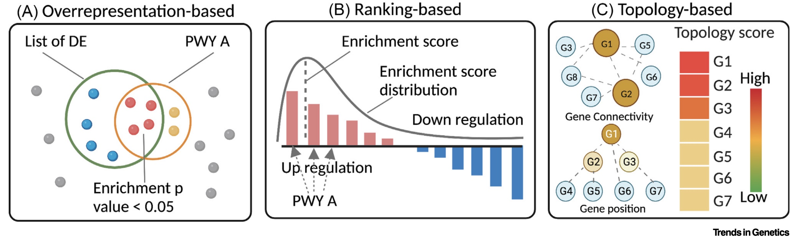

### Over-representation analysis

*ORA* involves statistical tests of overlap between two lists of genes: one derived from the experiment and one from the functional annotations. For example, one might ask what is the overlap between the genes in an annotation class, such as "Lysosome", and the genes that are significantly up-regulated in a given experimental condition. These tests usually rely on some form of Fisher's exact test (e.g. `fisher.test()`) or hypergeometric test (e.g. `phyper()`). If the gene lists consist of a larger number of overlapping genes than would be expected at random - given the sample sizes involved - then there is said to be a statistical over-representation of the annotation class within the experimental condition.  

Of course, these overlap tests are generally considered for all annotation classes, which can number in the hundreds to thousands. Performing this many statistical tests ensures that many will be identified as significant by chance. Therefore, there is typically a requirement to correct for multiple testing errors (e.g. `p.adjust()`). 

There are many R packages available to handle the statistical tests and corrections involved in ORA. Today we'll use `clusterProfiler::enrichGO()`, which wraps statistical testing for overlap with GO terms and multiple test correction in one function. 
Let's start by considering the enrichments from the mouse data analyzed previously. 


~~~
theme_set(theme_bw())
# load('../results/DEAnalysis_5XFAD.RData')
load('../data/DEAnalysis_5XFAD.RData')
~~~
{: .language-r}

We'll start by considering the genes that are significantly DE in 12 month old male animals

~~~
gene.list.up <- DE_5xFAD.df %>% 
  filter(sex == 'male', 
         age == '12 mo',
         padj <= 0.05, 
         log2FoldChange > 0) %>%
  arrange(desc(log2FoldChange)) %>% 
  filter(!duplicated(symbol), !is.na(symbol)) %>% 
  pull(symbol) %>% 
  unique()

gene.list.dn <- DE_5xFAD.df %>% 
  filter(sex == 'male', 
         age == '12 mo',
         padj <= 0.05, 
         log2FoldChange < 0) %>%
  arrange(desc(log2FoldChange)) %>% 
  filter(!duplicated(symbol), !is.na(symbol)) %>% 
  pull(symbol) %>% 
  unique()

length(gene.list.up)
~~~
{: .language-r}


~~~
[1] 1055
~~~
{: .output}


~~~
length(gene.list.dn)
~~~
{: .language-r}


~~~
[1] 491
~~~
{: .output}


There are a total of 1,055 significantly up-regulated genes and 491 significantly down-regulated genes in this cohort. Now test for over representation of GO terms among the DEGs. First, we need to identify the universe of all possible genes which includes the genes that were both measured by the experiment and contained within the annotation set.


~~~
univ <- as.data.frame(org.Mm.egGO) %>% 
  pull(gene_id) %>% 
  unique() %>% 
  bitr(., fromType = "ENTREZID", toType = 'SYMBOL', OrgDb = org.Mm.eg.db, drop = T) %>% 
  pull('SYMBOL') %>% 
  intersect(., DE_5xFAD.df$symbol)
~~~
{: .language-r}


~~~
'select()' returned 1:1 mapping between keys and columns
~~~
{: .output}

Now let's test for enriched GO terms (this can take 3-4 minutes)


~~~
enr.up <- enrichGO(gene.list.up, 
                   ont = 'all', 
                   OrgDb = org.Mm.eg.db, 
                   keyType = 'SYMBOL',
                   universe = univ
                   )
enr.dn <- enrichGO(gene.list.dn, 
                   ont = 'all', 
                   OrgDb = org.Mm.eg.db, 
                   keyType = 'SYMBOL',
                   universe = univ
                   )
~~~
{: .language-r}

How many significant terms are identified:  


~~~
enr.up@result %>% filter(p.adjust <= 0.05) %>% pull(ID) %>% unique() %>% length()
~~~
{: .language-r}


~~~
[1] 1583
~~~
{: .output}


~~~
enr.dn@result %>% filter(p.adjust <= 0.05) %>% pull(ID) %>% unique() %>% length()
~~~
{: .language-r}


~~~
[1] 529
~~~
{: .output}

> ## Challenge 1
> 1) How many significant terms are identified from the up-regulated gene list if you do not specify the "universe"?   
>
> > ## Solution to Challenge 1
> >
> > 1). `enrichGO(gene.list.up, ont = 'all', OrgDb = org.Mm.eg.db, keyType = 'SYMBOL') %>%  .@result %>% filter(p.adjust <= 0.05) %>% pull(ID) %>% unique() %>% length()`  
> >     2340  
> {: .solution}
{: .challenge}

Plot the top 10 significant terms:  


~~~
cowplot::plot_grid(
  dotplot(enr.dn, showCategory = 10) + ggtitle('down'),
  dotplot(enr.up, showCategory = 10) + ggtitle('up')
)
~~~
{: .language-r}

<div class="figure" style="text-align: center">
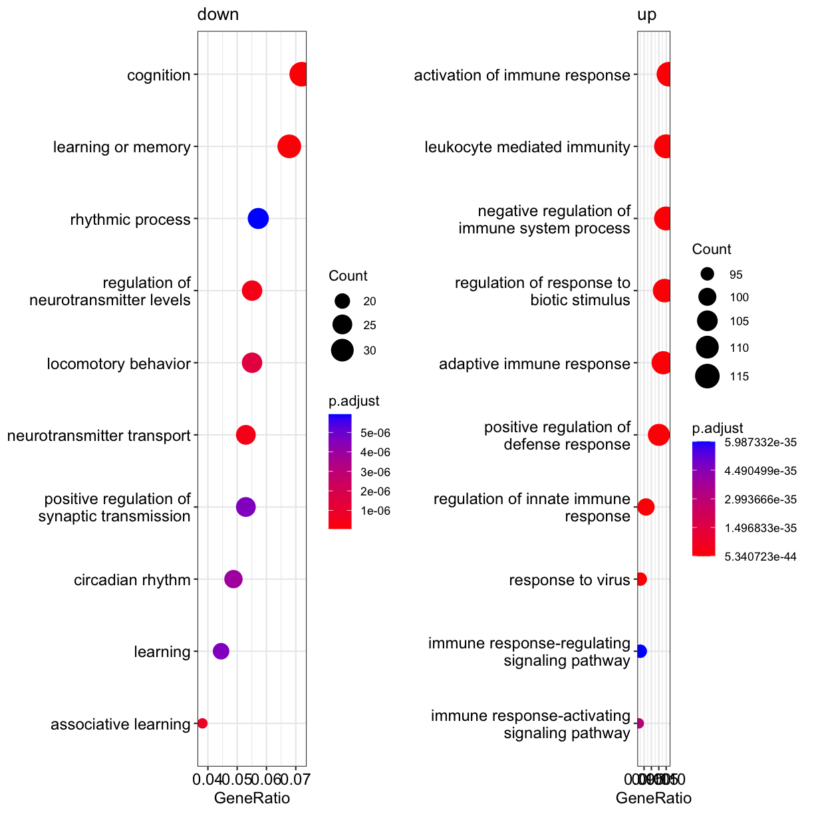
<p class="caption">plot of chunk significant_terms</p>
</div>

From this we can see that nervous system related terms (e.g. "learning or memory", "neurotransmitter transport") are down in 5xFAD males at 12 months, while immune functions (e.g. "cytokine-mediated signaling pathway" and "leukocyte mediated immunity") are up in 5xFAD males at 12 months.  

### Gene set enrichment analysis

`GSEA` is an alternative approach that uses a statistical measure from the omics data (e.g. the log fold change or significance) to rank the genes. An "enrichment score" is calculated for each annotation set based on where the genes annotated to the term sit in the overall distribution. 

Let's analyze those same data with the `clusterProfiler::gseGO()` function. First we'll specify the gene list and use the `log2FoldChange` value to rank the genes in the list.  


~~~
gene.list <- DE_5xFAD.df %>% 
  filter(sex == 'male', 
         age == '12 mo',
         padj <= 0.05
         ) %>%
  arrange(desc(log2FoldChange)) %>% 
  filter(!duplicated(symbol), !is.na(symbol)) %>% 
  pull(log2FoldChange, name = symbol)
~~~
{: .language-r}

Now we'll test for enrichment:  


~~~
enr <- gseGO(gene.list, ont = 'all', OrgDb = org.Mm.eg.db, keyType = 'SYMBOL')
~~~
{: .language-r}

How many significant terms are identified:  


~~~
enr@result %>% filter(p.adjust <= 0.05) %>% pull(ID) %>% unique() %>% length()
~~~
{: .language-r}


~~~
[1] 291
~~~
{: .output}

> ## Challenge 2
> 1) The tally above represents all genes, both up- and down-regulatd. To compare between GSEA and ORA, can you identify how many GSEA enriched terms are associated with up-regulated genes and how many are associated with down-regulated genes? (Hint: the `NES` value within the results relates to the directionality of enrichment). 
>
> > ## Solution to Challenge 2
> >
> > `enr@result %>% filter(p.adjust <= 0.05, NES < 0) %>% pull(ID) %>% unique() %>% length()`  
> > `enr@result %>% filter(p.adjust <= 0.05, NES > 0) %>% pull(ID) %>% unique() %>% length()`
> {: .solution}
{: .challenge}

Plot the term enrichments


~~~
ridgeplot(enr, core_enrichment = T, showCategory = 20)
~~~
{: .language-r}


~~~
Error in loadNamespace(x): there is no package called 'ggridges'
~~~
{: .error}

This plot shows the top 20 GSEA enriched terms. The displayed terms are all from the up-regulated class (i.e. `NES` > 0), and consist of many immune-relevant terms (e.g. "immune response" and "cytokine production"). 

### Common pitfalls & best practices

These kinds of functional enrichment analyses are very common, but not all results reported are equal! A recent paper describes an ["Urgent need for consistent standards in functional enrichment analysis"](https://journals.plos.org/ploscompbiol/article?id=10.1371/journal.pcbi.1009935){target='_blank'}. They examine how the results of functional enrichment analyses are reported in the literature, and identify several common shortcomings. Watch out for these common mistakes when performing and reporting your own analyses!  

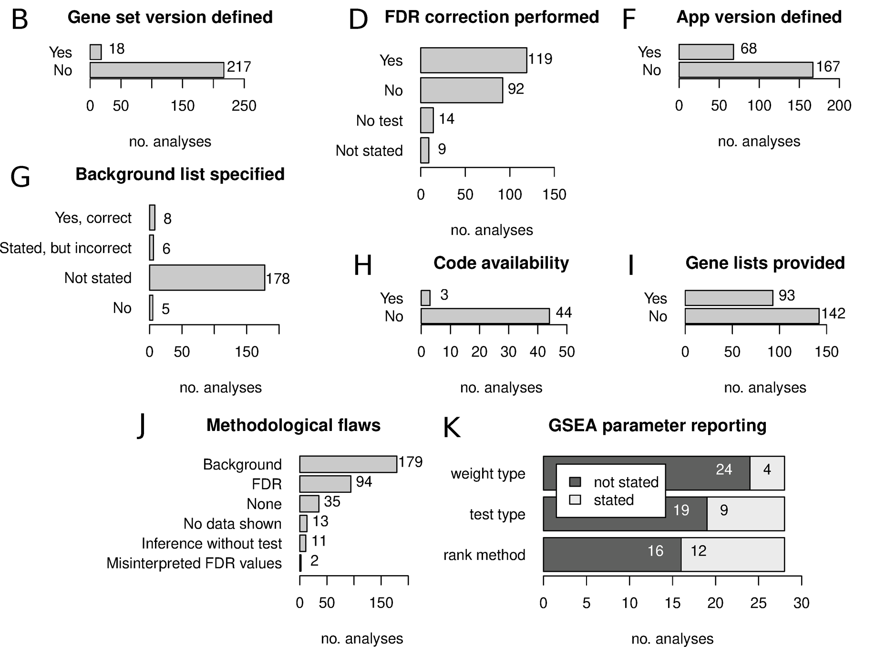

## Alzheimers's Disease Biological Domains

While these results are informative and help to provide essential biological context to the results of the omics experiment, it is difficult to understand all of the enriched terms and what that means for the biology of disease. It would be useful to group each of the enriched terms within broader areas of disease biology. There are several common molecular endophenotypes that are detected within human Alzheimer's cohorts across omics data types (transcriptomics, proteomics, and genetics). Several of these endophenotypic areas are shown in the figure below (source: Jesse Wiley).  

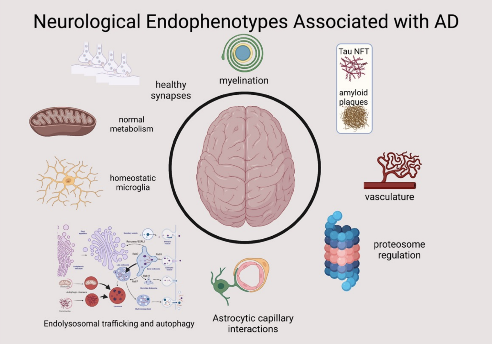

These endophenotypes describe molecular processes that are dysregulated by or during the disease process. Very similar sets of endophenotypes have been cataloged among the targets of therapeutics in clinical trials for AD (see below, [Cummings et al, Alzheimer's disease drug development pipeline: 2023, Alz Dem TRCI](https://www.ncbi.nlm.nih.gov/pmc/articles/PMC10210334/){target='_blank'}).  

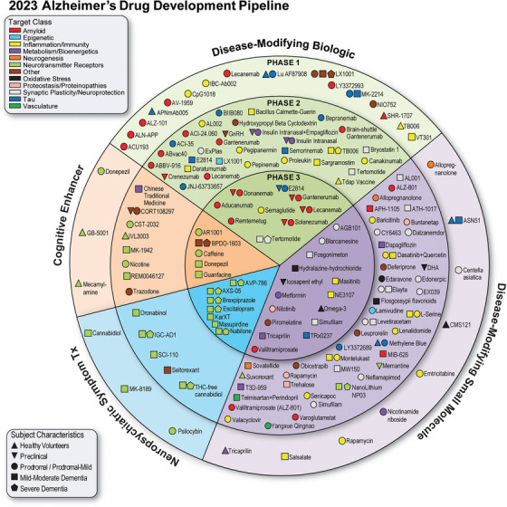

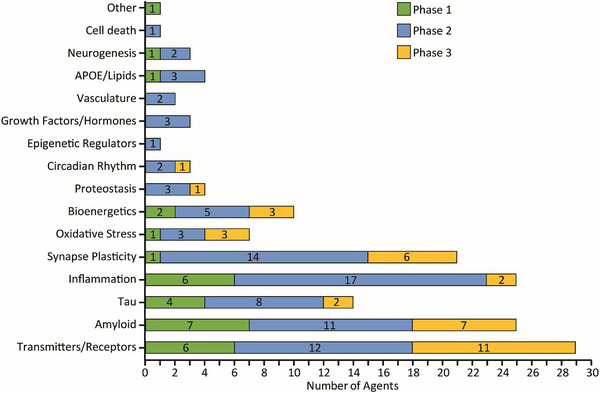

In order to formalize and operationalize these endophenotypic areas, the [Emory-Sage-SGC center of the TREAT-AD consortium](treatad.org/emory-sage-sgc/) has developed the biological domains of AD. In the enumeration of these domains, several criteria were established; the biological domains defined should be:  

 * *objective:* leverage existing well-annotated resources  
 * *automatable:* in CADRO, therapeutics and targets are manually assigned  
 * *intelligible:* groupings should be easy to understand  
 * *modifiable:* definitions should be (and are!) continuously be updated. 

In all 19 distinct biological domains (aka biodoms) have been identified. These biological domains are defined using sets of GO terms that align with the endophenotype. For example, terms like "cytokine receptor binding" and "leukocyte migration" are annotated to the `Immune Response` biodomain, while terms like "postsynaptic density" and "synaptic vesicle cycle" are annotated to the `Synapse` biodomain. Of all terms in the GO, 7,127 terms (16.4%) are annotated to one of the biological domains. Because the GO terms have genes annotated, genes can be associate with specific endophenotypes via the biological domain groupings of terms. In all, 18,289 genes annotated to at least 1 biodom term. While the biodomains exhibit very few overlapping GO terms (panel A), due to gene pleiotropy (etc) the number of overlapping genes between biological domains is quite a bit higher (panel B). The development of the biological domains is described in more detail in the medRxiv preprint [Genetic and Multi-omic Risk Assessment of Alzheimer’s Disease Implicates Core Associated Biological Domains](www.medrxiv.org/content/10.1101/2022.12.15.22283478v1.full){target='_blank'}.  

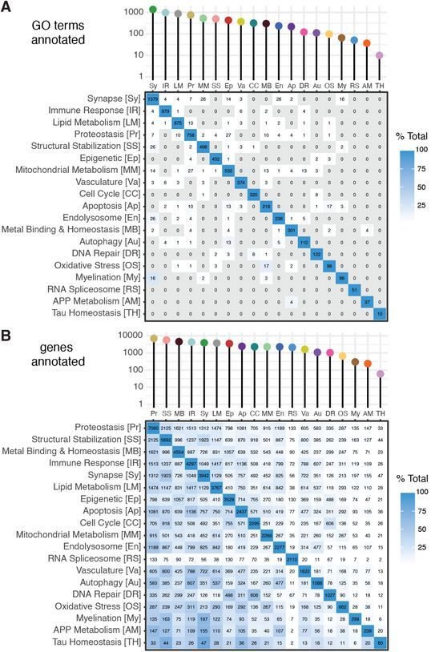


### Download and explore the biological domain annotations

First let's download the biodomain definition file from synapse.  

~~~
synLogin()
~~~
{: .language-r}


~~~
NULL
~~~
{: .output}


~~~
# biodomain definitions
biodom <- readRDS(synGet('syn25428992')$path)
dom.lab <- read_csv(synGet('syn26856828')$path)
~~~
{: .language-r}


~~~
Rows: 20 Columns: 4
── Column specification ───────────────────────────────────────────────────────────────────────
Delimiter: ","
chr (4): domain, abbr, label, color

ℹ Use `spec()` to retrieve the full column specification for this data.
ℹ Specify the column types or set `show_col_types = FALSE` to quiet this message.
~~~
{: .output}

What is in the file?

~~~
head(biodom)
~~~
{: .language-r}


~~~
# A tibble: 6 × 12
# Rowwise: 
  GO_ID      GOterm_Name  Biodomain n_symbol symbol uniprot n_ensGene ensembl_id
  <chr>      <chr>        <chr>        <int> <list> <list>      <int> <list>    
1 GO:0006955 immune resp… Immune R…     1544 <chr>  <chr>         785 <chr>     
2 GO:0019882 antigen pro… Immune R…      101 <chr>  <chr>         151 <chr>     
3 GO:0002376 immune syst… Immune R…     2165 <chr>  <chr>        1215 <chr>     
4 GO:0045087 innate immu… Immune R…      733 <chr>  <chr>         799 <chr>     
5 GO:0006954 inflammator… Immune R…      537 <chr>  <chr>         490 <chr>     
6 GO:0002250 adaptive im… Immune R…      585 <chr>  <chr>         733 <chr>     
# ℹ 4 more variables: n_entrezGene <int>, entrez_id <list>, n_hgncSymbol <int>,
#   hgnc_symbol <list>
~~~
{: .output}

You can see the file is a list of GO term accessions (`GO_ID`) and names (`GOterm_Name`) as well as the corresponding endophenotype (`Biodomain`) to which the term is annotated. There are also gene annotations for each term. These annotation sets come from two sources: (1) the `symbol` and `uniprot` annotations are drawn directly from the Gene Ontology via the provided API, (2) `ensembl_id`, `entrez_id`, and `hgnc_symbol` are from BioMart annotations (e.g. `biomaRt::getLDS()`).  

We can see how many GO terms are annotated to each biodomain: 


~~~
biodom %>% group_by(Biodomain) %>% summarise(n_term = length(unique(GO_ID))) %>% arrange(n_term) 
~~~
{: .language-r}


~~~
# A tibble: 19 × 2
   Biodomain                     n_term
   <chr>                          <int>
 1 Tau Homeostasis                   10
 2 APP Metabolism                    37
 3 RNA Spliceosome                   51
 4 Myelination                       66
 5 Oxidative Stress                  98
 6 Autophagy                        112
 7 DNA Repair                       122
 8 Apoptosis                        218
 9 Endolysosome                     236
10 Metal Binding and Homeostasis    301
11 Cell Cycle                       320
12 Vasculature                      374
13 Epigenetic                       432
14 Structural Stabilization         498
15 Mitochondrial Metabolism         532
16 Proteostasis                     758
17 Lipid Metabolism                 875
18 Immune Response                  979
19 Synapse                         1379
~~~
{: .output}

The biodomains range in size from `Tau Homeostasis` (10 terms) up to `Synapse` (1,379 terms).

We can also investigate the individual genes annotated to each biodomain term.


~~~
biodom %>% filter(GOterm_Name == 'amyloid-beta formation') %>% pull(symbol) %>% unlist()
~~~
{: .language-r}


~~~
[1] "PSEN1"  "APH1B"  "ABCA7"  "BACE1"  "DYRK1A" "NCSTN"  "PSEN2"  "PSENEN"
[9] "APH1A" 
~~~
{: .output}

So the genes associated with `amyloid-beta formation` within the `APP Metabolism` biodomain include PSEN1, PSEN2, BACE1, ABCA7, NCSTN, and others.  

### Annotate enriched terms with biological domain 

Let's re-characterize the 5xFAD functional enrichments we computed previously with the biological domain annotations and see if we can get more context about what is changing in that model. We'll focus first on the GSEA results and start by annotating the results with biodomain groupings.  


~~~
enr.bd = enr@result %>% 
  left_join(., biodom %>% select(Biodomain, ID = GO_ID), by = 'ID') %>% 
  relocate(Biodomain)

head(enr.bd[,1:4])
~~~
{: .language-r}


~~~
        Biodomain ONTOLOGY         ID                          Description
1 Immune Response       BP GO:0002376                immune system process
2 Immune Response       BP GO:0006955                      immune response
3            <NA>       BP GO:0006952                     defense response
4            <NA>       BP GO:0002682  regulation of immune system process
5            <NA>       BP GO:0009607          response to biotic stimulus
6            <NA>       BP GO:0043207 response to external biotic stimulus
~~~
{: .output}

Not all of the enriched terms are annotated to a biological domain. Some terms are too broad and not specific (e.g. 'defense response'), while others may not have been captured by a biological domain annotation yet (e.g. 'regulation of immune system process'). Remember that the conception of the biodomains involved a requirement that they be modifiable, and these terms may be added to the biodomain in the future. Let's modify the `Biodomain` value for terms that aren't annotated to a domain to 'none'.  


~~~
enr.bd$Biodomain[is.na(enr.bd$Biodomain)] <- 'none'
head(enr.bd[,1:4])
~~~
{: .language-r}


~~~
        Biodomain ONTOLOGY         ID                          Description
1 Immune Response       BP GO:0002376                immune system process
2 Immune Response       BP GO:0006955                      immune response
3            none       BP GO:0006952                     defense response
4            none       BP GO:0002682  regulation of immune system process
5            none       BP GO:0009607          response to biotic stimulus
6            none       BP GO:0043207 response to external biotic stimulus
~~~
{: .output}

How many terms are enriched from each domain?


~~~
bd.tally = tibble(domain = c(unique(biodom$Biodomain), 'none')) %>% 
  rowwise() %>% 
  mutate(
    n_term = biodom$GO_ID[ biodom$Biodomain == domain ] %>% unique() %>% length(),
    n_sig_term = enr.bd$ID[ enr.bd$Biodomain == domain ] %>% unique() %>% length()
    )
arrange(bd.tally, desc(n_sig_term))
~~~
{: .language-r}


~~~
# A tibble: 20 × 3
# Rowwise: 
   domain                        n_term n_sig_term
   <chr>                          <int>      <int>
 1 none                               0        136
 2 Immune Response                  979        115
 3 Structural Stabilization         498          9
 4 Synapse                         1379          9
 5 Proteostasis                     758          8
 6 Apoptosis                        218          5
 7 Autophagy                        112          3
 8 Lipid Metabolism                 875          3
 9 Vasculature                      374          2
10 Myelination                       66          1
11 Mitochondrial Metabolism         532          1
12 Endolysosome                     236          0
13 Epigenetic                       432          0
14 Oxidative Stress                  98          0
15 APP Metabolism                    37          0
16 Tau Homeostasis                   10          0
17 RNA Spliceosome                   51          0
18 Cell Cycle                       320          0
19 Metal Binding and Homeostasis    301          0
20 DNA Repair                       122          0
~~~
{: .output}

Many enriched terms don't map to a domain (134), but most do (156). Of those that do, the vast majority map into the `Immune Response` biodomain.  

We can plot the enrichment results, stratified by biodomain:  


~~~
enr.bd <- full_join(enr.bd, dom.lab, by = c('Biodomain' = 'domain')) %>% 
  mutate(Biodomain = factor(Biodomain, levels = arrange(bd.tally, n_sig_term) %>% pull(domain))) %>% 
  arrange(Biodomain, p.adjust) 

ggplot(enr.bd, aes(NES, Biodomain)) +
  geom_violin(data = subset(enr.bd, NES > 0), 
              aes(color = color), scale = 'width')+
  geom_violin(data = subset(enr.bd, NES < 0), 
              aes(color = color), scale = 'width')+
  geom_jitter(aes(size = -log10(p.adjust), fill = color), 
              color = 'grey20', shape = 21, alpha = .3)+
  geom_vline(xintercept = 0, lwd = .5, lty = 2)+
  scale_y_discrete(drop = F)+
  scale_fill_identity()+scale_color_identity()
~~~
{: .language-r}


~~~
Warning: Groups with fewer than two data points have been dropped.
Groups with fewer than two data points have been dropped.
Groups with fewer than two data points have been dropped.
Groups with fewer than two data points have been dropped.
Groups with fewer than two data points have been dropped.
~~~
{: .warning}


~~~
Warning: Removed 9 rows containing missing values (`geom_point()`).
~~~
{: .warning}

<div class="figure" style="text-align: center">
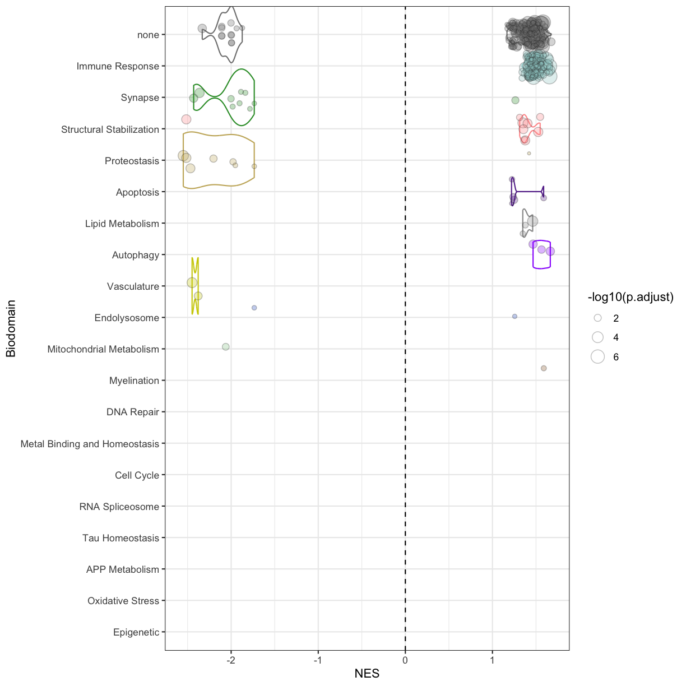
<p class="caption">plot of chunk enrichment_results</p>
</div>

We can produce a similar plot for the ORA results. Let's combine the up and down analyses into one, and make the adjusted p-value signed so that we can look at terms that are up and down separately:  


~~~
enr.ora = bind_rows(
  enr.up@result %>% mutate(dir = 'up'),
  enr.dn@result %>% mutate(dir = 'dn')
  ) %>% 
  left_join(., biodom %>% select(Biodomain, ID = GO_ID), by = 'ID') %>% 
  relocate(Biodomain)
~~~
{: .language-r}


~~~
Warning in left_join(., biodom %>% select(Biodomain, ID = GO_ID), by = "ID"): Detected an unexpected many-to-many relationship between `x` and `y`.
ℹ Row 379 of `x` matches multiple rows in `y`.
ℹ Row 2595 of `y` matches multiple rows in `x`.
ℹ If a many-to-many relationship is expected, set `relationship = "many-to-many"` to silence
  this warning.
~~~
{: .warning}


~~~
enr.ora$Biodomain[is.na(enr.ora$Biodomain)] <- 'none'

bd.tally = tibble(domain = c(unique(biodom$Biodomain), 'none')) %>% 
  rowwise() %>% 
  mutate(
    n_term = biodom$GO_ID[ biodom$Biodomain == domain ] %>% unique() %>% length(),
    n_sig_term = enr.ora$ID[ enr.ora$Biodomain == domain ] %>% unique() %>% length()
    )

enr.ora <- full_join(enr.ora, dom.lab, by = c('Biodomain' = 'domain')) %>% 
  mutate(Biodomain = factor(Biodomain, levels = arrange(bd.tally, n_sig_term) %>% pull(domain))) %>% 
  arrange(Biodomain, p.adjust) %>% 
  mutate(signed_logP = -log10(p.adjust),
         signed_logP = if_else(dir == 'dn', -1*signed_logP, signed_logP))
  
ggplot(enr.ora, aes(signed_logP, Biodomain)) +
  geom_violin(data = subset(enr.ora, dir == 'up'), aes(color = color), scale = 'width')+
  geom_violin(data = subset(enr.ora, dir == 'dn'), aes(color = color), scale = 'width')+
  geom_jitter(aes(size = Count, fill = color), color = 'grey20', shape = 21, alpha = .3)+
  geom_vline(xintercept = 0, lwd = .5, lty = 2)+
  scale_y_discrete(drop = F)+
  scale_fill_identity()+scale_color_identity()
~~~
{: .language-r}


~~~
Warning: Groups with fewer than two data points have been dropped.
~~~
{: .warning}


~~~
Warning: Groups with fewer than two data points have been dropped.
Groups with fewer than two data points have been dropped.
Groups with fewer than two data points have been dropped.
Groups with fewer than two data points have been dropped.
~~~
{: .warning}


~~~
Warning: Removed 1 rows containing missing values (`geom_point()`).
~~~
{: .warning}

<div class="figure" style="text-align: center">
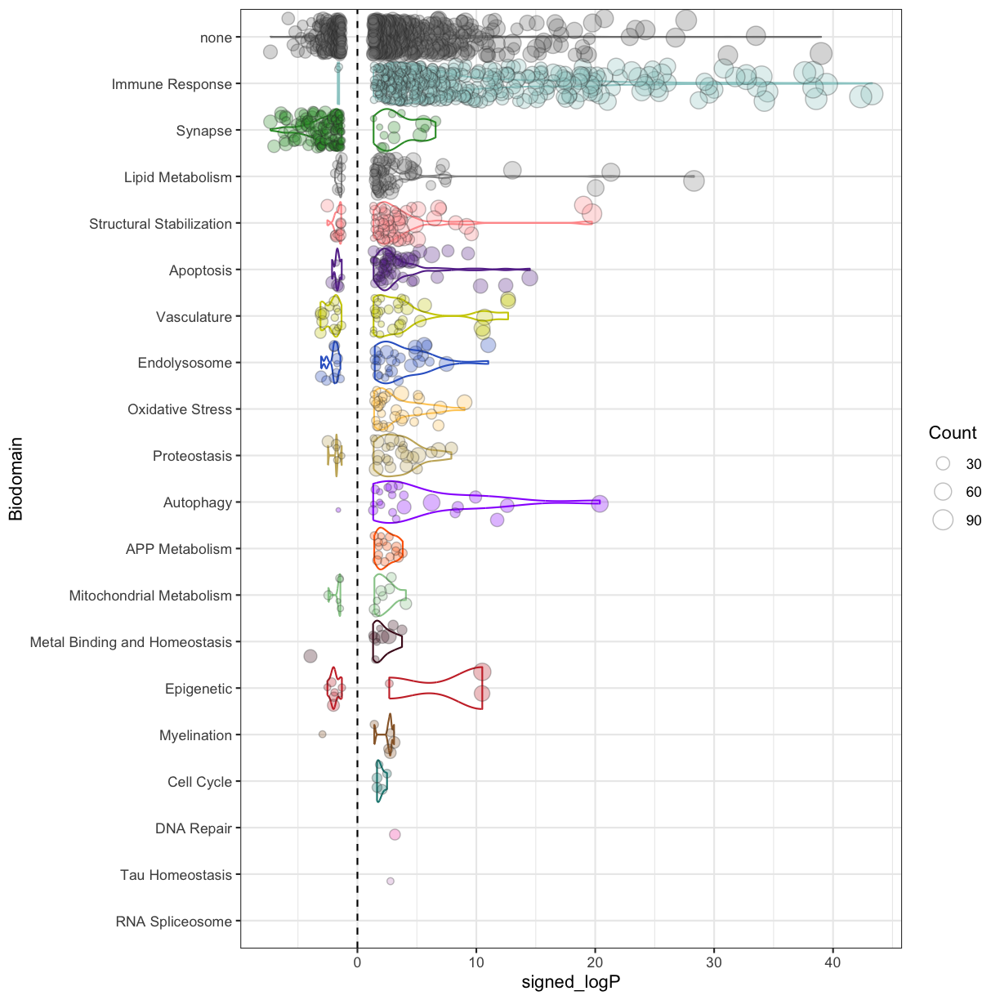
<p class="caption">plot of chunk ORA_results</p>
</div>

Because there are many more significantly enriched terms from the ORA, there is more detail to consider. The dominant signal is stil the up-regulation of terms from the `Immune Response` biodomain. There is also nearly exclusive up-regulation of terms from the `Autophagy`, `Metal Binding and Homeostasis`, `Oxidative Stress`, and `APP Metabolism` domains. The most down-regulated terms are from the `Synapse` biodomain.

> ## Challenge 3
> 1) While there are many more terms identified using ORA compared with GSEA, how many Biodomain terms are identified in both analyses vs unique to each?
> 2) Which biodomains and terms are uniquely identified in the GSEA analysis?
>
> > ## Solution to Challenge 3
> >
> > 1). `intersect(enr.bd$Description[enr.bd$Biodomain!='none'], enr.ora$Description[enr.ora$Biodomain!='none']) %>% length()`  
> >     133 in common
> >     `setdiff(enr.bd$Description[enr.bd$Biodomain!='none'], enr.ora$Description[enr.ora$Biodomain!='none']) %>% length()`
> >     20 unique to GSEA
> >     `setdiff(enr.ora$Description[enr.ora$Biodomain!='none'], enr.bd$Description[enr.bd$Biodomain!='none']) %>% length()`
> >     908 unique to ORA
> > 2). `enr.bd %>% filter( Description %in% setdiff(enr.bd$Description[enr.bd$Biodomain!='none'], enr.ora$Description[enr.ora$Biodomain!='none']) ) %>% group_by(Biodomain) %>% summarise(terms = paste0(Description, collapse = ', '))`
> >     Most terms unique to GSEA are from the `Immune Response` domain (13), but there are also terms from `Structural Stabilization` (4), `Apoptosis` (2), and `Synapse` (1) that are unique to the GSEA results. 
> {: .solution}
{: .challenge}

### Biological domains over model age

Let's take a look at how biodomain enrichments from the MODEL-AD strains change with respect to the age of the model. To save some time, let's load some pre-computed enrichment results for mouse & human data.  


~~~
mm.ora <- bind_rows(
  read_tsv('../data/5xFAD_ora_results.tsv', col_types = cols()) %>%
    mutate(age = str_remove_all(age, ' mo') %>% as.double()),
  read_tsv('../data/LOAD1_ora_results.tsv', col_types = cols())
)
mm.gsea <- bind_rows(
  read_tsv('../data/5xFAD_gsea_results.tsv', col_types = cols()) %>%
    mutate(age = str_remove_all(age, ' mo') %>% as.double()),
  read_tsv('../data/LOAD1_gsea_results.tsv', col_types = cols())
)

hs.ora <- read_tsv('../data/Hsap_ora_results.tsv', col_types = cols())
hs.gsea <- read_tsv('../data/Hsap_gsea_results.tsv', col_types = cols())
~~~
{: .language-r}

Annotate and plot the 5xFAD Male results, this time faceting by biodomain to compare across the age groups:

~~~
enr.bd = mm.ora %>% 
  filter(model == '5xFAD', sex == 'male') %>% 
  left_join(., biodom %>% select(Biodomain, ID = GO_ID), by = 'ID') %>% 
  relocate(Biodomain) %>% 
  mutate(Biodomain = if_else( is.na(Biodomain), 'none', Biodomain),
         signed_logP = -log10(p.adjust),
         signed_logP = if_else(dir == 'ora_dn', -1*signed_logP, signed_logP))
~~~
{: .language-r}


~~~
Warning in left_join(., biodom %>% select(Biodomain, ID = GO_ID), by = "ID"): Detected an unexpected many-to-many relationship between `x` and `y`.
ℹ Row 91 of `x` matches multiple rows in `y`.
ℹ Row 493 of `y` matches multiple rows in `x`.
ℹ If a many-to-many relationship is expected, set `relationship = "many-to-many"` to silence
  this warning.
~~~
{: .warning}


~~~
bd.tally = tibble(domain = c(unique(biodom$Biodomain), 'none')) %>% 
  rowwise() %>% 
  mutate(
    n_term = biodom$GO_ID[ biodom$Biodomain == domain ] %>% unique() %>% length(),
    n_sig_term = enr.bd$ID[ enr.bd$Biodomain == domain ] %>% unique() %>% length()
    )

enr.bd <- full_join(enr.bd, dom.lab, by = c('Biodomain' = 'domain')) %>% 
  mutate(age = factor(age, enr.bd$age %>% unique() %>% sort(decreasing = T) ),
         Biodomain = factor(Biodomain, levels = arrange(bd.tally, desc(n_sig_term)) %>% pull(domain))) %>% 
  arrange(Biodomain, p.adjust)

ggplot(enr.bd, aes(signed_logP, age)) +
  geom_violin(data = subset(enr.bd, signed_logP > 0), aes(color = color), scale = 'width')+
  geom_violin(data = subset(enr.bd, signed_logP < 0), aes(color = color), scale = 'width')+
  geom_point(aes(size = Count, fill = color, group = ID), 
              color = 'grey20', shape = 21, alpha = .5, position = position_jitter(width = .25, seed = 2)  )+
  facet_wrap(~Biodomain)+
  geom_vline(xintercept = 0, lwd = .5, lty = 2)+
  scale_fill_identity()+scale_color_identity()
~~~
{: .language-r}


~~~
Warning: Groups with fewer than two data points have been dropped.
~~~
{: .warning}


~~~
Warning: Groups with fewer than two data points have been dropped.
~~~
{: .warning}


~~~
Warning: Computation failed in `stat_ydensity()`
Caused by error in `$<-.data.frame`:
! replacement has 1 row, data has 0
~~~
{: .warning}


~~~
Warning: Groups with fewer than two data points have been dropped.
Groups with fewer than two data points have been dropped.
~~~
{: .warning}


~~~
Warning: Computation failed in `stat_ydensity()`
Caused by error in `$<-.data.frame`:
! replacement has 1 row, data has 0
~~~
{: .warning}


~~~
Warning: Groups with fewer than two data points have been dropped.
~~~
{: .warning}


~~~
Warning: Computation failed in `stat_ydensity()`
Caused by error in `$<-.data.frame`:
! replacement has 1 row, data has 0
~~~
{: .warning}


~~~
Warning: Groups with fewer than two data points have been dropped.
~~~
{: .warning}


~~~
Warning: Computation failed in `stat_ydensity()`
Caused by error in `$<-.data.frame`:
! replacement has 1 row, data has 0
~~~
{: .warning}


~~~
Warning: Groups with fewer than two data points have been dropped.
~~~
{: .warning}


~~~
Warning: Computation failed in `stat_ydensity()`
Caused by error in `$<-.data.frame`:
! replacement has 1 row, data has 0
~~~
{: .warning}


~~~
Warning: Groups with fewer than two data points have been dropped.
~~~
{: .warning}


~~~
Warning: Computation failed in `stat_ydensity()`
Caused by error in `$<-.data.frame`:
! replacement has 1 row, data has 0
~~~
{: .warning}


~~~
Warning: Groups with fewer than two data points have been dropped.
~~~
{: .warning}


~~~
Warning: Computation failed in `stat_ydensity()`
Caused by error in `$<-.data.frame`:
! replacement has 1 row, data has 0
~~~
{: .warning}

<div class="figure" style="text-align: center">
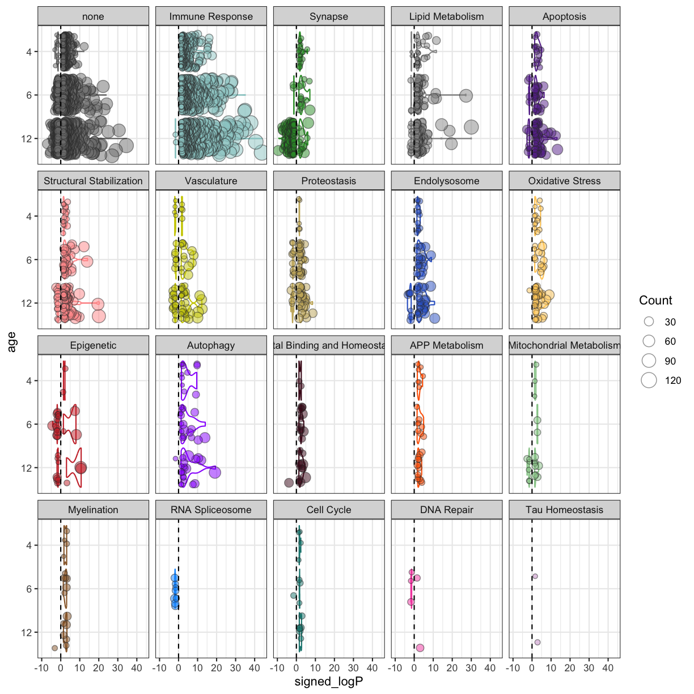
<p class="caption">plot of chunk Male_5xFAD_biodomain</p>
</div>

The `Immune Response` terms are over-represented among the up-regulated genes at all ages, but the overall significance of the associations increase with age. Similar age-dependent trends are apparent in other domains as well. Of note is the increasing number of terms from the `Synapse` domain over-represented among the down-regulated genes as the animals age. 

Let's consider the APOE4Trem2 results. Annotate the biodomains and plot the results of ORA from the DE genes in APOE4Trem2 Males:

~~~
enr.bd = mm.ora %>% 
  filter(model == 'APOE4Trem2', sex == 'male') %>% 
  left_join(., biodom %>% select(Biodomain, ID = GO_ID), by = 'ID') %>% 
  relocate(Biodomain) %>% 
  mutate(Biodomain = if_else( is.na(Biodomain), 'none', Biodomain),
         signed_logP = -log10(p.adjust),
         signed_logP = if_else(dir == 'ora_dn', -1*signed_logP, signed_logP))
~~~
{: .language-r}


~~~
Warning in left_join(., biodom %>% select(Biodomain, ID = GO_ID), by = "ID"): Detected an unexpected many-to-many relationship between `x` and `y`.
ℹ Row 304 of `x` matches multiple rows in `y`.
ℹ Row 2364 of `y` matches multiple rows in `x`.
ℹ If a many-to-many relationship is expected, set `relationship = "many-to-many"` to silence
  this warning.
~~~
{: .warning}


~~~
bd.tally = tibble(domain = c(unique(biodom$Biodomain), 'none')) %>% 
  rowwise() %>% 
  mutate(
    n_term = biodom$GO_ID[ biodom$Biodomain == domain ] %>% unique() %>% length(),
    n_sig_term = enr.bd$ID[ enr.bd$Biodomain == domain ] %>% unique() %>% length()
    )

enr.bd <- full_join(enr.bd, dom.lab, by = c('Biodomain' = 'domain')) %>%  
  filter(!is.na(age)) %>% 
  mutate(age = factor(age, levels = enr.bd$age %>% unique() %>% sort(decreasing = T)),
         Biodomain = factor(Biodomain, 
                            levels = arrange(bd.tally, desc(n_sig_term)) %>% pull(domain))) %>% 
  arrange(age, desc(Biodomain),  p.adjust) 

ggplot(enr.bd, aes(signed_logP, age)) +
  geom_violin(data = subset(enr.bd, signed_logP > 0), aes(color = color), scale = 'width')+
  geom_violin(data = subset(enr.bd, signed_logP < 0), aes(color = color), scale = 'width')+
  geom_jitter(aes(size = Count, fill = color), color = 'grey20', shape = 21, alpha = .5)+
  facet_wrap(~Biodomain)+
  geom_vline(xintercept = 0, lwd = .5, lty = 2)+
  scale_fill_identity()+scale_color_identity()
~~~
{: .language-r}


~~~
Warning: Groups with fewer than two data points have been dropped.
~~~
{: .warning}


~~~
Warning: Computation failed in `stat_ydensity()`
Caused by error in `$<-.data.frame`:
! replacement has 1 row, data has 0
~~~
{: .warning}


~~~
Warning: Groups with fewer than two data points have been dropped.
~~~
{: .warning}


~~~
Warning: Computation failed in `stat_ydensity()`
Caused by error in `$<-.data.frame`:
! replacement has 1 row, data has 0
~~~
{: .warning}


~~~
Warning: Groups with fewer than two data points have been dropped.
Groups with fewer than two data points have been dropped.
Groups with fewer than two data points have been dropped.
Groups with fewer than two data points have been dropped.
Groups with fewer than two data points have been dropped.
~~~
{: .warning}


~~~
Warning: Computation failed in `stat_ydensity()`
Caused by error in `$<-.data.frame`:
! replacement has 1 row, data has 0
~~~
{: .warning}

<div class="figure" style="text-align: center">
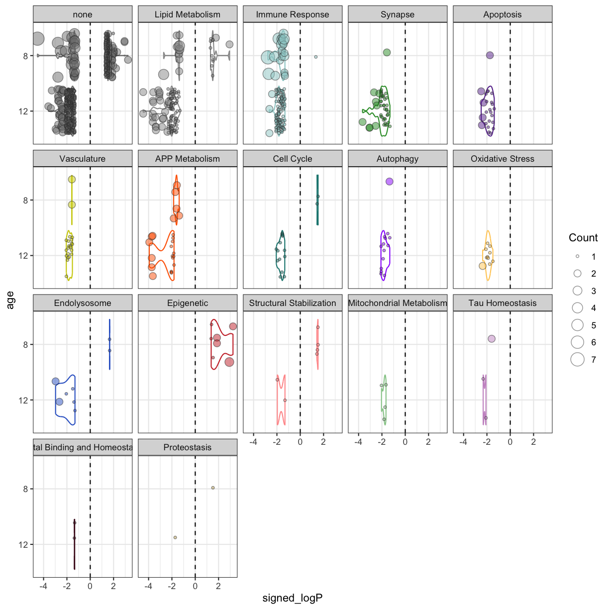
<p class="caption">plot of chunk APOE4Trem2_biodomain</p>
</div>

There aren't any terms enriched at the 4 month time point. Unlike the 5xFAD mice, APOE4Trem2 mice show a significant *down-regulation* of `Immune Response` terms, particularly at 8 months, as well as down-regulation in terms from `APP Metabolism` domain. There is an enrichment in terms from the `Synapse` domain for down-regulated genes, despite enrichments among down-regulated genes in cell death related domains `Autophagy` and `Apoptosis`.

> ## Challenge 4
> 1) Terms from `Immune Response` are enriched among the genes up in 5xFAD, but down in APOE4Trem2. Are these similar or different terms in each set? Focus on the 12 month old animals from each model.
>
> > ## Solution to Challenge 4
> >
> > 1). First, get the list of terms associated with up- and down-regulated genes in each model:
> >     `xf = mm.ora %>% filter(model == '5xFAD', sex == 'male', age == 12, dir == 'ora_up') %>% left_join(., biodom %>% select(Biodomain, ID = GO_ID), by = 'ID') %>% filter(Biodomain == 'Immune Response') %>% pull(Description)`
> >     `at = mm.ora %>% filter(model == 'APOE4Trem2', sex == 'male', age == 12, dir == 'ora_dn') %>% left_join(., biodom %>% select(Biodomain, ID = GO_ID), by = 'ID') %>% filter(Biodomain == 'Immune Response') %>% pull(Description)`
> >     Next how many terms are in each list and how many terms overlap?
> >     `length(xf)`
> >     434
> >     `length(at)`
> >     113
> >     `length(intersect(at,xf))`
> >     108
> >     Almost all terms (95.5%) enriched in the down-regulated analysis from APOE4Trem2 are also found in the enrichments from the up-regulated genes in 5xFAD.
> {: .solution}
{: .challenge}

### Comparing Human and Mouse functional enrichments

Finally let's consider how we can compare the functional enrichments in the mouse models with functional enrichments from the AMP-AD cohorts. We can first take a look at the functional enrichments from the different human cohorts. 

The cohorts ans tissues available are:

~~~
hs.ora %>% select(Study, Tissue) %>% distinct()
~~~
{: .language-r}


~~~
# A tibble: 6 × 2
  Study  Tissue
  <chr>  <chr> 
1 MAYO   CBE   
2 MAYO   TCX   
3 MSSM   STG   
4 MSSM   PHG   
5 MSSM   IFG   
6 ROSMAP DLPFC 
~~~
{: .output}

We can focus on one tissue per cohort, let's look at TCX for Mayo, PHG for Mt Sinai, and DLPFC for ROSMAP. 


~~~
enr.bd = hs.ora %>% 
  filter(Tissue %in% c('TCX','PHG','DLPFC')) %>% 
  left_join(., biodom %>% select(Biodomain, ID = GO_ID), by = 'ID') %>% 
  relocate(Biodomain) %>% 
  mutate(Biodomain = if_else( is.na(Biodomain), 'none', Biodomain),
         signed_logP = -log10(p.adjust),
         signed_logP = if_else(dir == 'ora_dn', -1*signed_logP, signed_logP))
~~~
{: .language-r}


~~~
Warning in left_join(., biodom %>% select(Biodomain, ID = GO_ID), by = "ID"): Detected an unexpected many-to-many relationship between `x` and `y`.
ℹ Row 302 of `x` matches multiple rows in `y`.
ℹ Row 2638 of `y` matches multiple rows in `x`.
ℹ If a many-to-many relationship is expected, set `relationship = "many-to-many"` to silence
  this warning.
~~~
{: .warning}


~~~
bd.tally = tibble(domain = c(unique(biodom$Biodomain), 'none')) %>% 
  rowwise() %>% 
  mutate(
    n_term = biodom$GO_ID[ biodom$Biodomain == domain ] %>% unique() %>% length(),
    n_sig_term = enr.bd$ID[ enr.bd$Biodomain == domain ] %>% unique() %>% length()
    )

enr.bd <- full_join(enr.bd, dom.lab, by = c('Biodomain' = 'domain')) %>% 
  filter(!is.na(Study)) %>% 
  mutate(Biodomain = factor(Biodomain, levels = arrange(bd.tally, desc(n_sig_term)) %>% pull(domain))) %>% 
  arrange(Biodomain, p.adjust)

ggplot(enr.bd, aes(signed_logP, Biodomain)) +
  geom_violin(data = subset(enr.bd, signed_logP > 0), aes(color = color), scale = 'width')+
  geom_violin(data = subset(enr.bd, signed_logP < 0), aes(color = color), scale = 'width')+
  geom_point(aes(size = Count, fill = color, group = ID), 
              color = 'grey20', shape = 21, alpha = .5, position = position_jitter(width = .25, seed = 2)  )+
  facet_wrap(~paste0(Study, ': ', Tissue))+
  geom_vline(xintercept = 0, lwd = .5, lty = 2)+
  scale_fill_identity()+scale_color_identity()
~~~
{: .language-r}


~~~
Warning: Groups with fewer than two data points have been dropped.
~~~
{: .warning}


~~~
Warning: Groups with fewer than two data points have been dropped.
Groups with fewer than two data points have been dropped.
Groups with fewer than two data points have been dropped.
Groups with fewer than two data points have been dropped.
Groups with fewer than two data points have been dropped.
~~~
{: .warning}

<div class="figure" style="text-align: center">
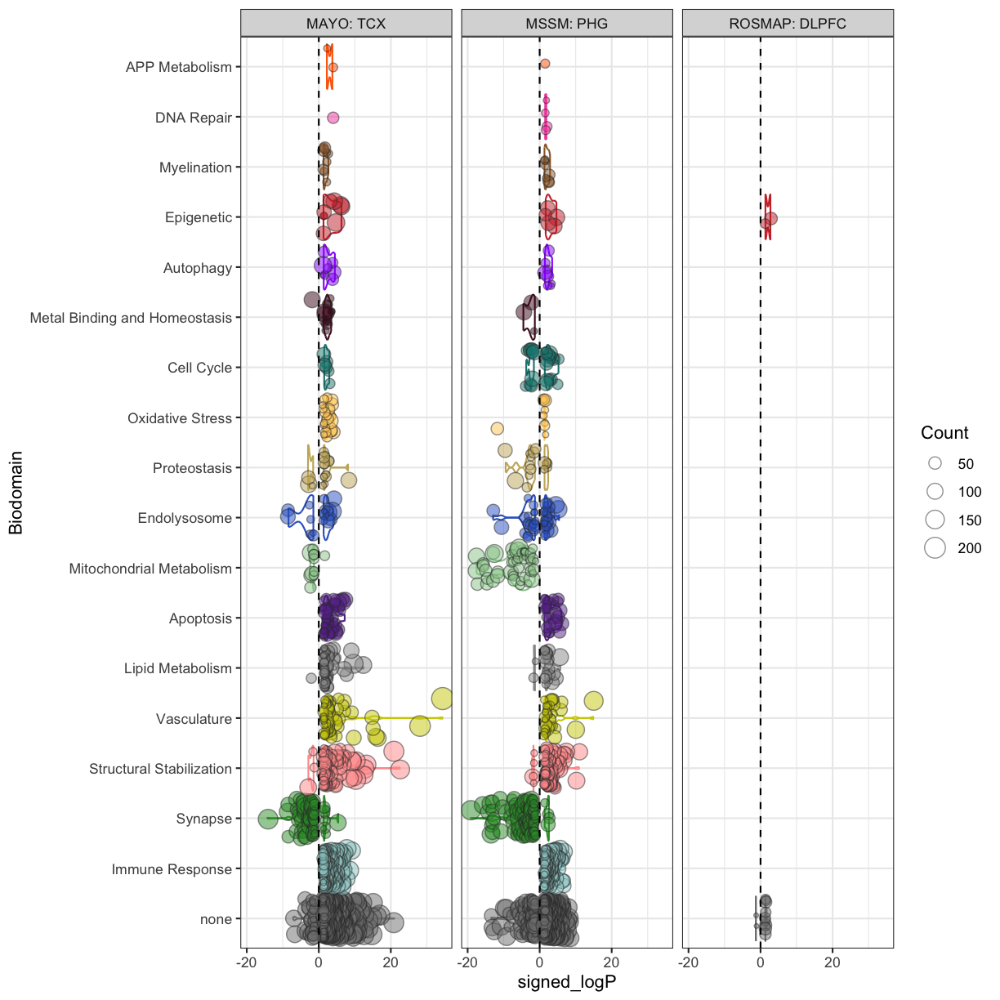
<p class="caption">plot of chunk biodomain_one_tissue_per_cohort</p>
</div>

Huh, the Mayo and MSSM look largely similar, but the ROSMAP DLPFC doesn't have very many enriched terms. Let's ignore the ROSMAP result for now and compare the terms enriched between Mayo TCX and the 5xFAD males. First we can join up the enriched terms between the sets into one data frame.


~~~
comb_5x = bind_rows(
  hs.ora %>% 
    filter(Study == 'MAYO', Tissue == 'TCX') %>% 
    mutate(species = 'hs') %>% 
    select(ID, Description, species, dir, p.adjust, Count),
  mm.ora %>% 
    filter(model == '5xFAD', sex == 'male', age == 12) %>% 
    mutate(species = 'mm') %>% 
    select(ID, Description, species, dir, p.adjust, Count)) %>% 
  mutate(signed_logP = -log10(p.adjust),
         signed_logP = if_else(dir == 'ora_dn', -1*signed_logP, signed_logP)) %>% 
  pivot_wider(id_cols = c(ID, Description), 
              names_from = species, 
              values_from = signed_logP
  ) %>% 
  unnest(cols = c(hs,mm)) %>% 
  mutate(across(c(hs,mm), ~ if_else(is.na(.x), 0, .x)))
~~~
{: .language-r}


~~~
Warning: Values from `signed_logP` are not uniquely identified; output will contain list-cols.
• Use `values_fn = list` to suppress this warning.
• Use `values_fn = {summary_fun}` to summarise duplicates.
• Use the following dplyr code to identify duplicates.
  {data} %>%
  dplyr::group_by(ID, Description, species) %>%
  dplyr::summarise(n = dplyr::n(), .groups = "drop") %>%
  dplyr::filter(n > 1L)
~~~
{: .warning}


~~~
head(comb_5x)
~~~
{: .language-r}


~~~
# A tibble: 6 × 4
  ID         Description                              hs    mm
  <chr>      <chr>                                 <dbl> <dbl>
1 GO:0048514 blood vessel morphogenesis             34.3  0   
2 GO:0001525 angiogenesis                           28.0  0   
3 GO:0009611 response to wounding                   16.8  0   
4 GO:0001503 ossification                           16.2  2.00
5 GO:1901342 regulation of vasculature development  16.2 10.1 
6 GO:0045765 regulation of angiogenesis             16.1 10.3 
~~~
{: .output}

Great! Now let's annotate the biodomains and plot it up:


~~~
enr.bd <- comb_5x %>% 
  left_join(., biodom %>% select(Biodomain, ID = GO_ID), by = 'ID') %>% 
  relocate(Biodomain) %>% 
  mutate(Biodomain = if_else( is.na(Biodomain), 'none', Biodomain))
~~~
{: .language-r}


~~~
Warning in left_join(., biodom %>% select(Biodomain, ID = GO_ID), by = "ID"): Detected an unexpected many-to-many relationship between `x` and `y`.
ℹ Row 306 of `x` matches multiple rows in `y`.
ℹ Row 3065 of `y` matches multiple rows in `x`.
ℹ If a many-to-many relationship is expected, set `relationship = "many-to-many"` to silence
  this warning.
~~~
{: .warning}


~~~
bd.tally = tibble(domain = c(unique(biodom$Biodomain), 'none')) %>% 
  rowwise() %>% 
  mutate(
    n_term = biodom$GO_ID[ biodom$Biodomain == domain ] %>% unique() %>% length(),
    n_sig_term = enr.bd$ID[ enr.bd$Biodomain == domain ] %>% unique() %>% length()
    )

enr.bd <- full_join(enr.bd, dom.lab, by = c('Biodomain' = 'domain')) %>% 
  mutate(Biodomain = factor(Biodomain, 
                            levels = arrange(bd.tally, desc(n_sig_term)) %>% pull(domain))) %>% 
  arrange(Biodomain)

ggplot(enr.bd, aes(hs, mm)) +
  geom_point(aes(fill = color),color = 'grey20', shape = 21, alpha = .5)+
  geom_vline(xintercept = 0, lwd = .5, lty = 2)+
  geom_hline(yintercept = 0, lwd = .5, lty = 2)+
  facet_wrap(~Biodomain, scales = 'free')+
  scale_fill_identity()
~~~
{: .language-r}


~~~
Warning: Removed 1 rows containing missing values (`geom_point()`).
~~~
{: .warning}

<div class="figure" style="text-align: center">
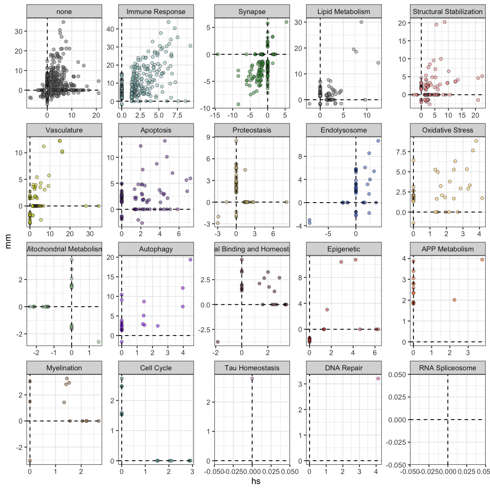
<p class="caption">plot of chunk annotated_biodomains</p>
</div>

There are several terms from multiple biodomains that are enriched in similar directions (i.e. from the up-regulated genes in both human AD and 5xFAD). There are fewer that are enriched in opposite directions (i.e. up in human AD and down in 5xFAD), but there are many terms that are unique to either the human or the mouse data set.

What if we compare the APOE4Trem2 males to Mayo TCX?


~~~
comb_at = bind_rows(
  hs.ora %>% 
    filter(Study == 'MAYO', Tissue == 'TCX') %>% 
    mutate(species = 'hs') %>% 
    select(ID, Description, species, dir, p.adjust, Count),
  mm.ora %>% 
    filter(model == 'APOE4Trem2', sex == 'male', age == 12) %>% 
    mutate(species = 'mm') %>% 
    select(ID, Description, species, dir, p.adjust, Count)) %>% 
  mutate(signed_logP = -log10(p.adjust),
         signed_logP = if_else(dir == 'ora_dn', -1*signed_logP, signed_logP)) %>% 
  pivot_wider(id_cols = c(ID, Description), 
              names_from = species, 
              values_from = signed_logP
  ) %>% 
  unnest(cols = c(hs,mm)) %>% 
  mutate(across(c(hs,mm), ~ if_else(is.na(.x), 0, .x)))

enr.bd <- comb_at %>% 
  left_join(., biodom %>% select(Biodomain, ID = GO_ID), by = 'ID') %>% 
  relocate(Biodomain) %>% 
  mutate(Biodomain = if_else( is.na(Biodomain), 'none', Biodomain))

bd.tally = tibble(domain = c(unique(biodom$Biodomain), 'none')) %>% 
  rowwise() %>% 
  mutate(
    n_term = biodom$GO_ID[ biodom$Biodomain == domain ] %>% unique() %>% length(),
    n_sig_term = enr.bd$ID[ enr.bd$Biodomain == domain ] %>% unique() %>% length()
    )

enr.bd <- full_join(enr.bd, dom.lab, by = c('Biodomain' = 'domain')) %>% 
  mutate(Biodomain = factor(Biodomain, 
                            levels = arrange(bd.tally, desc(n_sig_term)) %>% pull(domain))) %>% 
  arrange(Biodomain)

ggplot(enr.bd, aes(hs, mm)) +
  geom_point(aes(fill = color),color = 'grey20', shape = 21, alpha = .5)+
  geom_vline(xintercept = 0, lwd = .5, lty = 2)+
  geom_hline(yintercept = 0, lwd = .5, lty = 2)+
  facet_wrap(~Biodomain, scales = 'free')+
  scale_fill_identity()
~~~
{: .language-r}


~~~
Warning: Removed 1 rows containing missing values (`geom_point()`).
~~~
{: .warning}

<div class="figure" style="text-align: center">
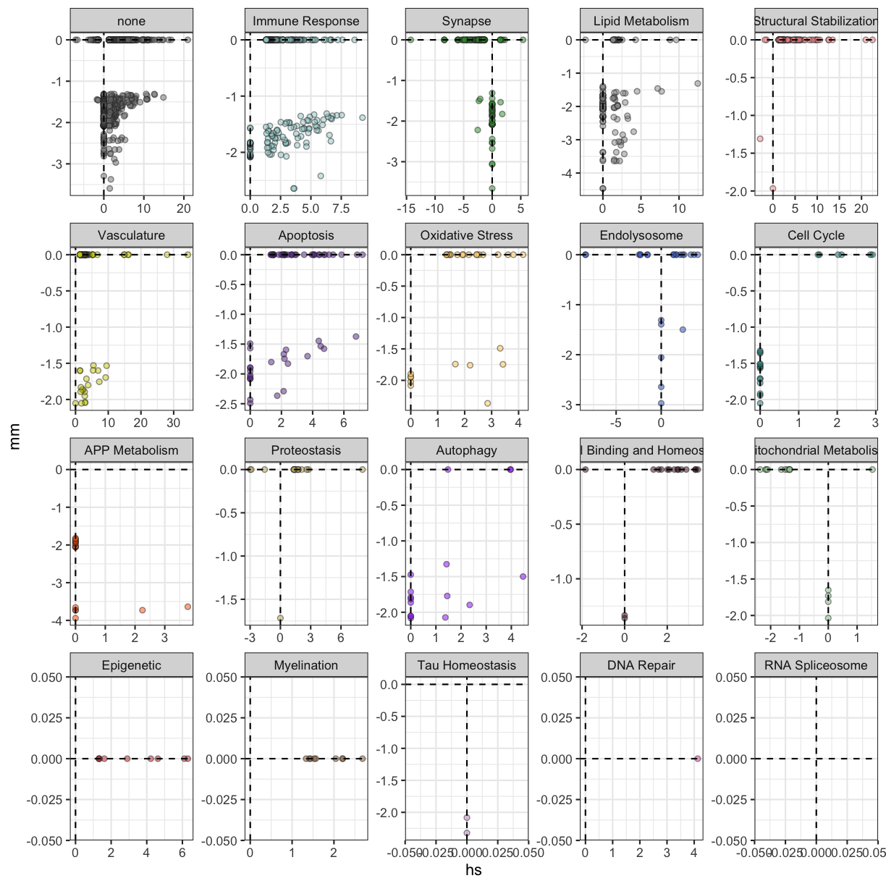
<p class="caption">plot of chunk APOE4Trem2_MayoTCX</p>
</div>

Many of the terms that are enriched among the down-regulated genes from APOE4Trem2 are enriched from genes up-regulated in AD, especially from `Immune Response` and `Lipid Metabolism` domains.

Overall, by aligning human and mouse omics signatures through the lens of domains affected in each context, we can get a better understanding of the relationships between the biological processes affected in each context. 

> ## Challenge 5
> 1) We haven't focused on it much, but there are terms that aren't in a biodomain and are enriched in opposite direction between the human and mouse model tests. Are there any terms that *aren't* annotated to a biodomain, but are up in humand and down in both animal model tests?
>
> > ## Solution to Challenge 5
> >
> > 1). First, get the list of terms associated with up- and down-regulated genes in each model:
> >     `intersect( comb_5x %>% left_join(., biodom %>% select(Biodomain, ID = GO_ID), by = 'ID') %>%  filter(is.na(Biodomain), hs > 0, mm < 0) %>% pull(Description), comb_at %>% left_join(., biodom %>% select(Biodomain, ID = GO_ID), by = 'ID') %>% filter(is.na(Biodomain), hs > 0, mm < 0) %>% pull(Description) )`
> >     Intriguingly there are some apparently relevant terms, such as "negative regulation of gliogenesis", that are up in human cohort and down in both mouse models. The biological domain annotations are a helpful tool, but certainly not the whole picture. 
> {: .solution}
{: .challenge}

## Session Info

~~~
sessionInfo()
~~~
{: .language-r}


~~~
R version 4.3.0 (2023-04-21)
Platform: aarch64-apple-darwin20 (64-bit)
Running under: macOS Monterey 12.6.2

Matrix products: default
BLAS:   /Library/Frameworks/R.framework/Versions/4.3-arm64/Resources/lib/libRblas.0.dylib 
LAPACK: /Library/Frameworks/R.framework/Versions/4.3-arm64/Resources/lib/libRlapack.dylib;  LAPACK version 3.11.0

locale:
[1] en_US.UTF-8/en_US.UTF-8/en_US.UTF-8/C/en_US.UTF-8/en_US.UTF-8

time zone: America/New_York
tzcode source: internal

attached base packages:
[1] stats4    stats     graphics  grDevices utils     datasets  methods  
[8] base     

other attached packages:
 [1] synapser_1.0.59       cowplot_1.1.1         clusterProfiler_4.8.1
 [4] org.Hs.eg.db_3.17.0   org.Mm.eg.db_3.17.0   AnnotationDbi_1.62.1 
 [7] IRanges_2.34.0        S4Vectors_0.38.1      Biobase_2.60.0       
[10] BiocGenerics_0.46.0   lubridate_1.9.2       forcats_1.0.0        
[13] stringr_1.5.0         dplyr_1.1.2           purrr_1.0.1          
[16] readr_2.1.4           tidyr_1.3.0           tibble_3.2.1         
[19] ggplot2_3.4.2         tidyverse_2.0.0       knitr_1.43           

loaded via a namespace (and not attached):
  [1] DBI_1.1.3               bitops_1.0-7            gson_0.1.0             
  [4] shadowtext_0.1.2        gridExtra_2.3           rlang_1.1.1            
  [7] magrittr_2.0.3          DOSE_3.26.1             compiler_4.3.0         
 [10] RSQLite_2.3.1           png_0.1-8               vctrs_0.6.2            
 [13] reshape2_1.4.4          pkgconfig_2.0.3         crayon_1.5.2           
 [16] fastmap_1.1.1           XVector_0.40.0          labeling_0.4.2         
 [19] ggraph_2.1.0            utf8_1.2.3              HDO.db_0.99.1          
 [22] tzdb_0.4.0              enrichplot_1.20.0       bit_4.0.5              
 [25] xfun_0.39               zlibbioc_1.46.0         cachem_1.0.8           
 [28] aplot_0.1.10            jsonlite_1.8.5          GenomeInfoDb_1.36.0    
 [31] blob_1.2.4              highr_0.10              BiocParallel_1.34.2    
 [34] tweenr_2.0.2            parallel_4.3.0          R6_2.5.1               
 [37] stringi_1.7.12          RColorBrewer_1.1-3      reticulate_1.28        
 [40] GOSemSim_2.26.0         Rcpp_1.0.10             downloader_0.4         
 [43] Matrix_1.5-4            splines_4.3.0           igraph_1.4.3           
 [46] timechange_0.2.0        tidyselect_1.2.0        qvalue_2.32.0          
 [49] viridis_0.6.3           codetools_0.2-19        lattice_0.21-8         
 [52] plyr_1.8.8              treeio_1.24.1           withr_2.5.0            
 [55] KEGGREST_1.40.0         evaluate_0.21           gridGraphics_0.5-1     
 [58] scatterpie_0.2.1        polyclip_1.10-4         Biostrings_2.68.1      
 [61] ggtree_3.8.0            pillar_1.9.0            ggfun_0.0.9            
 [64] generics_0.1.3          vroom_1.6.3             rprojroot_2.0.3        
 [67] RCurl_1.98-1.12         hms_1.1.3               tidytree_0.4.2         
 [70] munsell_0.5.0           scales_1.2.1            glue_1.6.2             
 [73] lazyeval_0.2.2          tools_4.3.0             data.table_1.14.8      
 [76] fgsea_1.26.0            graphlayouts_1.0.0      fastmatch_1.1-3        
 [79] tidygraph_1.2.3         grid_4.3.0              ape_5.7-1              
 [82] colorspace_2.1-0        nlme_3.1-162            patchwork_1.1.2        
 [85] GenomeInfoDbData_1.2.10 ggforce_0.4.1           cli_3.6.1              
 [88] fansi_1.0.4             viridisLite_0.4.2       gtable_0.3.3           
 [91] yulab.utils_0.0.6       digest_0.6.31           ggrepel_0.9.3          
 [94] ggplotify_0.1.0         rjson_0.2.21            farver_2.1.1           
 [97] memoise_2.0.1           lifecycle_1.0.3         here_1.0.1             
[100] httr_1.4.6              GO.db_3.17.0            bit64_4.0.5            
[103] MASS_7.3-58.4          
~~~
{: .output}
